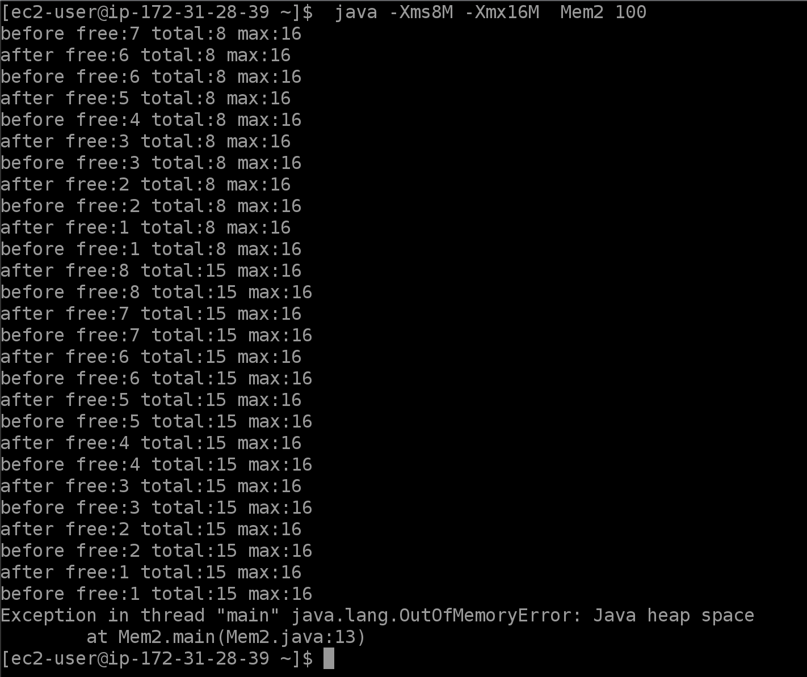

> Runtime.getRuntime().freeMemory()  
Returns the amount of free memory in the Java Virtual Machine. Calling the gc method may result in increasing the value returned by freeMemory. return an approximation to the total amount of memory currently available for future allocated objects, measured in bytes.

> Runtime.getRuntime().totalMemory()  
Returns the total amount of memory in the Java virtual machine. The value returned by this method may vary over time, depending on the host environment. Note that the amount of memory required to hold an object of any given type may be implementation-dependent. return the total amount of memory currently available for current and future objects, measured in bytes.

> Runtime.getRuntime().maxMemory()  
Returns the maximum amount of memory that the Java virtual machine will attempt to use.  If there is no inherent limit then the value java.lang.Long#MAX_VALUE will be returned. return  the maximum amount of memory that the virtual machine will attempt to use, measured in bytes.

-Xmx = Runtime.getRuntime().maxMemory()  
-Xms = Runtime.getRuntime().totalMemory()


>```
>public static void main(String[] args) throws Exception {
>		List<byte[]> ba = new ArrayList<>();
>		int unit = Integer.parseInt(args[0]);
>		int mb = 1000 * 1000;
>		for(int i = 0; i < unit; i++) {
>			System.out.println("before free:" + Runtime.getRuntime().freeMemory() / mb + " total:"
>							   + Runtime.getRuntime().totalMemory() / mb + " max:"
>							   + Runtime.getRuntime().maxMemory() / mb);
>			byte[] bytes = new byte[mb];
>			ba.add(bytes);
>			System.out.println("after free:" + Runtime.getRuntime().freeMemory() / mb + " total:"
>							   + Runtime.getRuntime().totalMemory() / mb + " max:"
>							   + Runtime.getRuntime().maxMemory() / mb);
>			TimeUnit.SECONDS.sleep(1);
>		}
>	}
>```
> java -Xms8M -Xmx16M  Mem2 100
>  

journalctl = less /var/log/messages  
must have some error logs in /var/log/messages file.  

kernel: oom-kill:constraint=CONSTRAINT_NONE,nodemask=(null),cpuset=/,mems_allowed=0,global_oom,task_memcg=/,task=java,
pid=15304,uid=1000
kernel: Out of memory: Killed process 15304 (java) total-vm:12671008kB, anon-rss:829028kB, file-rss:0kB, shmem-rss:0kB
, UID:1000 pgtables:1900kB oom_score_adj:0

[Difference between Resident Set Size (RSS) and Java total committed memory (NMT) for a JVM running in Docker container](https://stackoverflow.com/questions/38597965/difference-between-resident-set-size-rss-and-java-total-committed-memory-nmt)

[Java Heap Space Memory with the Runtime API](https://www.baeldung.com/java-heap-memory-api)