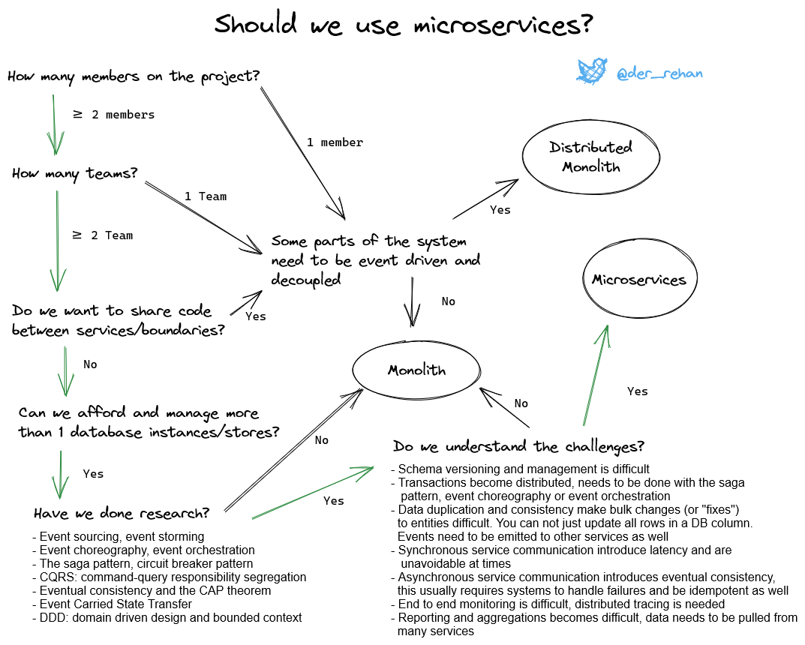

[Monolith, Distributed Monolith and Microservice architectures](https://twitter.com/der_rehan/status/1450044694013022209?ref_src=twsrc%5Etfw%7Ctwcamp%5Etweetembed%7Ctwterm%5E1450044694013022209%7Ctwgr%5E%7Ctwcon%5Es1_&ref_url=https%3A%2F%2Fwww.rehanvdm.com%2Fblog%2Ffrom-monolith-to-resilient-microservices)

>  

[best practices for building a microservice architecture](https://www.vinaysahni.com/best-practices-for-building-a-microservice-architecture)

[The Twelve-Factor App](https://12factor.net/)

[Seven Ways to Fail at Microservices](https://www.infoq.com/articles/microservices-seven-fail/)