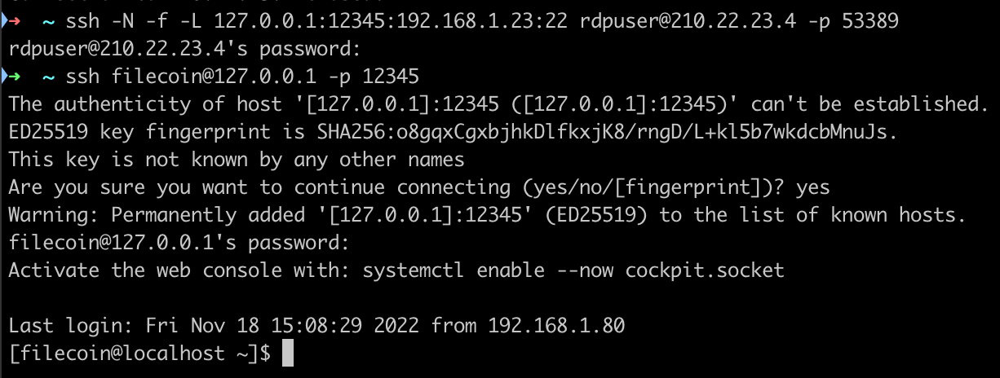

[ssh隧道与代理](https://cloud.tencent.com/developer/article/1134323?from=15425)

>  

ssh -N -f -L 127.0.0.1:12345:192.168.1.23:22 rdpuser@210.22.23.4 -p 53389
127.0.0.1:12345 本机ip:port
192.168.1.23:22 目标ip:port
rdpuser@210.22.23.4 -p 53389 代理ip:port

执行上述命令后，再执行：
ssh filecoin@127.0.0.1 -p 12345
相当于访问192.168.1.23:22