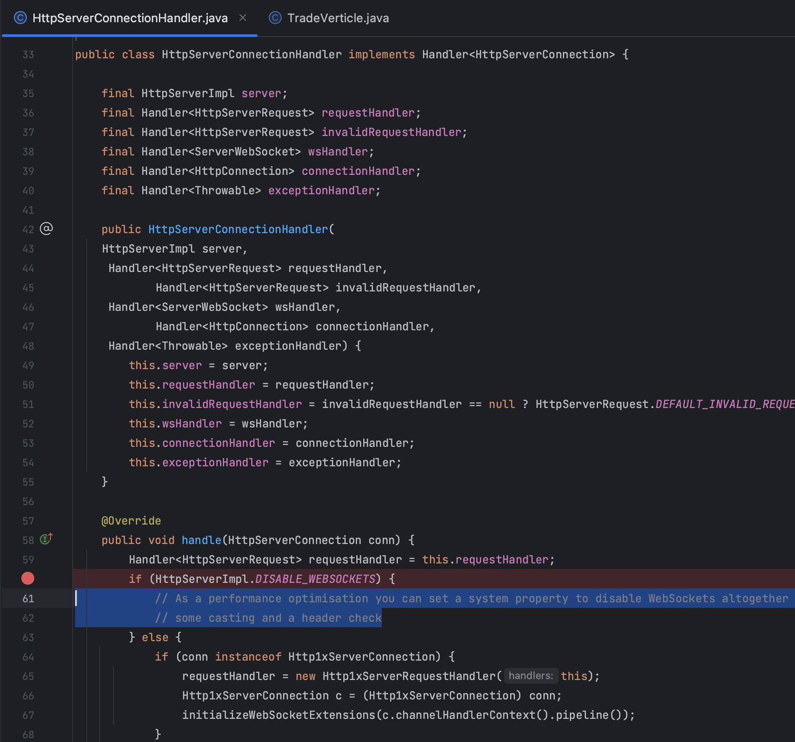
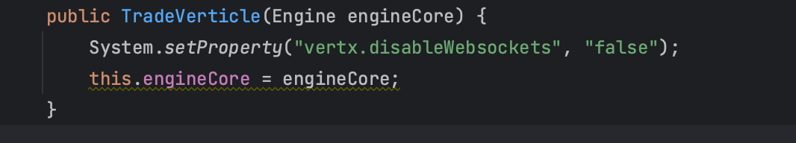

vertx 4.4.4 websocket is disable.

io.vertx.core.http.impl.HttpServerConnectionHandler
HttpServerImpl.DISABLE_WEBSOCKETS is true

>  

need to set property to false.
System.setProperty("vertx.disableWebsockets", "false");

>  