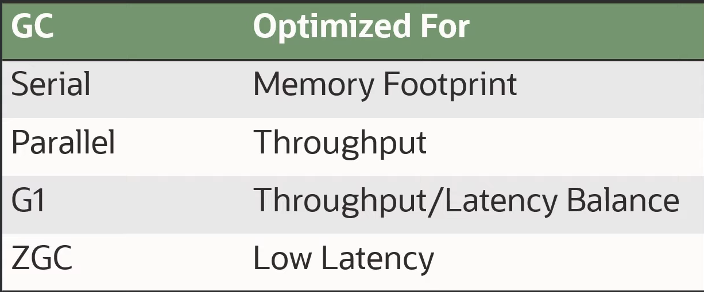

# [GC progress from JDK8 to JDK17](https://kstefanj.github.io/2021/11/24/gc-progress-8-17.html)

# [ZGC What's new in JDK 17](https://malloc.se/blog/zgc-jdk17)

# [ZGC - The Future of Low-Latency Garbage Collection Is Here](https://malloc.se/blog/zgc-jdk17)

>  