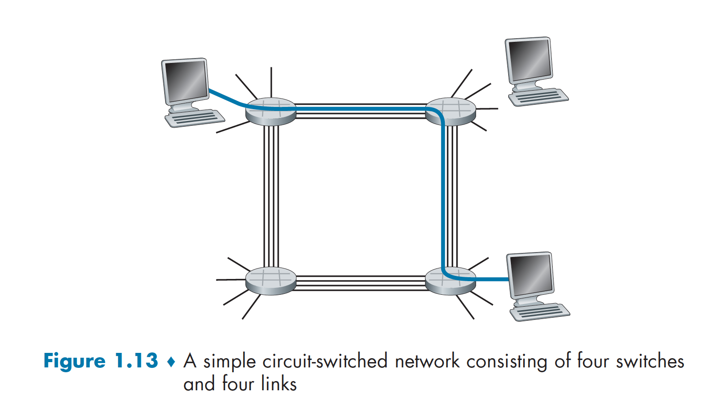

# Computer Network
## 1 Computer Networks and the Internet
#### 1.3.1 Packet Switch
> To send a message from a source end system to a destination end system, the source breaks long messages into smaller chunks of data known as **packets**. Between source and destination, each packet travels through communication links and **packets switches**(for which there are two predominant types, **routers** and **link-layer switches**).

##### Store-and-Forward Transmission
> Store-and-forward transmission means that the packet switch must receive the entire packet before it can begin to transmit the first bit of the packet onto the outbound link.
> 

##### Queuing Delays and Packet Loss
> Each packet switch has multiple links attached to it. For each attached link, the packet switch has an **output buffer**(also called an **output queue**), which stores packets that the router is about to send into that link. If an arriving packet needs to be transmitted onto a linke but finds the link busy with the transmission of another packet, the arriving packet must wait in the output buffer. Thus, in addition to the store-and-forward delays, packets suffer output buffer **queuing delays**. These delays are variable and depend on the level of congestion in the network. Since the amount of buffer space is finite, an arriving packet may find that the buffer is completely full with other packets waiting for transmission. In this case, **packet loss** will occur-either the arriving packet or one of the already-queued packets will be dropped.
> 

#### 1.3.2 Circuit Switching
> There are two fundamental approaches to moving data through a network of links and switches: **circuit switching** and **packet switching**.

> In circuit-switched networks, the resources needed along a path(buffers, link tranmission rate) to provide for communication between the end systems are reversed for the duration of the communication session between the end systems. Traditional telephone networks are examples of circuit-switched networks.
> 

> In packet-switched networks, these resources are not reserved; a session's messages use the resources on demand and, as a consequence, may have to wait(that is, queue) for access to a communication link. The Internet is a packet-switched netowork.

##### Multiplexing in Circuit-Switched Networks
> With FDM(frequency-division multiplexing), the frequency spectrum of a link is divided up among the connections established across the link. For a TDM(time-division multiplexing) link, time is divided into frames of fixed duration, and each frame is divided into a fixed number of time slots.
> 

### 1.4 Delay, Loss, and Throughput in Packet-Switched Networks
#### 1.4.1 Overview of Delay in Packet-Switched Networks
> As a packet travels from one node(host or router) to the subsequent node(host or router) along this path, the packet suffers from several types of delays at each node along the path. The most important of these delays are the **nodal processing delay, queuing delay, transmission delay,** and **propagation delay**; together, these delays accumulate to give a **total nodal delay**.

##### Types of Delay
> As part of its end-to-end route between source and destination, a packet is sent from the upstream node through router A to router B. Our goal is to characterize the nodal delay at router A. Note that router A has an outbound link leading to router B. This link is preceded by a queue(also known as a buffer). When the packet arrives at router A from the upstream node, router A examines the packet's header to determine the appropriate outbound link for the packet and then directs the packet to this link. In this example, the outbound link for the packet is the one that leads to router B. A packet can be transmitted on a link only if there is no other packet currently being transmitted on the link and if there are no other packets preceding it in the queue; if the link is currently busy or if there are other packets already queued for the link, the newly arriving packet will then join the queue.
> 

###### Processing Delay
> The time required to examine the packet's header and determine where to direct the packet is part of the **processing delay**.

###### Queuing Delay
> At the queue, the packet experiences a **queuing delay** as it waits to be transmitted onto the link.

###### Transmission Delay
> Assuming that packets are transmitted in a first-come-first-served manners, as is common in packet-switched networks, our packet can be transmitted only after all the packets that have arrived before it have been transmitted.

###### Propagation Delay
> Once a bit is pushed into the link, it needs to propagate to router B. The time required to propagate from the beginning of the link to router B is the **propagation delay**.

###### Comparing Transmission and Propagation Delay
> The transmission delay is the amount of time required for the router to push out the packet; it is a function of the packet's length and the transmission rate of the link, but has nothing to do with the distance between the two routers. The propagation delay, on the other hand, is the time it takes a bit to propagate from one router to the next; it is a function of the distance between the two routers, but has nothing to do with the packet's length or the transmission rate of the link.


#### 1.4.2 Queuing Delay and Packet Loss
##### Packet Loss
> A packet can arrive to find a full queue. With no place to store such a packet, a router will **drop** that packet; that is, the packet will be **lost**.

> The fraction of lost packets increases as the traffic intensity increases. Therefore, performance at a node is often measured not only in terms of delay, but also in terms of the probability of packet loss.

#### 1.4.4 Throughput in Computer Networks
> In addition to delay and packet loss, another critical performance measure in computer networks is end-to-end throughput.
> 

### 1.5 Protocol Layers and Their Service Models
#### 1.5.1 Layered Architecture
> 

##### Application Layer
> The Internet's application layer includes many protocols, such as the HTTP protocol, SMTP, the FTP.

> An application-layer protocol is distributed over multiple end systems, with the application in one end system using the protocol to exchange packets of information with the application in another end system. We'll refer to this packet of information at the application layer as a **message**.

##### Transport Layer
> In the Internet, there are two transport protocols, TCP and UDP, either of which can transport application-layer messages.

> We'll refer to a transport-layer packet as a **segment**.

##### Network Layer
> The Internet's network layer is responsible for moving network-layer packets known as **datagrams** from one host to another.

> There is only one IP protocol, and all Internet components that have a network layer must run the IP protocol.

##### Link Layer
> The Internet's network layer routes a datagram through a series of routers between the source and destination. To move a packet from one node(host or router) to the next node in the route, the network layer relies on the service of the link layer.

> Examples of link-layer protocols include Ethernet, WiFi, and the cable access network's DOCSIS protocol.

> We'll refer to the link-layer packets as **frames**.

##### Physical Layer
> The job of the physical layer is to move the individual bits within the frame from one node to the next. The protocol in this layer are link dependent and further depend on the actual transmission medium of the link(for example, twisted-pair copper wire, single-mode fiber optics).

#### 1.5.2 Encapsulation
> Routers and link-layer switches are both packet switches. Similar to end system, routers and link-layer switches organize their networking hardware and software into layers. But routers and link-layer switches do not implement all of the layers in the protocol stack; they typically implement only the bottom layers.
> 
> At the sending host, an **application-layer message** is passed to the transport layer. In the simplest case, the transport layer takes the message and appends additional information that will be used by the receiver-side transport layer. The application-layer message and the transport-layer header information together consistute the **transport-layer segment**. The transport-layer segment thus encapsulates the application-layer message. The added information might include information allowing the receiver-side transport layer to deliver the message up to the appropriate application, and error-detection bits that allow the receiver to determine whether bits in the message have been changed in route. The transport layer then passes the segment to the network layer, which adds network-layer header information such as source and destination end system addresses, creating **network-layer datagram**. The datagram is then passed to the link layer, which will add its own link-layer header information and create a **link-layer frame**. Thus, we see that at each layer, a packet has two types of  fields: header fields and a **payload field**. The payload is typically a packet from the layer above.

## 2 Application Layer
### 2.1 Principle of Network Applications
#### 2.1.1 Network Application Architectures
> From the application developer's perspective, the network architecture is fixed and provide a specific set of services to applications. The **application architecture**, on the other hand, is designed by the application developer and dictates how the application is structured over the various end systems.

> In a **client-server architecture**, there is an always-on host, called the server, which services requests from many other hosts, called clients.
> In a **P2P architecture**, there is minimal(or no) reliance on dedicated servers in data centers. Instead the application exploits direct communication between pairs of intermittently connected hosts, called peers. One of the most compelling features of P2P architectures is their **self-scalability**. However, P2P application face challenges of security, performance, and reliability due to their highly decentralized structure.
> 

#### 2.1.2 Processes Communicating
##### Client and Server Processes
> In the context of a communication session between a pair of processes, the process that initiates the communication(that is, initially contacts the other process at the beginning of the session) is labelled as the client. The process that waits to be contacted to begin the session is the server.

##### The Interface Between the Process and the Computer Network
> A process sends messages into, and receive messages from, the network through a software interface called a **socket**.

> A socket is the interface between the application layer and the transport layer within a host. It is also referred to as the **Application Programming Interface(API)** between the application and the network, since the socket is the programming interface with which network applications are built. The application developer has control of everything on the application-layer side of the socket but has little control of the transport-layer side of the socket. The only control that the application developer has on the transport-layer is (1) the choice of transport protocol and (2) perhaps the ability to fix a few transport-layer parameters such as maximum buffer and maximum segment sizes.
> 

#### 2.1.3 Transport Services Available to Application
> What are the services that a transport-layer protocol can offer to applications invoking it? We can broadly classify the possible services along four dimensions: reliable data transfer, throughput, timing, and security.

#### 2.1.4 Transport Services Provided by the Internet
> The Internet(and, more generally, TCP/IP networks) makes two transport protocols available to applications, UDP and TCP.
> 

##### TCP Services
> The TCP service model includes a connection-oriented service and a reliable data transfer service. When an application invokes TCP as its transport protocol, the application receives both of these services from TCP.
>- Connection-oriented service.
>- Reliable data transfer service.
> The TCP congestion-control mechanism throttles a sending process(client or server) when the network is congested between sender and receiver.

##### UDP Services
> UDP is connectionless, so there is no handshaking before the two processes start to communicate. UDP provides an unreliable data transfer service. Furthermore, messages that do arrive at the receiving process may arrive out of order.
> UDP does not include a congestion-control mechanism, so the sending side of UDP can pump data into the layer below(the network layer) at any rate it pleases.

##### Services Not Provided by Internet Transport Protocols
> Today's Internet can often provide satisfactory service to time-sensitive applications, but it can't provide any timing or throughput guarantees.

> We see that e-mail, remote terminal access, the Web, and file transfer all use TCP. These applications have chosen TCP primarily because TCP provides reliable data transfer, guaranteeing that all data will eventually get to its destionation. Because Internet telephony applications(such as Skype) can often tolerate some loss but require a minimal rate to be effective, developers of Internet telephony applications usually prefer to run their applications over UDP, thereby circumventing TCP's congestion control mechanism and packet overheads. But because many firewalls are configured to block(most type of) UDP traffic, Internet telephony applications often are designed to use TCP as a backup if UDP communication fails.
> 

#### 2.1.5 Application-Layer Protocols
> An **aplication-layer protocols** defines how an application's processes, running on different end systems, pass messages to each other.

> It's important to distinguish between network applications and application-layer protocols. An application-layer protocol is only one piece of a network application.

> The Web's application-layer protocol, HTTP, defines the format and sequence of messages exchanged between browser and Web server. Thus, HTTP is only one piece of the Web application.

### 2.2 The Web and HTTP
#### 2.2.1 Overview of HTTP
> HTTP uses TCP as its underlying transport protocol. The HTTP client first initiates a TCP connection with the server. Once the connection is established, the browser and the server processes access TCP through their socket interface. Once the client sends a message into its socket interface, the message is out of the client's hands and is "in the hands" of TCP. TCP provides a reliable data transfer service to HTTP. This implies that each HTTP request message sent by a client process eventually arrives intact at the server; similarly, each HTTP response message sent by the server process eventually arrives intact at the client. Here we see one of the great advantages of a layered architecture - HTTP need not worry about lost data or the details of how TCP recovers from loss or recording of data within the network. That is the job of TCP and the protocols in the lower layers of the protocol stack.

> Because an HTTP server maintains no information about the clients, HTTP is said to be a **stateless protocol**.

#### 2.2.2 Non-Persistent and Persistent Connections
> When this client-server interaction is taking place over TCP, the application developer needs to make an important decision - should each request/response pair be sent over a separate TCP connection, or should all of the requests and their corresponding response be sent over the same TCP connection? In the former approach, the application is said to use **non-persistent connections**; and in the latter approach, **persistent connections**.

#### 2.2.3 HTTP Message Format
> There are two types of HTTP messsages, request messages and response messages.

##### HTTP Request Message
>```
>GET /somedir/page.html HTTP/1.1
>Host: www.someschool.edu
>Connection: close
>User-agent: Mozilla/5.0
>Accept-language: fr
>```
> The first line of an HTTP request message is called the **request line**; the subsequent lines are called the **header lines**. The request line has three fields: the method field, the URL field, and the HTTP version field. The method field can take on servral different values, including GET, POST, HEAD, PUT, and DELETE.
> The header line Host: www.someschool.edu specifies the host on which the object resides. You might think that this  header line is unnecessary, as there is already a TCP connection in place to the host. But the information provided by the host header line is required by Web proxy caches. By including the Connection: close header line, the browser is telling the server that it doesn't want to bother with persistent connections; it wants the server to close the connection after sending the requested object. The User-agent: header line specifies the user agent, that is, the browser type that is making the request to the server. This header line is useful because the server can actually send different versions of the same object to different types of user agents. Finally, the Accept-language: header indicate that the user prefers to receive a French version of the object, it is just one of many content negotiation headers available in HTTP.
> 

##### HTTP Response Message
>```
>HTTP/1.1 200 OK
>Connection: close
>Date: Tue, 18 Aug 2015 15:44:04 GMT
>Server: Apache/2.2.3 (CentOS)
>Last-Modified: Tue, 18 Aug 2015 15:11:03 GMT
>Content-Length: 6821
>Content-Type: text/html
>(data data data data data ...)
>```
> It has three sections: an initial **status line**, six **header lines**, and then the **entity body**. The entity body is the meat of the message - it contains the requested object itself. The status line has three fields: the protocol version field, a status code, and a corresponding status message. In this example, the status line indicates that the server is using HTTP/1.1 and that everything is OK. The server uses the Connection: close header line to tell the client that it is going to close the TCP connection after sending the message. The Date: header line indicates the time and date when the HTTP response was created and sent by the server. Note that this is not the time when the object was created or last modified; it is the time when the server retrieves the object from its file system, inserts the object into the response message, and sends the response message. The Server: header line indicates that the message was generated by an Apache Web server; it is analogous to the User-agent: header line in the HTTP request message. The Last-Modified: header line indicates the time and date when the object was created or last modified. The Last-Modified: header, which we will soon cover in more detail, is critical for object caching, both in the local client and in network cache servers(also known as proxy servers). The Content-Length: header line indicates the number of bytes in the object being sent. The Content-Type: header line indicates that the object in the entity body is HTML text.
> 

#### 2.2.4 User-Server Interaction: Cookies
> HTTP uses cookies that allow sites to keep track of users.

> Cookie technology has four components: (1) a cookie header line in the HTTP response message; (2) a cookie header line in the HTTP request message; (3) a cookie file kept on the user's end system and managed by the user's browser; and (4) a back-end database at the Web site.
> 

#### 2.2.5 Web Caching
> A **Web cache** -  also called a **proxy server** - is a network entity that satisfies HTTP requests on the behalf of an origin Web server. The Web cache has its own disk storage and keeps copies of recently requested objects in this storage. A user's browser can be configured so that all of the user's HTTP requests are first directed to the Web cache.
> 
> Not that a cache is both a server and a client at the same time. When it receives requests from and sends responses to a browser, it is a server. When it sends requests to and receives responses from an origin server, it is a client.

> Typically a Web cache is purchased and installed by an ISP.

> We caching has seen deployment in the Internet for two reasons. First, a Web cache can substantially reduce the response time for a client request, particularly if the bottleneck bandwith between the client and the origin server is much less than the bottleneck bandwith between  the client and the cache. Second, Web cache can substantially reduce traffic on an institution's access link to the Internet. Furthermore, Web caches can substantially reduce Web traffic in the Internet as a whole, thereby improving performance for all applications.

> Through the use of **Content Distribution Network(CDNs)**, Web cache are increasingly playing an important role in the Internet. A CDN company installs many geographically distributed caches throughout the Internet, thereby localizing much of the traffic.

##### The Conditional GET
> Althrough caching can reduce user-perceived response times, it introduces a new problem - the copy of an object residing in the cache may be stale. In other words, the object housed in the Web server may have been modified since the copy was cached at the client. Fortunately, HTTP has a mechanism that allows a cache to verify that its objects are up to date. This mechanism is called the **conditional GET**. An HTTP request message is a so-called conditional GET message if (1) the request message uses the GET method and (2) the request message includes an If-Modified-Since: header line.

>```
>GET /fruit/kiwi.gif HTTP/1.1
>Host: www.exotiquecuisine.com
>If-modified-since: Wed, 9 Sep 2015 09:23:24
>```
> Note that the value of the If-modified-since: header line is exactly equal to the value of the Last-Modified: header line that was sent by the server. This conditional GET is telling the server to send the object only if the object has been modified since the specified date.

#### 2.2.6 HTTP/2
> The primary goals for HTTP/2 are to reduce perceived latency by enabling request and response mulitplexing over a single TCP connection, provide request prioritization and server push, and provide efficient compression of HTTP header fields. HTTP/2 does not change HTTP methods, status codes, URLs, or header fields. Instead, HTTP/2 changes how the data is formatted and transported between the client and server.

> To understand HOL(Head of Line) blocking, consider a Web page that includes an HTML base page, a large video clip near the top of Web page, and many small objects below the video. Further suppose there is a low-to-medium speed bottleneck link on the path between server and client. Using a single TCP connection, the video clip will take a long time to pass through the bottleneck link, while the small objects are delayed as they wait behind the video clip; that is, the video clip at the head of the link blocks the small objects behind it.

##### HTTP/2 Framing
> The HTTP/2 solution for HOL blocking is to break each message into small frames, and interleave the request and response messages on the same TCP connection.

##### Response Message Prioritization and Server Pushing
> Message prioritization allows developers to customize the relative priority of request to better optimize application performance.

> Another feature of HTTP/2 is the ability for a server to send multiple responses for a single client request.

##### HTTP/3
> QUIC is a new "transport" protocol that is implemented in the application layer over the bare-bones UDP protocol.

### 2.3 Electronic Mail in the Internet
> This diagram presents a high-level view of the Internet mail system. We see from this diagram that it has three major components: **user agent**, **mail servers**, and the **Simple Mail Transfer Protocol(SMTP)**.
> 

#### 2.3.1 SMTP
> Let's now take a closer look at how SMTP transfer a message from a sending mail server to a receiving mail server. First, the client SMTP(running on the sending mail server host) has TCP establish a connection to port 25 at the server SMTP(running on the receiving mail server host). If the server is down, the client tries again later. Once this connection is established, the server and client perform some applcaation-layer handshaking, SMTP clients and servers introduce themselves before transferring information. During this SMTP handshaking phase, the SMTP clients indicates the e-mail address of the sender and the e-mail address of the recipient. Once the SMTP client and server have introduce themselves to each other, the client sends the message. SMTP can count on the reliable data transfer service of TCP to get the message to the server without errors. The client then repeats this process over the same TCP connection if it has other messages to send to the server; otherwise, it instructs TCP to close the connection.

### 2.4 DNS - The Internet's Directory Service
#### 2.4.1 Services Provided by DNS
> The DNS is (1) a distributed database implemented in a hierarchy of **DNS servers**, and (2) an application-layer protocol that allows hosts to query the distributed database. The DNS protocol runs over UDP and uses port 53.

#### 2.4.2 Overview of How DNS Works
##### A Distributed, Hierarchical Database
> In order to deal with the issue of scale, the DNS uses a large number of servers, organized in a hierarchical fashion and distributed around the world. No single DNS server has all of the mappings for all the hosts in the Internet. Instead, the mappings are distributed across the DNS servers. To a first approximation, there are three classes of DNS servers - root DNS servers, top-level domain(TLD) DNS servers, and authoritative DNS servers - orginized in a hierarchy.
> 
>- **Root DNS servers**. There are more than 1000 root servers instances scattered all over the world. Root name servers provide the IP addresses of the TLD servers.
>- **Top-Level domain(TLD) servers**. TLD servers provide the IP addresses for authoritative DNS servers.
>- **Authoritative DNS servers**. Every organization with publicly accessible hosts on the Internet must provide publicly accessible DNS records that map the names of those hosts to IP addresses.

> There is another important type of DNS server called the **local DNS server**. A local DNS server does not strictly belong to the hierarchy of servers but is nevertheless central to the DNS architecture. Each ISP - such as a residential ISP or an institutional ISP - has a local DNS server. When a host connects to an ISP, the ISP provides the host with the IP address of one or more of its local DNS servers.

#### 2.4.3 DNS Records and Messages
> The DNS servers that together implement the DNS distributed database store **resource records(RRs)**, including RRs that provide hostname-to-IP address mappings.

> A resource record is a four-tuple that contains the following fields:
(Name, Value, Type, TTL)
TTL is the time to live of the resource record; it determines when a resource should be removed from a cache.
>- If Type = A, then Name is a hostname and Value is the IP address for the hostname. Thus, a Type A record provides the standard hostname-to-IP address mapping. As an example, (relay1.bar.foo.com, 145.37.93.126, A) is a Type A record.
>- If Type = NS, then Name is a domain(such as foo.com) and Value is the hostname of an authoritative DNS server that knows how to obtain the IP addresses for hosts in the domain. This record is used to route DNS queries further along in the query chain. As an example, (foo.com, dns.foo.com, NS) is a Type NS record.
>- If Type = CNAME, then Value is a canonical hostname for the alias hostname Name. This record can provide querying hosts the canonical name for a hostname. As an example, (foo.com, relay1.bar.foo.com, CNAME) is a CNAME record.
>- If Type = MX, then Value is the canonical name of a mail server that has an alias hostname Name. As an example, (foo.com, mail.bar.foo.com, MX) is a MX record.

> If a DNS server is authoritative for a particular hostname, then the DNS server will contain a Type A record for the hostname. If a server is not authoritiative for a hostname, then the server will contain a Type NS record for the domain that includes the hostname; it will also contain a Type A record that provides the IP address of the DNS server in the Value field of the NS record.

##### DNS Messages
> 

168