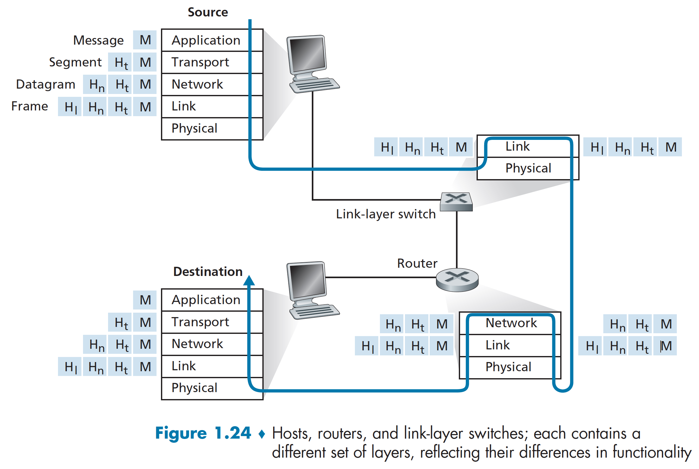

# Computer Network
## 1 Computer Networks and the Internet
#### 1.3.1 Packet Switch
> To send a message from a source end system to a destination end system, the source breaks long messages into smaller chunks of data known as **packets**. Between source and destination, each packet travels through communication links and **packets switches**(for which there are two predominant types, **routers** and **link-layer switches**).

##### Store-and-Forward Transmission
> Store-and-forward transmission means that the packet switch must receive the entire packet before it can begin to transmit the first bit of the packet onto the outbound link.
> 

##### Queuing Delays and Packet Loss
> Each packet switch has multiple links attached to it. For each attached link, the packet switch has an **output buffer**(also called an **output queue**), which stores packets that the router is about to send into that link. If an arriving packet needs to be transmitted onto a linke but finds the link busy with the transmission of another packet, the arriving packet must wait in the output buffer. Thus, in addition to the store-and-forward delays, packets suffer output buffer **queuing delays**. These delays are variable and depend on the level of congestion in the network. Since the amount of buffer space is finite, an arriving packet may find that the buffer is completely full with other packets waiting for transmission. In this case, **packet loss** will occur-either the arriving packet or one of the already-queued packets will be dropped.
> 

#### 1.3.2 Circuit Switching
> There are two fundamental approaches to moving data through a network of links and switches: **circuit switching** and **packet switching**.

> In circuit-switched networks, the resources needed along a path(buffers, link tranmission rate) to provide for communication between the end systems are reversed for the duration of the communication session between the end systems. Traditional telephone networks are examples of circuit-switched networks.
> 

> In packet-switched networks, these resources are not reserved; a session's messages use the resources on demand and, as a consequence, may have to wait(that is, queue) for access to a communication link. The Internet is a packet-switched netowork.

##### Multiplexing in Circuit-Switched Networks
> With FDM(frequency-division multiplexing), the frequency spectrum of a link is divided up among the connections established across the link. For a TDM(time-division multiplexing) link, time is divided into frames of fixed duration, and each frame is divided into a fixed number of time slots.
> 

### 1.4 Delay, Loss, and Throughput in Packet-Switched Networks
#### 1.4.1 Overview of Delay in Packet-Switched Networks
> As a packet travels from one node(host or router) to the subsequent node(host or router) along this path, the packet suffers from several types of delays at each node along the path. The most important of these delays are the **nodal processing delay, queuing delay, transmission delay,** and **propagation delay**; together, these delays accumulate to give a **total nodal delay**.

##### Types of Delay
> As part of its end-to-end route between source and destination, a packet is sent from the upstream node through router A to router B. Our goal is to characterize the nodal delay at router A. Note that router A has an outbound link leading to router B. This link is preceded by a queue(also known as a buffer). When the packet arrives at router A from the upstream node, router A examines the packet's header to determine the appropriate outbound link for the packet and then directs the packet to this link. In this example, the outbound link for the packet is the one that leads to router B. A packet can be transmitted on a link only if there is no other packet currently being transmitted on the link and if there are no other packets preceding it in the queue; if the link is currently busy or if there are other packets already queued for the link, the newly arriving packet will then join the queue.
> 

###### Processing Delay
> The time required to examine the packet's header and determine where to direct the packet is part of the **processing delay**.

###### Queuing Delay
> At the queue, the packet experiences a **queuing delay** as it waits to be transmitted onto the link.

###### Transmission Delay
> Assuming that packets are transmitted in a first-come-first-served manners, as is common in packet-switched networks, our packet can be transmitted only after all the packets that have arrived before it have been transmitted.

###### Propagation Delay
> Once a bit is pushed into the link, it needs to propagate to router B. The time required to propagate from the beginning of the link to router B is the **propagation delay**.

###### Comparing Transmission and Propagation Delay
> The transmission delay is the amount of time required for the router to push out the packet; it is a function of the packet's length and the transmission rate of the link, but has nothing to do with the distance between the two routers. The propagation delay, on the other hand, is the time it takes a bit to propagate from one router to the next; it is a function of the distance between the two routers, but has nothing to do with the packet's length or the transmission rate of the link.

#### 1.4.2 Queuing Delay and Packet Loss
##### Packet Loss
> A packet can arrive to find a full queue. With no place to store such a packet, a router will **drop** that packet; that is, the packet will be **lost**.

> The fraction of lost packets increases as the traffic intensity increases. Therefore, performance at a node is often measured not only in terms of delay, but also in terms of the probability of packet loss.

#### 1.4.4 Throughput in Computer Networks
> In addition to delay and packet loss, another critical performance measure in computer networks is end-to-end throughput.
> 

### 1.5 Protocol Layers and Their Service Models
#### 1.5.1 Layered Architecture
> 

##### Application Layer
> The Internet's application layer includes many protocols, such as the HTTP protocol, SMTP, the FTP.

> An application-layer protocol is distributed over multiple end systems, with the application in one end system using the protocol to exchange packets of information with the application in another end system. We'll refer to this packet of information at the application layer as a **message**.

##### Transport Layer
> In the Internet, there are two transport protocols, TCP and UDP, either of which can transport application-layer messages.

> We'll refer to a transport-layer packet as a **segment**.

##### Network Layer
> The Internet's network layer is responsible for moving network-layer packets known as **datagrams** from one host to another.

> There is only one IP protocol, and all Internet components that have a network layer must run the IP protocol.

##### Link Layer
> The Internet's network layer routes a datagram through a series of routers between the source and destination. To move a packet from one node(host or router) to the next node in the route, the network layer relies on the service of the link layer.

> Examples of link-layer protocols include Ethernet, WiFi, and the cable access network's DOCSIS protocol.

> We'll refer to the link-layer packets as **frames**.

##### Physical Layer
> The job of the physical layer is to move the individual bits within the frame from one node to the next. The protocol in this layer are link dependent and further depend on the actual transmission medium of the link(for example, twisted-pair copper wire, single-mode fiber optics).

#### 1.5.2 Encapsulation
> Routers and link-layer switches are both packet switches. Similar to end system, routers and link-layer switches organize their networking hardware and software into layers. But routers and link-layer switches do not implement all of the layers in the protocol stack; they typically implement only the bottom layers.
> 
> At the sending host, an **application-layer message** is passed to the transport layer. In the simplest case, the transport layer takes the message and appends additional information that will be used by the receiver-side transport layer. The application-layer message and the transport-layer header information together consistute the **transport-layer segment**. The transport-layer segment thus encapsulates the application-layer message. The added information might include information allowing the receiver-side transport layer to deliver the message up to the appropriate application, and error-detection bits that allow the receiver to determine whether bits in the message have been changed in route. The transport layer then passes the segment to the network layer, which adds network-layer header information such as source and destination end system addresses, creating **network-layer datagram**. The datagram is then passed to the link layer, which will add its own link-layer header information and create a **link-layer frame**. Thus, we see that at each layer, a packet has two types of  fields: header fields and a **payload field**. The payload is typically a packet from the layer above.