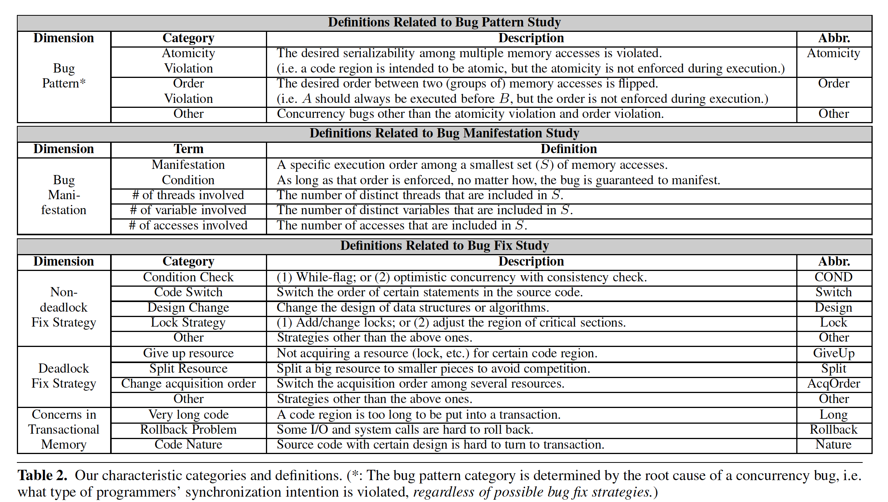

# Learning from Mistaks - A Comprehensive Study on Real World Concurrency Bug Characteristics

## Abstract
> This paper provides the first comprehensive real world concurrency bug characteristic study. Specifically, we have carefully examined concurrency bug patterns, manifestation, and fix strategies of 105 randomly selected real world concurrency bugs from 4 representative server and client open source application(MySQL, Apache, Mozilla and OpenOffice). Our study reveals several interesting findings and provides useful guidance for concurrency bug detection, testing, and concurrent programming language design.
> Some of our findings are as follows:(1) Around one third of the examined non-deadlock concurrency bugs are caused by violation of programers' order intentions, which may not be easily expressed via synchronization primitives like locks and transactional memories; (2) Around 34% of the examined non-deadlock concurrency bugs involve multiple variables; which are not well addressed by existing bug detection tools; (3) About 92% of the examined concurrency bugs can be reliably triggered by enforcing certain orders among no more than 4 memory accesses. This indicates that testing concurrent programs can target at exploring possible orders among all memory accesses; (4) About 73% of the examined non-deadlock concurrency bugs were not fixed by simply adding or changing locks, and many of the fixes were not correct at the first try, indicating the difficulty of reasoning concurrent execution by programmers.

## 1. Instroduction
### 1.1 Motivation
#### (1) Concurrency bug detection
>- **Data race** occurs when two conflicting accesses to one shared variable are executed without proper synchronization, e.g., not protected by a common lock. 
>- **Deadlock** occurs when two or more operations circularly wait for each other to release the acquired resource(e.g., locks).
>- **Atomicity violation** bugs are caused by concurrent execution unexpectedly violating the atomicity of a certain code region.

> Most race detection and many atomicity bug detection techniques focus on synchronization among accesses to a single variable.

#### (2) Concurrent program testing and model checking
> The major challenge of concurrency testing is the exponential interleaving space of concurrent programs. Exposing concurrency bugs requires not only a bug-exposing input, but also a bug-triggering execution interleaving. Therefore, to achieve a complete testing coverage of concurrent programs, testing needs to cover every possible interleaving for each input test case, which is infeasible in practice.

## 2. Methodology
### 2.1 Bug sources
### 2.2 Characteristic categories
> 
 
