# Designing Data-Intensive Applications
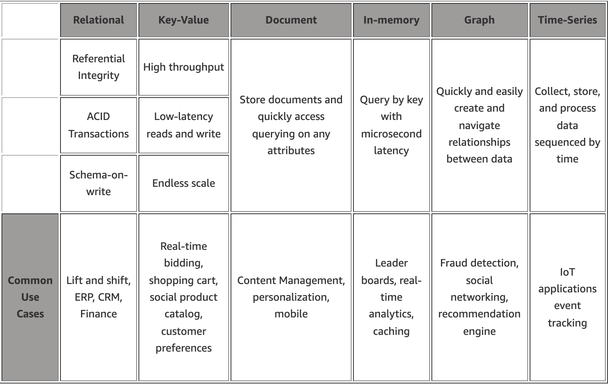

## CHAPTER 1 Reliable, Scalable, and Maintainable Applications
> When building an application, we still need to figure out which tools and which approaches are the most appropriate for the task at hand.
### Scalability
#### Describing Performance
> If you take your list of response times and sort it from fastest to slowest, then the median is the halfway point: for example, if your median response time is 200ms, that means half your requests return in less than 200ms, and half your request take longer than that. The median is also known as the 50th percentile(p50).  
> In order to figure out how bad your outliers are, you can look at higher percentiles: the 95th, 99th, and 99.9th percentiles are common.  
> High percentiles of response times, also known as tail latencies, are important because they directly affect users' experience of the service. For example, Amazon describes response time requirements for internal servicesin terms of the 99.9th percentile, even though it only affects 1 in 1000 requests. This is because the customers with the slowest requests are often those who have the most data on their accounts because they have made many purchases—that is, they’re the most valuable customers. It’s important to keep those customers happy by ensuring the website is fast for them.  

## CHAPTER 2 Data Models and Query Languages
### Relational Versus Document Database Today
> The main arguments in favor of the document data model are schema flexibility, better performance due to locality, and that for some application it is closer to the data structures used by the application(one-to-many). The relational model counters by providing better support for joins, and many-to-one and many-to-many relationships.

> It's not possible to say in general which data model leads to simpler application code; it depends on the kinds of relationships that exist between data items. For highly interconnected data, the document model is awkward, the relational model is acceptable, and graph models are the natural.

### MapReduce Querying
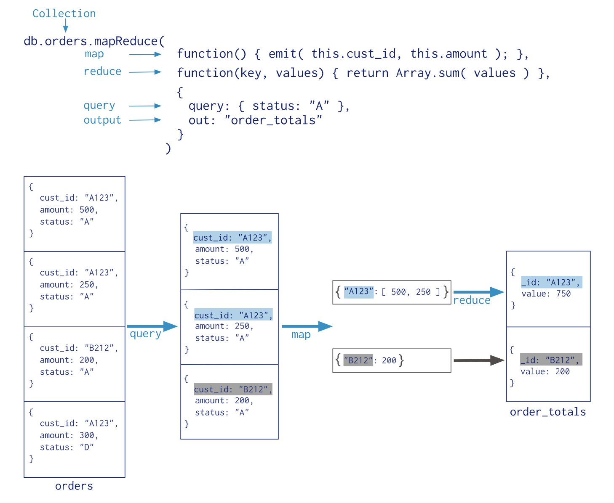

### Graph-Like Data Models
> If your application has mostly one-to-many relationships(tree-structured data) or no relationships between records, the document model is appropriate. The relational model can handle simple case of many-to-many relationships, but as the connections within your data become more complex, it becomes more natural to start modeling your data as a graph.

> There are several different, but related, ways of structuring and querying data in graphs, the properties graph model(implemented by neo4j, Titan, and InfiniteGraph) and the triple-store model(implemented by Datomic, AllegroGraph, and others).

#### Property Graphs
> In the property graph model, each vertex consists of:
>- A unique identifier
>- A set of outgoing edges
>- A set of incoming edges
>- A collection of properties(key-value pairs) 
> Each edge consists of:
>- A unique identifier
>- The vertex at which the edge starts(the tail vertex)
>- The vertex at which the edge ends(the head vertex)
>- A label to describe the kind of relationship between the two vertices
>- A collection of properties(key-value pairs)

> Some important aspects of this model are:
>1. Any vertex can have an edge connecting it with any other vertex.
>2. Given any vertex, you can efficiently find both its incoming and its outgoing edges, and thus traverse the graph.
>3. By using different labels for different kinds of relationships, you can store several different kinds of information in a single graph, while still maintaining a clean data model.

#### Graph Queries in SQL
> In a relational database, you usually know in advance which joins you need in your query. In a graph query, you may need to traverse a variable number of edges before you find vertex you're looking for that is, the number of joins is not fixed in advance.

#### Triple-Stores and SPARQL
> The triple-store model is mostly equivalent to the property graph model, using different words to describe the same idea.

> In a triple-store, all information is stored in the form of very simple three-part statements:(subject, predicate, object). For example, in the triple(Jim, likes, bananas), Jim is the subject, likes is the predicate(verb), and bananas is the object.

## CHAPTER 3 Storage and Retrieval
> You're probably not going to implement your own storage engine from scratch, but you do need to select a storage engine that is appropriate for your application, from the many that are available.

### Data Structures That Power Your Database
> In order to efficiently find the value for a particular key in the database, we need a different data structure: an index. The general idea behind them is to keep some additional metadata on the side, which acts as a signpost and helps you to locate the data you want. If you want to search the same data in several different ways, you may need several different indexes on different parts of the data.

> This is an important trade-off in storage systems: well-chosen indexes speed up read queries, but every index slows down writes. For this reason, databases don’t usually index everything by default, but require you—the application developer or database administrator—to choose indexes manually, using your knowledge of the application’s typical query patterns. You can then choose the indexes that give your application the greatest benefit, without introducing more overhead than necessary.

#### Hash Indexes
> Key-value stores are quite similar to the dictionary type that you can find in most programming languages, and which is usually implemented as a hash map (hash table).

> keep an in-memory hash map where every key is mapped to a byte offset in the data file—the location at which the value can be found, as illustrated in Figure 3-1.
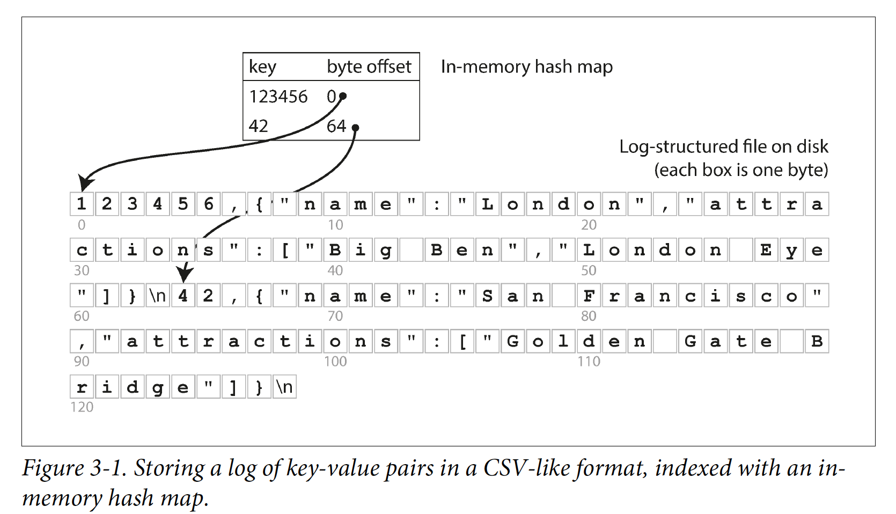

> A good solution to avoid eventually running out of disk space is to break the log into segments of a certain size by closing a segment file when it reaches a certain size, and making subsequent writes to a new segment file. We can then perform compaction on these segments, as illustrated in Figure 3-2. Compaction means throwing away duplicate keys in the log, and keeping only the most recent update for each key.
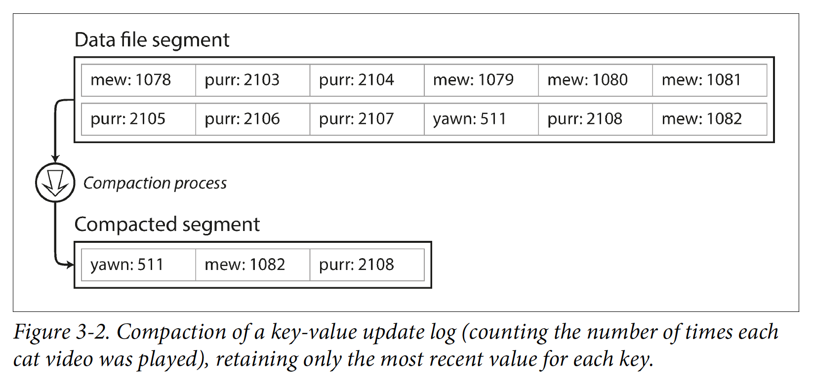

> Segments are never modified after they have been written, so the merged segment is written to a new file. The merging and compaction of frozen segments can be done in a background thread, and while it is going on, we can still continue to serve read and write requests as normal, using the old segment files. After the merging process is complete, we switch read requests to using the new merged segment instead of the old segments—and then the old segment files can simply be deleted.
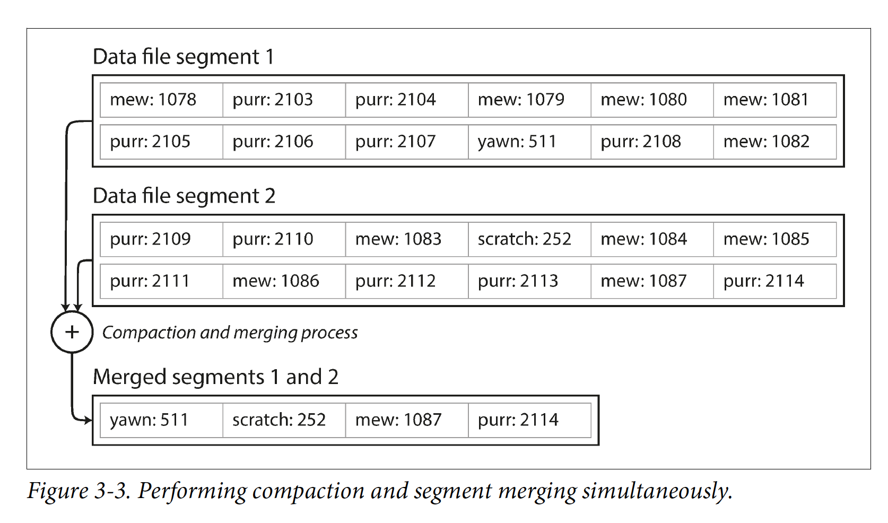

> An append-only design turns out to be good for several reasons:
>- Appending and segment merging are sequential write operations, which are generally much faster than random writes, especially on magnetic spinning-disk hard drives. To some extent sequential writes are also preferable on flash-based solid state drives (SSDs).
>- Concurrency and crash recovery are much simpler if segment files are appendonly or immutable. For example, you don’t have to worry about the case where a crash happened while a value was being overwritten, leaving you with a file containing part of the old and part of the new value spliced together. 
>- Merging old segments avoids the problem of data files getting fragmented over time.

> The hash table index also has limitations:
>- The hash table must fit in memory, so if you have a very large number of keys, you’re out of luck. In principle, you could maintain a hash map on disk, but unfortunately it is difficult to make an on-disk hash map perform well. It requires a lot of random access I/O, it is expensive to grow when it becomes full, and hash collisions require fiddly logic.
>- Range queries are not efficient. For example, you cannot easily scan over all keys between kitty00000 and kitty99999—you’d have to look up each key individually in the hash maps.

#### SSTables and LSM-Trees
> We require that the sequence of key-value pairs is sorted by key. We call this format Sorted String Table, or SSTable for short. We also require that each key only appears once within each merged segment file (the compaction process already ensures that). SSTables have several big advantages over log segments with hash indexes:
>1. Merging segments is simple and efficient, even if the files are bigger than the available memory. The approach is like the one used in the mergesort algorithm and is illustrated in Figure 3-4: you start reading the input files side by side, look at the first key in each file, copy the lowest key (according to the sort order) to the output file, and repeat. This produces a new merged segment file, also sorted by key.
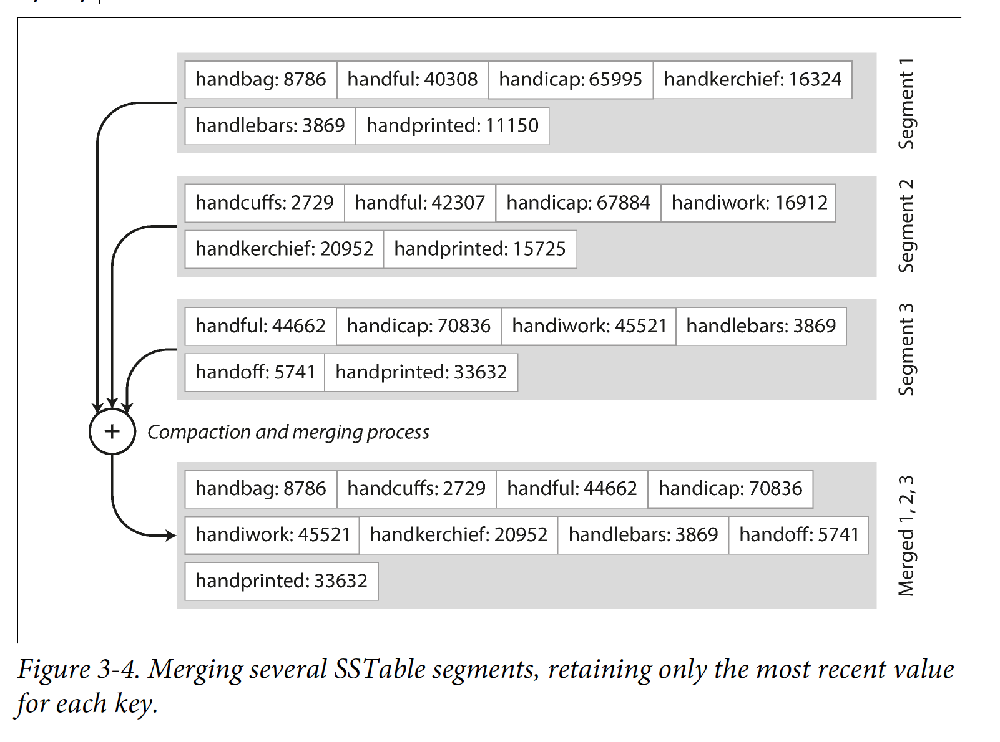
>2. In order to find a particular key in the file, you no longer need to keep an index of all the keys in memory. You still need an in-memory index to tell you the offsets for some of the keys, but it can be sparse: one key for every few kilobytes of segment file is sufficient, because a few kilobytes can be scanned very quickly.
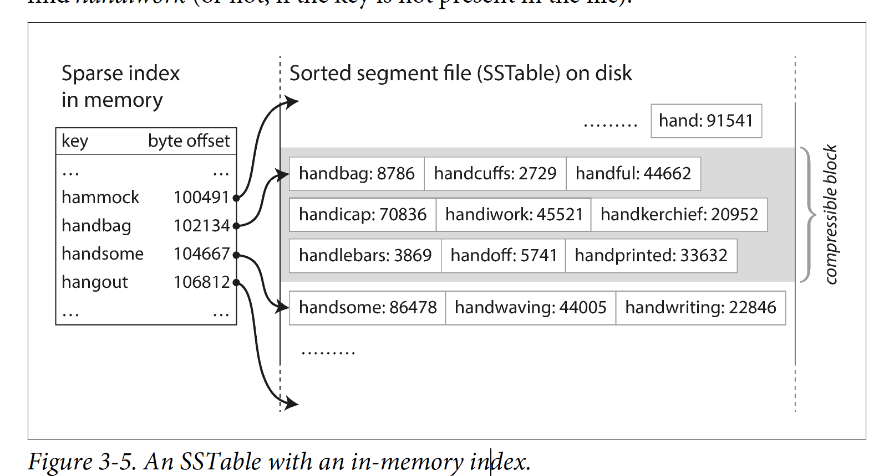
>3 Since read requests need to scan over several key-value pairs in the requested range anyway, it is possible to group those records into a block and compress it before writing it to disk. Each entry of the sparse in-memory index then points at the start of a compressed block. Besides saving disk space, compression also reduces the I/O bandwidth use.

##### Constructing and maintaining SSTables
> Maintaining a sorted structure on disk is possible, but maintaining it in memory is much easier.

> We can now make our storage engine work as follows:
>- When a write comes in, add it to an in-memory balanced tree data structure (for example, a red-black tree). This in-memory tree is sometimes called a memtable.
>- When the memtable gets bigger than some threshold—typically a few megabytes—write it out to disk as an SSTable file. This can be done efficiently because the tree already maintains the key-value pairs sorted by key. The new SSTable file becomes the most recent segment of the database. While the SSTable is being written out to disk, writes can continue to a new memtable instance.
>- In order to serve a read request, first try to find the key in the memtable, then in the most recent on-disk segment, then in the next-older segment, etc.
>- From time to time, run a merging and compaction process in the background to combine segment files and to discard overwritten or deleted values.

> This scheme works very well. It only suffers from one problem: if the database crashes, the most recent writes (which are in the memtable but not yet written out to disk) are lost. In order to avoid that problem, we can keep a separate log on disk to which every write is immediately appended, just like in the previous section. That log is not in sorted order, but that doesn’t matter, because its only purpose is to restore the memtable after a crash. Every time the memtable is written out to an SSTable, the corresponding log can be discarded.

##### Performance optimizations
> The LSM-tree algorithm can be slow when looking up keys that do not exist in the database: you have to check the memtable, then the segments all the way back to the oldest (possibly having to read from disk for each one) before you can be sure that the key does not exist. In order to optimize this kind of access, storage engines often use additional Bloom filters.

#### B-Trees
> Like SSTables, B-trees keep key-value pairs sorted by key, which allows efficient keyvalue lookups and range queries. But that’s where the similarity ends: B-trees have a very different design philosophy.

> The log-structured indexes we saw earlier break the database down into variable-size segments, typically several megabytes or more in size, and always write a segment sequentially. By contrast, B-trees break the database down into fixed-size blocks or pages, traditionally 4 KB in size (sometimes bigger), and read or write one page at a time. This design corresponds more closely to the underlying hardware, as disks are also arranged in fixed-size blocks.

> Each page can be identified using an address or location, which allows one page to refer to another—similar to a pointer, but on disk instead of in memory. We can use these page references to construct a tree of pages.
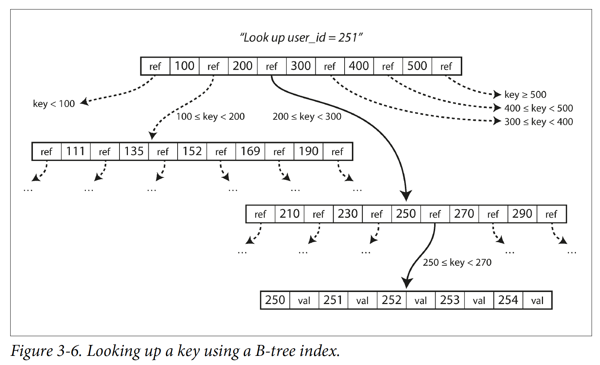

> One page is designated as the root of the B-tree; whenever you want to look up a key in the index, you start here. The page contains several keys and references to child pages. Each child is responsible for a continuous range of keys, and the keys between the references indicate where the boundaries between those ranges lie.

> The number of references to child pages in one page of the B-tree is called the branching factor. For example, in Figure 3-6 the branching factor is six. In practice, the branching factor depends on the amount of space required to store the page references and the range boundaries, but typically it is several hundred.

> If you want to update the value for an existing key in a B-tree, you search for the leaf page containing that key, change the value in that page, and write the page back to disk (any references to that page remain valid). If you want to add a new key, you need to find the page whose range encompasses the new key and add it to that page. If there isn’t enough free space in the page to accommodate the new key, it is split into two half-full pages, and the parent page is updated to account for the new subdivision of key ranges—see Figure 3-7.
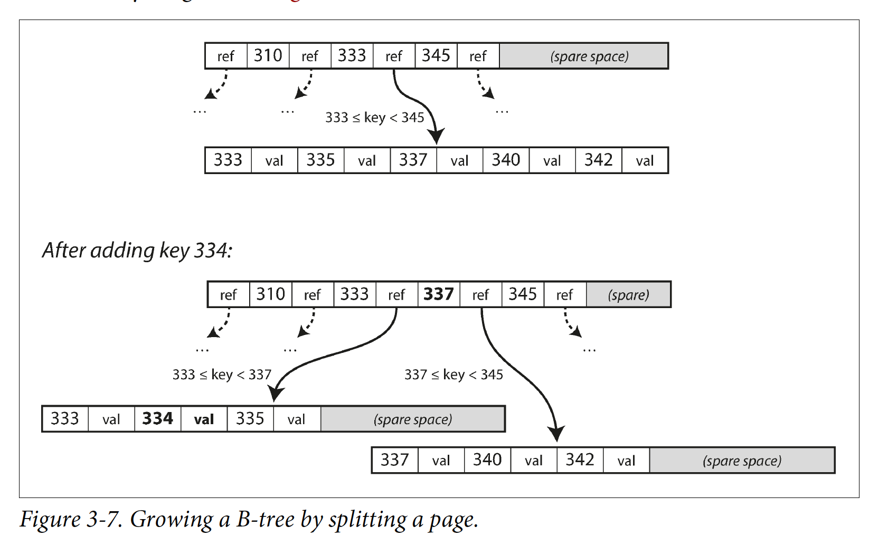

> This algorithm ensures that the tree remains balanced: a B-tree with n keys always has a depth of O(log n). Most database can fit into a B-tree that is three or four levels deep, so you don't need to follow many page references to find the page you are looking for.(A four-level tree of 4 KB pages with a branching factor of 500 can store up to 256 TB.)

##### Making B-tree reliable
> In order to make the database resilient to crashes, it is common for B-tree implementations to include an additional data structure on disk: a write-ahead log(redo log). This is an append-only file to which every B-tree modification must be written before it can be applied to the pages of the tree itself. When the database comes back up after a crash, this log is used to restore the B-tree back to a consistent state.

#### Comparing B-Trees and LSM-Trees
> LSM-trees are typically faster for writes, whereas B-trees are though to be faster for reads. Reads are typically slower on LSM-trees because they have to check several different data structures and SSTables at different stages fo compaction.

#### Other Indexing Structures
> In some situations, the extra hop from the index to the heap file is too much of a performance penalty for reads, so it can be desirable to store the indexed row directly within an index. This is known as a clustered index. For example, in MySQL's InnoDB storage engine, the primary key of a table is always a clustered index, and secondary indexes refer to the primary key(rather than a heap file location).  

### Transaction Processing or Analytics?
> An application typically looks up a small number of records by some key, using an index. Records are inserted or updated based on the user's input. Because these applications are interactive, the access pattern became known as online transaction processing(OLTP).

> Usually an analytic query needs to scan over a huge number of records, only reading a few columns per record, and calculates aggregate statistics(such as count, sum, or average) rather than returning the raw data to the user. These statistics are used to help the management of a company make better decisions(BI). This is called online analytic processing(OLAP).

> The different between OLTP and OLAP is not always clear-cut, but some typical characteristics are listed in below:
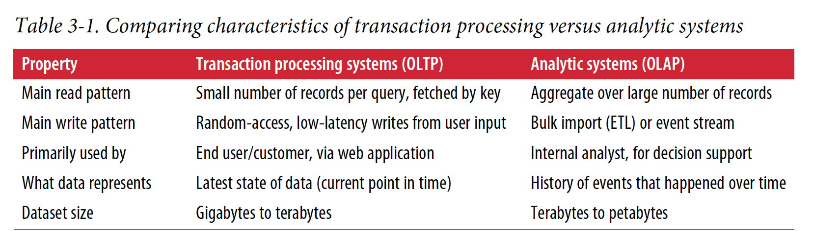

#### Data Warehousing
> A data warehouse is a separate database that analysts can query to their hearts' content, without affecting OLTP operations. The data warehouse contains a read-only copy of the data in all the various OLTP systems in the company. Data is extracted from OLTP databases, transformed into an analysis-friendly schema, cleaned up, and then loaded into the data warehouse. This process of getting data into the warehouse is known as Extract-Transform-Load(ETL).
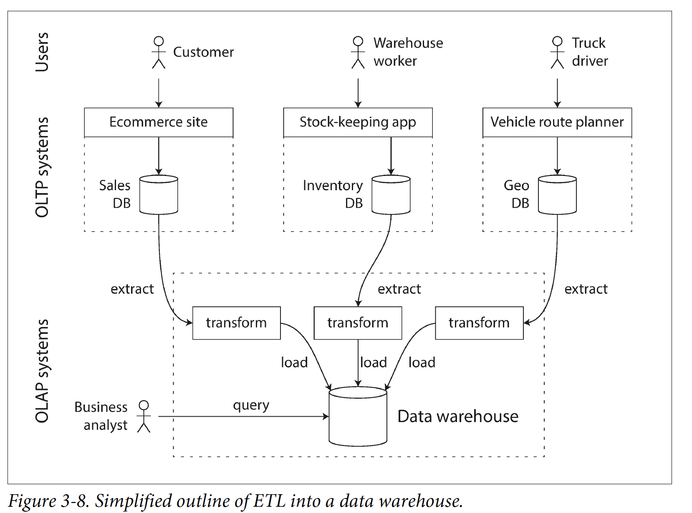

> A big advantage of using a separate data warehouse, rather than querying OLTP systems directly for analytics, is that the data warehouse can be optimized for analytic access patterns. It turns out that the OLTP indexing algorithms are not very good at answering analytic queries.

##### The divergence between OLTP databases and data warehouses
> The data model of a data warehouse is most commonly relational, because SQL is generally a good fit for analytic queries. There are many graphical data analysis tools that generate SQL queries, visualize the results, and allow analysts to explore the data (through operations such as drill-down and slicing and dicing).

> On the surface, a data warehouse and a relational OLTP database look similar, because they both have a SQL query interface. However, the internals of the systems can look quite different, because they are optimized for very different query patterns. Many database vendors now focus on supporting either transaction processing or analytics workloads, but not both.

#### Stars and Snowflakes: Schemas for Analytics
> In analytics, there is much less diversity of data models. Many data warehouses are used in a fairly formulaic style, known as a star schema.

> The example schema in Figure 3-9 shows a data warehouse that might be found at a grocery retailer. At the center of the schema is a so-called fact table (in this example, it is called fact_sales). Each row of the fact table represents an event that occurred at a particular time (here, each row represents a customer’s purchase of a product). If we were analyzing website traffic rather than retail sales, each row might represent a page view or a click by a user.
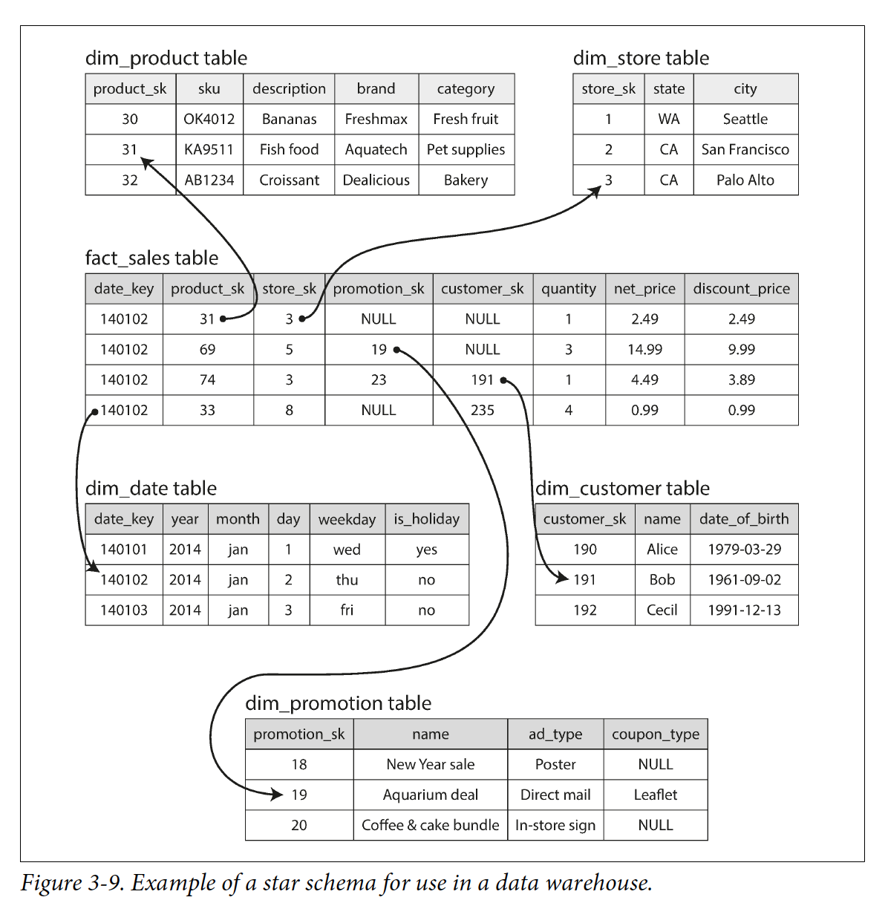

> A variation of this template is known as the snowflake schema, where dimensions are further broken down into subdimensions.

> In a typical data warehouse, tables are often very wide: fact tables often have over 100 columns, sometimes several hundred. Dimension tables can also be very wide, as they include all the metadata that may be relevant for analysis.

### Column-Oriented Storage
> In order to process a query, a row-oriented storage engine still needs to load all of those rows(each consisting of over 100 attributes) from disk into memory, parse them, and filter out those that don't meet the required conditions. That can take a long time.

> The idea behind column-oriented storage is simple: don't store all the values from one row together, but store all the values from each column together instead. If each column is stored in a sepsrate file, a query only needs to read and parse those columns that are used in that query, which can save a lot of work.
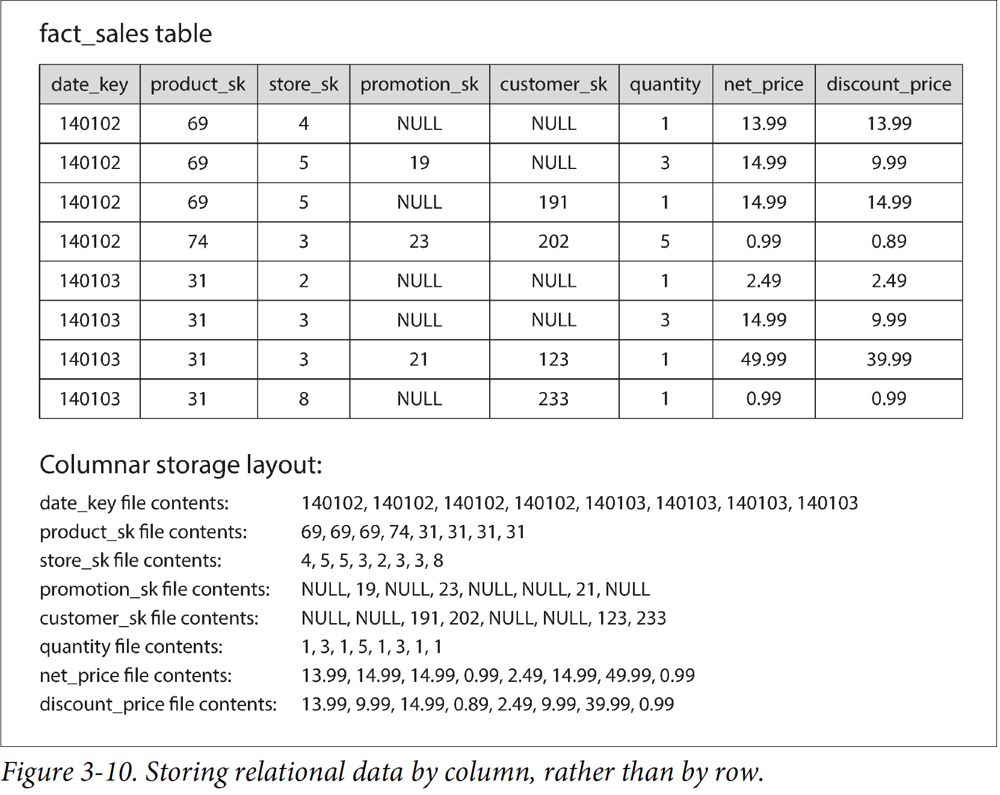

> The column-oriented storage layout relies on each column file containing the rows in the same order. Thus, if you need to reassemble an entire row, you can take the 23rd entry from each of the individual column files and put them together to form the 23rd row of the table.

#### Column Compression
> Besides only loading those columns from disk that are required for a query, we can further reduce the demands on disk throughput by compressing data. Fortunately, column-oriented storage often lends itself very well to compression.

#### Memory bandwidth and vertorized processing
> Beside reducing the volumn of data that needs to be loaded from disk, column-oriented storage layouts are also good for making efficient use of CPU cycles.

#### Sort Order in Column Storage
> Note that it wouldn’t make sense to sort each column independently, because then we would no longer know which items in the columns belong to the same row. We can only reconstruct a row because we know that the kth item in one column belongs to the same row as the kth item in another column.

## CHAPTER 4 Encoding and Evolution
### Formats for Encoding Data
> Programs usually work with data in(at least) two different representations:
>1. In memory, data is kept in objects, structs, lists, arrays, hash tables, trees, and so on. These data structures are optimized for efficient access and manipulation by the CPU(typically using pointers).
>2. When you want to write data to a file or send it over the network, you have to encode it as some kind of self-contained sequence of bytes(e.g. a JSON document). Since a pointer wouldn't make sense to any other process, this sequence-of-bytes representation looks quite different from the data structures that are normally used in memory.

> The transaction from the in-memory representation to a byte sequence is called encoding(also known as serialization or marshalling), and the reverse is called decoding(parsing, deserialization, unmarshalling).

#### Language-Specific Formats
> Language-specific encoding libraries have a number of deep problems:
>- The encoding is often tied to a particular programming language, and reading the data in another language is very difficult.
>- In order to restore data in the same object types, the decoding process needs to be able to instantiate arbitrary classes. This is frequently a source of security problems.
>- Versioning data is often an afterthought in these libraries.
>- Efficiency is also often an afterthought.

> For these reason it's generally a bad idea to use your language's built-in encoding for anything other than very transient purposes.

## CHAPTER 7 Transactions
### The Slippery Concept of a Transaction
#### Single-Object and Multi-Object Operations
> Atomicity, isolation, and durability are properties of the database, whereas consistency(in the ACID sense) is a property of the application. The application may rely on the database's atomicity and isolation properties in order to achieve consistency, but it's not up to the database alone.  

> To recap, in ACID, atomicity and isolation describe what the database should do if a client makes several writes within the same transaction.

> Atomicity and isolation also apply when a single object is being changed. For example, imagine you are writing a 20KB JSON document to a database.

> It's only worth retrying after transient errors(for example)
### Weak Isolation Levels
> If two transactions don't touch the same data, they can safely be run in parallel, because neither depends on the other. Concurrency issue(race conditions) only come into play when one transaction reads data that is concurrently modified by another transaction, or when two transactions try to simulatneously modify the same data.  
#### Read Committed
> For every object that is written, the database remembers both the old committed value and the new value set by the transaction that currently holds the write lock. While the transaction is ongoing, any other transactions that read the object are simply given the old value. Only when the new value is committed do transactions switch over to reading the new value.  

#### Snapshot Isolation and Repeatable Read
> Most commonly, database prevent dirty writes by using row-level locks: when a transaction wants to modify a particular object(row or document), it must first acquire a lock on that object. It must then hold that lock until the transaction is commited or aborted.

> For every object that is written, the database remembers both the old committed value and the new value set by the transaction that currently holds the write lock. While the transaction is ongoing, any other transactions that read the object are simply given the old value. Only when the new value is committed do transactions switch over to reading the new value.  

> Some situations cannot tolerate such temporary inconsistency: Backups and Analytic queries and integrity checks.  

> To implement snapshot isolation, database use a generalization of the mechanism we saw for preventing dirty reads. The database must potentially keep serveral different committed versions of an object, because various in-progress transactions may need to see the state of the database at different points in time.

> By carefully defining visibility rules, the database can present a consistent snapshot of the database to the application. This works as follows:
>1. At the start of each transaction, the database makes a list of all the other transactions that are in progress(not yet committed or aborted) at that time. Any writes that those transactions have made are ignored, even if the transactions subquently commit.  
>2. Any writes made by aborted transactions are ignored.  
>3. Any writes made by transactions with a later transaction ID(i.e., which started after the current transaction started) are ignored, regardless of whether those transactions have committed.  
>4. All other writes are visible to the application's queries.    

> An object is visible if both of the following condition are true:
>1. At the time when the reader's transaction started, the transaction that created the object had already committed.  
>2. The object is not marked for deletion, or if it is, the transaction that requested deletion had not yet committed at the time when the reader's transaction started.

#### Preventing Lost Updates
> PostgreSQL's repeatable read, Oracle's serializable, and SQL Server's snapshot isolation levels automatically detect when a lost update has occurred and abort the offending transaction. However, MYSQL/InnoDB's repeatable read does not detect lost updates.  

> Locks and compare-and-set operations assume that there is a single up-to-date copy of the data. However, databases with multi-leader or leaderless replication usually allow serveral writes to happen concurrently and replicate them asynchronously, so they cannot guarantee that there is a single up-to-date copy of the data. Thus, techniques based on locks or compare-and-set do not apply in this context.  

#### Write Skew and Phantoms
> Write skew can occur if two transactions read the same objects, and then update some of those objects(different transactions may update different objects).  

> Automatically preventing write skew requires true serializable isolation.  

> If you can't use a serializable isolation level, the second-best option in this case is probably to explicitly lock the rows that the transaction depends on. FOR UPDATE tells the database to lock all rows returned by this query. 

> Phantoms causing write skew follow a similar pattern:
>1. A SELECT query checks whether some requirement is satisfied by searching for rows that match some search condition.
>2. Depending on the result of the first query, the application code decide how to continue.
>3. If the application decides to go ahead, it makes a write to the database and commits the transaction. 

> This effect, where a write in one transaction changes the result of a search query in another transaction, is called a phantom. Snapshot isolation avoids phantoms in read-only queries, but in read-write transactions, phantoms can lead to particularly tricky cases of write skew.  

### Summary
> An application with very simple access patterns, such as reading and writing only a single record, can probably manage without transactions. However, for more complex access patterns, transactions can hugely reduce the number of potential error cases you need to think about.   
> Without transactions, various error scenarios (processes crashing, network interruptions, power outages, disk full, unexpected concurrency, etc.) mean that data can become inconsistent in various ways. 

