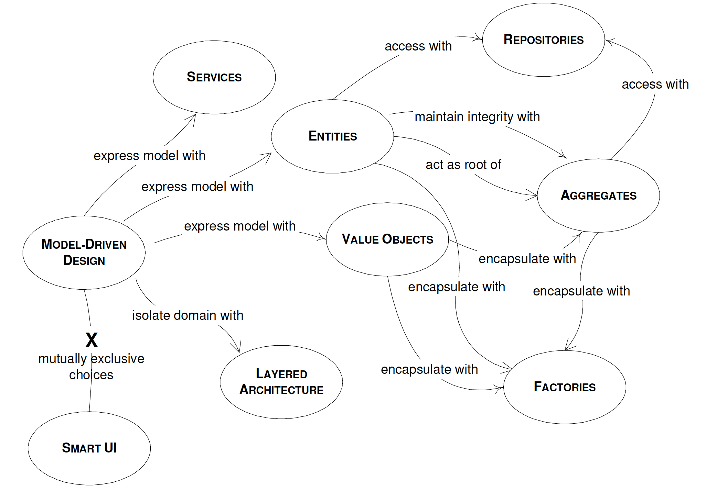

# Domain Driven Design Quickly
## 1. What Is Domain-Driven Design  
> When we begin a software project, we should focus on the domain it is operating in. The entire purpose of the software is to enhance a specific domain. To be able to do that, the software has to fit harmoniously with the domain it has been created for. Otherwise it will introduce strain into the domain, provoking malfunction, damage, and even wreak chaos.  

> The best way to do it is to make software a reflection of the domain. Software needs to incorporate the core concepts and elements of the domain, and to precisely realize the relationships between them. Software has to model the domain.  

> Software which does not have its roots planted deeply into the domain will not react well to change over time.  

> There are different approaches to software design.  
>- One is the waterfall design method. This method involves a number of stages. The business experts put up a set of requirements which are communicated to the business analysts. The analysts create a model based on those requirements, and pass the results to the developers, who start coding based on what they have received. It's a one way flow of knowledge. While this has been a traditional approach in software design, and has been used with a certain level of success over the years, it has flaws and limits. The main problem is that there is no feedback from the analysts to the business experts or from the developers to the analysts.  
>- Another approach is the Agile methodologies, such as Extreme Programming(XP). These mehodologies are a collective movement against the waterfall approach, resulting from the difficulties of trying to come up with all the requirements upfront, particularly in light of requirements change. It's really hard to create a complete model which covers all aspects of a domain upfront. It takes a lot of thinking, and often you just cann't see all the issue involved from the beginning, nor can you foresee some of the nagative side effects or mistakes of your design. Another problem Agile attempts to solve is the so called "analysis paralysis", with team members so afraid of making any design decisions that they make no progress at all. While Agile advocates recognize the imporance of design decision, they resist upfront design. Instead they employ a great deal of implementation flexibility, and through iterative development with continuous business stakeholder participation and a lot of refactoring, the development team gets to learn more about the customer domain and can better produce software that meets the customers needs.

## 2. The ubiquitous Language
### The Need for a Common Language
> A project faces serious problems when team members don't share a common language for discussing the domain. Domain experts use their jargon while technical team members have their own language tuned for discussing the domain in terms of design.  

### Creating the Ubiquitous Language
> We can use documents. One advisable way of communicating the model is to make some small diagrams each containing a subset of the model.

## 3. MODEL-DRIVEN DESIGN
> Any domain can be expressed with many models, and any model can be expressed in various ways in code. For each particular problem there can be more than one solution. It is important to choose a model which can be easily and accurately put into code.  

> Those who write the code should know the model very well, and should feel responsible for its integrity. They should realize that a change to the code implies a change to the model.  

> Any technical person contributing to the model must spend some time touching the code, whatever primary role he or she plays on the project. Anyone responsible for changing code must learn to express a model through the code. Every developer must be involved in some level of discussion about the model and have contact with domain experts. Those who contribute in different ways must consciously engage those who touch the code in a dynamic exchange of model ideas through the Ubiquitous Language.

> Design a portion of the software system to reflect the domain model in a very literal way, so that mapping is obvious.  

> Object-oriented programming is suitable for model implementation because they are both based on the same paradigm.

### The Building Blocks Of A Model-Driven Design

[domain-model](https://www.culttt.com/2014/11/12/domain-model-domain-driven-design)
>- Layered Architecture 
 
> Develop a design within each LAYER that is cohesive and that depends only on the layers below. Follow standard architectural patterns to provide loose coupling to the layers above. Concentrate all the code related to the domain model in one layer and isolate it from the user interface, application, and infrastructure code.  
>>- Presentation Layer  
>> Responsible for presenting information to the user and interpreting user commands.  
>>- Application Layer  
>> This is thin layer which coordinates the application activity. It does not contain business logic. It does not hold the state of the business objects, but it can hold the state of an application task progress.  
>> The application layer is a thin layer which stands between the user interface, the domain and the infrastructure.    
>>- Domain Layer  
>> This layer contains information about the domain. This is the heart of the business software. The state of business objects is held here. Persistence of the business objects and possibly their state is delegated to the infrastructure layer.  
>>- Infrastructure Layer  
>> This layer acts as a supporting library for all the other layers. It provides communication between layers, implements persistence for business objects, contains supporting libraries for the user interface layer, etc.  

> The domain layer should be focused on core domain issues. It should not be involved in infrastructure activities. The UI should neither be tightly connected to the business logic, nor to the tasks which normally belong to the infrastructure layer. An application layer is necessary in many cases. There has to be a manager over the business logic which supervises and coordinates the overall activity of the application.  

>- Entities  
> For these objects it is not the attributes which matter, but a thread of continuity and identify, which spans the life of a system and can extend beyond it. Such objects are called entities.  
> Implementing entities in software means creating identity.  

>- Value Objects  
> There are cases when we need to contain some attributes of a domain element. We are not interested in which object it is, but what attributes it has. An object that is used to describe certain aspects of a domain, and which does not have identity, is named Value Object.  
> It is highly recommended that value objects be immutable. They are created with a constructor, and never modified during their life time. When you want a different value for the object, you simply create another one. This has important consequences for the design. Being immutable, and having no identity, Value Objects can be shared. That can be imperative for some designs.  
> If Value Objects are sharable, they should be immutable. Value Objects should be kept thin and simple. When a Value Object is needed by another party, it can be simply passed by value, or a copy of it can be created and given. Making a copy of a Value Object is simple, and usually without any consequences. If there is no identity, you can make as many copies as you wish, and destroy all of them when necessary.

[Entity vs Value Object](https://enterprisecraftsmanship.com/posts/entity-vs-value-object-the-ultimate-list-of-differences/)

>- Service  
> Such an object does not have an internal state, and its purpose is to simply provide functionality for the domain.  
> A Service can group related functionality which serves the Entities and the Value Objects.  
> A high degree of coupling between many objects is a sign of poor design because it makes the code difficult to read and understand, and more importantly, it makes it difficult to change.  
> A Service should not replace the operation which normally belongs on domain objects. But when such an operation stands out as an important concept in the domain, a Service should be created for it.  
> Make the Service is stateless.  
> Both application and domain Services are usually built on top of domain Entities and Values providing required functionality directly related to those objects.  

>- Modules  
> Modules are used as a method of organizing related concepts and tasks in order to reduce complexity.  
> Communicational cohesion is achieved when parts of the module operate on the same data. The functional cohesion is achieved when all parts of the module work together to perform a well-defined task.  

> Aggregate is a domain pattern used to define object ownership and boundaries. Factories and Repositories are two design patterns which help us deal with object creation and storage.  

>- Aggregates     
> An Aggregate is a group of associated objects which are considered as one unit with regard to data changes. The Aggregate is demarcated by a boundary which separates the objects inside from those outside. Each Aggregate has one root. The root is an Entity, and it is the only object accessible from outside. The root can hold references to any of the aggregate objects, and the other objects can hold references to each other, but an outside object can hold references only to the root object.  
> Since other objects can hold references only to the root, it means that they cannot directly change the other objects in the aggregate. All they can do is to change the root, or ask the root to perform some actions.  
> Object inside an Aggregate should be allowed to hold references to roots of other Aggregates.  

>- Factories  
> Factories are used to encapsulate the knowledge necessary for object creation, and they are especially useful to create Aggregates. When the root of the Aggregate is created, all the objects contained by the Aggregate are created along with it, and all the invariants are enforced.  
> Entity Factories and Value Object Factories are different. Values are usually immutable objects, and all the necessary attributes need to be produced at the time of creation. When the object is created, it has to be valid and final. It won't change. Entities are not immutable. They can be changed later, by setting some of the attributes with the mention that all invariants need to be respected. Another difference comes from the fact that Entities need identity, while Value Objects do not.  
> The Factory is concerned with the creation of objects.  

>- Repositories  
> Use a Repository, the purpose of which is to encapsulate all the logic needed to obtain object references. The domain objects won't have to deal with the infrastructure to get the needed references to other objects of the domain. They will just get them from the Repository and the model is regaining its clarity and focus.  
> Domain model is decoupled from the need of storing objects or their references, and accessing the underlying persistence infrastructure.  
> Keep the client focused on the model, delegating all object storage and access to the Repository.  
> The Repository takes care of already existing objects.  
> Factories are "pure domain", but Repositories can contain links to the infrastructure, e.g. the datebase.  

## 4. Refactoring Toward Deeper Insight

