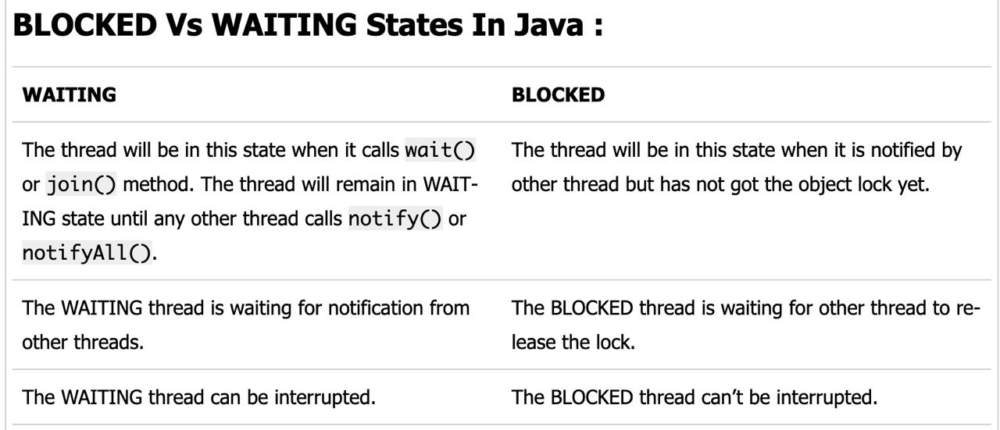
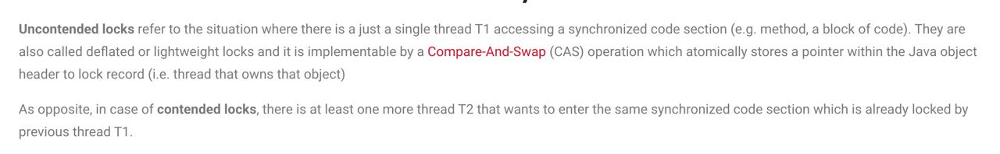
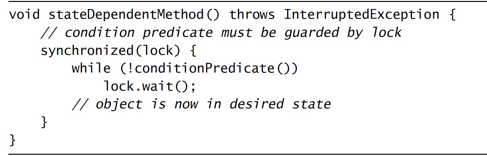

# Java Concurrency in Practice
- [race condition vs data race](https://blog.regehr.org/archives/490)

- Safe Publishing a Object
> To publish an object safely, both the reference to the object and the object’s state must be made visible to other threads at the same time. A properly constructed object can be safely published by:
• Initializing an object reference from a static initializer;
• Storing a reference to it into a volatile field or AtomicReference;
• Storing a reference to it into a final field of a properly constructed
object; or
• Storing a reference to it into a field that is properly guarded by a
lock.

- Using And Sharing Objects In A Concurrent Program  
> The most useful policies for using and sharing objects in a concurrent
program are:
Thread-confined. A thread-confined object is owned exclusively by and confined to one thread, and can be modified by its owning thread.
Shared read-only. A shared read-only object can be accessed concurrently by multiple threads without additional synchronization, but cannot be modified by any thread. Shared read-only objects include immutable and effectively immutable objects.
Shared thread-safe. A thread-safe object performs synchronization internally, so multiple threads can freely access it through its public interface without further synchronization.
Guarded. A guarded object can be accessed only with a specific lock held. Guarded objects include those that are encapsulated within other thread-safe objects and published objects that are known to be guarded by a specific lock.

- Deep Copy
```
private static Map<String, MutablePoint> deepCopy(Map<String, MutablePoint> m) {              
    Map<String, MutablePoint> result = new HashMap<String, MutablePoint>();
    for (String id : m.keySet())
        result.put(id, new MutablePoint(m.get(id)));
    return Collections.unmodifiableMap(result);
}
```

- Lock
```
@NotThreadSafe
class BadListHelper <E> {
    **public** List<E> list = Collections.synchronizedList(new ArrayList<E>());

    public synchronized boolean putIfAbsent(E x) {
        boolean absent = !list.contains(x);
        if (absent)
            list.add(x);
        return absent;
    }
}

@ThreadSafe
class GoodListHelper <E> {
    public List<E> list = Collections.synchronizedList(new ArrayList<E>());

    public boolean putIfAbsent(E x) {
        synchronized (list) {
            boolean absent = !list.contains(x);
            if (absent)
                list.add(x);
            return absent;
        }
    }
}
```
> The problem is that it synchronizes on the wrong lock. Whatever lock the List uses to guard its state, it sure isn’t the lock on the ListHelper. ListHelper provides only the illusion of synchronization; the various list operations, while all synchronized, use different locks, which means that putIfAbsent is not atomic relative to other operations on the List. So there is no guarantee that another thread won’t modify the list while putIfAbsent is executing.

- [Copy on Write](https://www.geeksforgeeks.org/copy-on-write/)

- [Fail-Fast And Fail-Safe Iterators](https://dzone.com/articles/a-tale-of-two-iterators)

- Blocked Vs Waiting States


- Cache implemented by FutureTask (Lazy)
```
public class Memoizer <A, V> implements Computable<A, V> {
    private final ConcurrentMap<A, Future<V>> cache
            = new ConcurrentHashMap<A, Future<V>>();
    private final Computable<A, V> c;

    public Memoizer(Computable<A, V> c) {
        this.c = c;
    }

    public V compute(final A arg) throws InterruptedException {
        while (true) {
            Future<V> f = cache.get(arg);
            if (f == null) {
                Callable<V> eval = new Callable<V>() {
                    public V call() throws InterruptedException {
                        return c.compute(arg);
                    }
                };
                FutureTask<V> ft = new FutureTask<V>(eval);
                f = cache.putIfAbsent(arg, ft);
                if (f == null) {
                    f = ft;
                    ft.run();
                }
            }
            try {
                return f.get();
            } catch (CancellationException e) {
                cache.remove(arg, f);
            } catch (ExecutionException e) {
                throw LaunderThrowable.launderThrowable(e.getCause());
            }
        }
    }
}
```

- Interrupted Status
> Thread.sleep()
InterruptedException - if any thread has interrupted the current thread. The interrupted status of the current thread is cleared when this exception is thrown.
> Object.wait()
InterruptedException - if any thread interrupted the current thread before or while the current thread was waiting for a notification. The interrupted status of the current thread is cleared when this exception is thrown.

- Uncontended Lock VS Contend Lock


- Lock Condition
> As careful design would have it, take already holds that lock, which it needed to test the condition predicate (and if the condition predicate was true, to modify the buffer state in the same atomic operation). The wait method releases the lock, blocks the current thread, and waits until the specified timeout expires, the thread is interrupted, or the thread is awakened by a notification. After the thread wakes up, wait reacquires the lock before returning. A thread waking up from wait gets no special priority in reacquiring the lock; it contends for the lock just like any other thread attempting to enter a synchronized block.
> When using condition waits (Object.wait or Condition.await):
• Always have a condition predicate—some test of object state that must hold before proceeding;
• Always test the condition predicate before calling wait, and again after returning from wait;
• Always call wait in a loop;
• Ensure that the state variables making up the condition predicate are guarded by the lock associated with the condition queue;
• Hold the lock associated with the the condition queue when calling wait, notify, or notifyAll; and
• Do not release the lock after checking the condition predicate but before acting on it.


- Notify / NotifyAll
> There are two notification methods in the condition queue API—notify and notifyAll. To call either, you must hold the lock associated with the condition queue object. Calling notify causes the JVM to select one thread waiting on that condition queue to wake up; calling notifyAll wakes up all the threads waiting on that condition queue. Because you must hold the lock on the condition queue object when calling notify or notifyAll, and waiting threads cannot return from wait without reacquiring the lock, the notifying thread should release the lock quickly to ensure that the waiting threads are unblocked as soon as possible. Because multiple threads could be waiting on the same condition queue for different condition predicates, using notify instead of notifyAll can be dangerous, primarily because single notification is prone to a problem akin to missed signals.
> Single notify can be used instead of notifyAll only when both of the following conditions hold: Uniform waiters. Only one condition predicate is associated with the condition queue, and each thread executes the same logic upon returning from wait; and One-in, one-out. A notification on the condition variable enables at most one thread to proceed.

- [Blocking Non-blocking Synchronous Asynchronous](https://stackoverflow.com/questions/8416874/whats-the-differences-between-blocking-with-synchronous-nonblocking-and-asynch)
> Blocking - operation are said to have blocking behavior if it waits for some event to get complete. For example: if a lock is not available a thread may enter a wait state on event till lock is available. Such an operation is said to be blocking.
> Synchronous - Synchronous call can be easily understood with an example of http protocol where client waits for reply from server an then proceeds. Synchronous call can be blocking or non blocking.
> Asynchronous - A method can asynchronous call other method. After a call it can continue to execute its next instruction. When called method completes it execution it will send an reply/callback to caller method of it's success or failure.
> Non-blocking - Non blocking behavior is like checking the condition at that instance. For example- in case of locks if it is not available it will not wait till it is available like blocking operation. Also we need to repeatedly check the availability of locks as there will be no callback like asynchronous calls.

> Summary: Blocking is always synchronous.
> Synchronous call have blocking operations if it waits for some event to get complete, caller method may enter wait state.
> Synchronous call is non blocking, if it repeatedly check for some event to occur before proceeding for next instruction. Caller method does not enter wait state on some event to complete.
> Asynchronous call cannot be blocking and it involves callback from called method which needs to handle.

- Init Safe
> Initialization safety makes visibility guarantees only for the values that are reachable through final fields as of the time the constructor finishes. For values reachable through nonfinal fields, or values that may change after construction, you must use synchronization to ensure visibility.

- Classes
    1. Lock 
    -> ReentrantLock
    -> ReentrantReadWriteLock
    -> StampedLock
    2. ExecutorService、CompletionService
    3. Synchronized *HashMap* = *ConcurrentHashMap*  
    Synchronized *SortedMap* -> Synchronized *TreeMap* = *ConcurrentSkipListMap*  
    Synchronized *SortedSet* -> Synchronized *TreeSet* = *ConcurrentSkipListSet*  
    Synchronized *List* -> Synchronized *ArrayList* = *CopyOnWriteArrayList*  
    Synchronized *Set* = *CopyOnWriteArraySet* implemented by *CopyOnWriteArrayList*
    4. CountDownLatch、CyclicBarrier、Exchanger、Semaphore
    5. The FutureTask implements RunnableFuture
    
```
     public <T> Future<T> submit(Runnable task, T result) {
        if (task == null) throw new NullPointerException();
        RunnableFuture<T> ftask = newTaskFor(task, result);
        execute(ftask);
        return ftask;
    }

    protected <T> RunnableFuture<T> newTaskFor(Runnable runnable, T value) {
        return new FutureTask<T>(runnable, value);
    }

    public <T> Future<T> submit(Callable<T> task) {
        if (task == null) throw new NullPointerException();
        RunnableFuture<T> ftask = newTaskFor(task);
        execute(ftask);
        return ftask;
    }

    protected <T> RunnableFuture<T> newTaskFor(Callable<T> callable) {
        return new FutureTask<T>(callable);
    }
```

> For the purposes of the Java programming language memory model, a single write to a non-volatile long or double is treated as two separate writes: one to each 32-bit half. This can result in a situation where a thread sees the first 32 bits of a 64-bit value from one write, and the second 32 bits from another write.  
> Write and reads of volatile long and double values are always atomic.  
> Writes to and reads of references are always atomic, regardless of whether they are implemented as 32-bit or 64-bit values.  
[Non-Atomic Treatment of double and long](https://docs.oracle.com/javase/specs/jls/se18/html/jls-17.html)