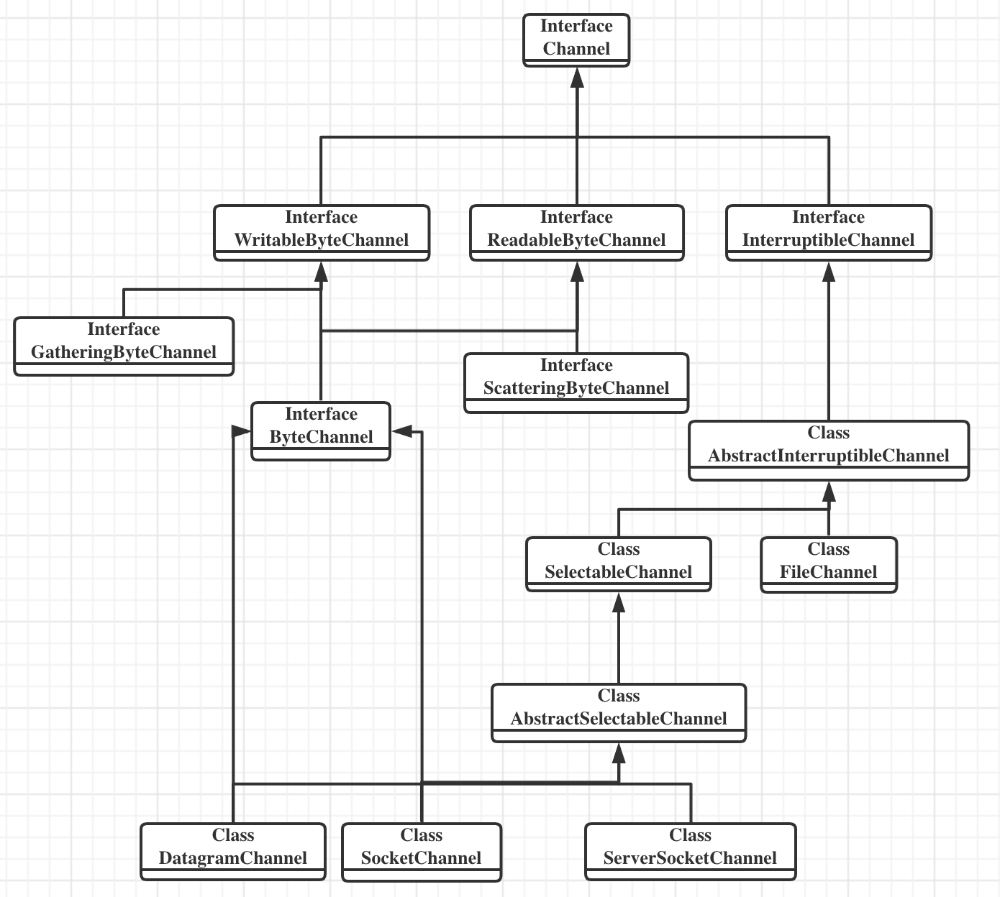

# Java NIO

## Chapter 1. Introduction

### 1.1 I/O Versus CPU Time
> Programmers love to tune their code, but I/O performance tuning is often an afterthought, or is ignored entirely. It's a shame, because even small investment in improving I/O performance can yield substantial dividends.

### 1.4 I/O Concepts

[Java NIO vs. IO](http://tutorials.jenkov.com/java-nio/nio-vs-io.html)

#### 1.4.1 Buffer Handling
> Buffers, and how buffers are handled, are the basis of all I/O. The very term "input/output" means nothing more than moving data in and out of buffers.

> The image shows a simplified logical diagram of how block data moves from an external source, such as a disk, to a memory area inside a running process. The process requests that its buffer be filled by making the *read()* system call. This results in the kernel issuing a command to the disk controller hardware to fetch the data from disk. The disk controller writes the data directly into a kernel memory buffer by DMA without further assistance from the main CPU. Once the disk controller finishes filling the buffer, the kernel copies the data from the temporary buffer in kernel space to the buffer speicified by the process when it requested the *read()* operation.

> User space is where regular processes live. The JVM is a regular process and dwells in user space. User space is a nonprivileged area: code executing there cannot directly access hareware devices, for example. Kernel space is where the operating system lives. Kernel code has special privileges: it can communicate with device controllers, manipulate the state of processes in user space, etc. Most importantly, all I/O flows through kernel space, either directly or indirectly.

#### 1.4.2 Virtual Memory
> Operating system divide their memory address space into pages, which are fixed-size groups of bytes.

[whats-the-difference-between-virtual-memory-and-swap-space](https://stackoverflow.com/questions/4970421/whats-the-difference-between-virtual-memory-and-swap-space) 

#### 1.4.4 File I/O
> File I/O occurs within the context of a filesystem. A filesystem is a very different thing from a disk. Disks store data in sectors, which are usually 512 bytes each. They are hardware devices that know nothing about the semantics of files. They simply provide a number of slots where data can be stored. In this respect, the sectors of a disk are simliar to memory pages; all are of uniform size and are addressable as a large array.
> A filesystem is a higher level of abstraction. Filesystem are a particular method of arranging and interpreting data stored on a disk. The code you write almost always interacts with a filesystem, not with the disks directly. It is the filesystem that defines the abstractions of filenames, paths, files, file attributes, etc.

[The Linux Filesystem Explained](https://www.linux.com/training-tutorials/linux-filesystem-explained/)

##### 1.4.4.1 Memory-mapped files
> Virtual memory and disk I/O are intimately linked and, in many respects, are simply two aspects of the same thing. Keep this in mind when handling large amounts of data. Most operating system are far more efficient when handling data buffers that are page-aligned and are mutiples of the native page size.

## Chapter 2. Buffer
The Buffer family tree


### 2.1 Buffer Basics
Buffers are not safe for use by mutiple concurrent threads. If a buffer is to be used by more than one thread then access to the buffer should be controlled by appropriate synchronization.

#### 2.1.1 Attributes
The meaning of position and limit depends on whether the *Buffer* is in read or write mode. Capacity always means the same, no matter the buffer mode.
[Capacity-Position-Limit](http://tutorials.jenkov.com/java-nio/buffers.html#capacity-position-limit)   

#### 2.1.4 Filling
> Remember in Java, characters are represented internally in Unicode,and each Unicode character occupies 16 bits.

#### 2.1.5 Flipping
> We need to set the limit to the current position, then reset the position to 0.
```
public Buffer flip() {
    limit = position;
    position = 0;
    mark = -1;
    return this;
}
```
Flip is used to flip the *ByteBuffer* from "reading from I/O"(put) to "writing to I/O"(get).
[what-is-the-purpose-of-bytebuffers-flip-method-and-why-is-it-called-flip](https://stackoverflow.com/questions/14792968/what-is-the-purpose-of-bytebuffers-flip-method-and-why-is-it-called-flip)
> The *rewind()* method is similar to *flip()* but does not affect the limit. It only sets the position back to 0. You can use *rewind()* to go back and reread the data in a buffer that has already been flipped.

> What if you flip a buffer twice? It effectively becomes zero-sized. Apply the same steps to the buffer; set the limit to the position and the position to 0. Both the limit and position become 0. 

#### 2.1.6 Draining
> Once a buffer has been filled and drained, it can be reused. The *clear()* method resets a  buffer to an empty state. It doesn't change any of the data elements of the buffer but simply sets the limit to the capacity and the position back to 0.

#### 2.1.7 Compacting
[clear vs compact](http://tutorials.jenkov.com/java-nio/buffers.html#clear)
```
public IntBuffer compact() {
    System.arraycopy(hb, ix(position()), hb, ix(0), remaining());
    position(remaining());
    limit(capacity());
    discardMark();
    return this;
}

public Buffer clear() {
    position = 0;
    limit = capacity;
    mark = -1;
    return this;
}
```

#### 2.1.8 Marking
> Some buffer methods will discard the mark if one is set(*rewind(),clear(),flip()* always discard the mark). Calling the versions of *limit()* or *position()* that take index arguments will discard the mark if the new value being set is less than the current mark.

#### 2.1.9 Comparing
> - Both objects are the same type. *Buffers* containing different data types are never equal, and no *Buffer* is ever equal to a non-*Buffer* object.
> - Both buffers have the same number of remaining elements. The buffer capacities need not be the same, and the indexes of the data remaining in the buffers need not to be same. But the count of elements remaining(from position to limit) in each buffer must be the same.
> - The sequence of remaining data elements, which would be returned from *get()*, must be identical in each buffer.

#### 2.1.10 Bulk Moves
> buffer.get(myArray); is equivalent to buffer.get(myArray,0,myArray.length); 
> If the number of elements you ask for cannot be transferred, no data is transferred, the buffer state is left unchanged, and a *BufferUnderflowException* is thrown. So when you pass in an array and don't specify the length, you're asking for the entire array to be filled. If the buffer doesn't contain at least enough elements to completely fill the array, you'll get an exception. This means that if you want to transfer a small buffer into a large array, you need to explicitly specify the length of the data remaining in the Buffer.
> ```
> char[] bigArray = new char[1000];
> int length = buffer.remaining();
> buffer.get(bigArray,0,length);
> 
> char[] smallArray = new char[10];
> while(buffer.hasRemaining()){
>     int length = Math.min(buffer.remaining(),smallArray.length);
>     buffer.get(smallArray,0,length);
> }
> ```

> buffer.put(myArray); is equivalent to buffer.put(myArray,0,myArray.length);
> If the buffer has room to accept the data in the array(*buffer.remaining() >= myArray.length*), the data will be copied into the buffer starting at the current position, and the buffer position will be advanced by the number of data elements added. If there is no sufficient room in the buffer, no data will be transferred into, and a *BufferOverflowException* will be thrown.

### 2.2 Creating Buffers
> If you want to provide your own array to be used as the buffer's backing store, call the *wrap()* method:
> ```
> char[] myArray = new char[100];
> CharBuffer charBuffer = CharBuffer.wrap(myArray);
> ```
> This constructs a new buffer object, but the data elements will live in the array. This implies that changes made to the buffer by invoking *put()* will be reflected in the array, and any changes made directly to the array will be visible to the buffer object.

> Doing this:
> ```
> CharBuffer charBuffer = CharBuffer.wrap(myArray,12,42); 
> ```
> create a CharBuffer with a position of 12, a limit of 54, and a capacity of myArray.length. This method does not, as you might expect, create a buffer that occupies only a subrange of the array. The buffer will have access to the full extent of the array; the offset and length arguments only set the initial state.

> Buffers created by either *allocate()* or *wrap()* are always nondirect. Nondirect buffers have backing arrays.

### 2.3 Duplicating Buffers
> Slicing a buffer is similar to duplicating, but *slice()* creates a new buffer that starts at the original buffer's current position and whose capacity is the number of elements remaining in the original buffer.

*slice()* and *duplicate()* have the same backing array with original buffer.

### 2.4 Byte Buffers
> When moving data between the JVM and the operating system, it's necessary to break down the other data types into their constituent bytes.

#### 2.4.1 Byte Ordering
> The way multibyte numeric values are stored in memory is commonly referred to as *endian-ness*. If the numerically most-significant byte of the number, the *big end*, is at the lower address, then the system is *big-endian*. If the least-significant byte come first, it's *little-endian*.

> The IPs define a notion of network byte order, which is big-endian. All multibyte numeric values used within the protocol portions of IP packets must be converted between the local *host byte order* and the common network byte order.
> ```
> //java.nio.ByteBuffer
> boolean nativeByteOrder = (ByteOrder.nativeOrder() == ByteOrder.BIG_ENDIAN);
> ```

> *Bytebuffer* objects posses a host of convenience mehods for getting and putting the buffer content as other primitive data types. The way these methods encode or decode the bytes is dependent on the *ByteBuffer*'s current byte-order setting.

#### 2.4.2 Direct Buffers
> The most significant way in which byte buffers are distinguished from other buffer types is that they can be the source and/or targets of I/O performed by *Channel*.

> Direct buffers are optimal for I/O, but they may be more expensive to create than nondirect byte buffers. The memory used by direct buffers is allocated by calling through to native, operating system-specific code, bypassing the standard JVM heap. Setting up and tearing down direct buffers could be significantly more expensive than heap-resident buffers, depending on the host operating system and JVM implementation. The memory-storage areas of direct buffers are not subject to garbage collection because they are outside the standard JVM heap.

> While *ByteBuffer* is the only type that can be allocated as direct, *isDirect()* could be true for nonbyte view buffers if the underlying buffer is a direct *ByteBuffer*.

#### 2.4.3 View Buffers
> View buffers are created by a factory method on an existing buffer object instance. The view object maintains its own attribute, capacity, position, limit, and mark, but shares data elements with the original buffer. 

Endianess has no meaning for a byte[]. Endianess only matter for multi-byte data types like short, int, long, float, or double.
[how-write-big-endian-bytebuffer-to-little-endian-in-java](https://stackoverflow.com/questions/14496893/how-write-big-endian-bytebuffer-to-little-endian-in-java)

> Whenever a view buffer accesses the underlying bytes of a *Bytebuffer*, the bytes are packed to compose a data element according to the view buffer's byte-order setting. When a view buffer is created, it inherits the byte-order setting of the underlying *ByteBuffer* at the time the view is created. The byte-order setting of the view cannot be changed later.
> A CharBuffer view of a ByteBuffer
> 
> 

> 
> This code:
> ```
> int value = buffer.getInt();
> ```
> would return an int value composed of the byte values in locations 1-4 of the buffer. The actual value returned would depend on the current *ByteOrder* setting of the buffer. To be more specific:
> ```
> int value = buffer.order(ByteOrder.BIG_ENDIAN).getInt();
> ```
> returns the numeric value 0x3BC5315E, while:
> ```
> int value = buffer.order(ByteOrder.LITTLE_ENDIAN).getInt();
> ```
> returns the value 0x5E31C53B.

> If the primitive data type you're trying to get requires more bytes than what remains in the buffer, a *BufferUnderflowException* will be thrown. 
> The put methods perform the inverse operation of the gets. Primitive data values will be broken into bytes according to the byte order of the buffer and stored. If insufficient space is available to store all the bytes, a *BufferOverflowException* will be thrown.

## Chatper 3. Channels
The channel family tree


### 3.1 Channel Basics

#### 3.1.1 Opening Channels
> Channels can be created in serveral ways. The socket channels have factory methods to create new socket channels directly. But a *FileChannel* object can be obtained only by calling the *getChannel()* method on an open *RandomAccessFile*, *FileInputStream*, or *FileOutputStream* object. You cannot create a *FileChannel* object directly.
> ```
> SocketChannel sc = SocketChannel.open();
> sc.connect(new InetSocketAddress("somehost"),someport);
>
> ServerSocketChannel ssc = ServerSocketChannel.open();
> ssc.socket().bind(new InetSocketAddress(somelocalport));
> 
> DatagramChannel dc = DatagramChannel.open();
> 
> RandomAccessFile raf = new RandomAccessFile("somefile","r");
> FileChannel fc = raf.getChannel();
> ```

> Channels can be *unidirectional* or *bidirectional*. A given channel class might implement *ReadableByteChannel*, which defines the *read()* method. Another might implement *WritableByteChannel* to provide *write()*. A class implementing one or the other of these interface is unidirectional: it can transfer data in only one direction. If a class implements both interfaces, it is bidirectional and can transfer data in both directions.
> 

#### 3.1.2 Using Channels
> Channels can operate in *blocking* or *nonblocking* modes. A channel in nonblocking mode never puts the invoking thread to sleep. The requested operation either completes immediately or returns a result indicating that nothing was done. Such as sockets and pipes, can be placed in nonblocking mode.

Java IO is a stream-oriented package which means that it can be read one or more bytes at a time from a stream. It uses a stream for transferring the data between data source/sink and java program. It is a unidirectional data transfer.

Java NIO is a buffer-oriented package. This means that the data is read into a buffer from which it is further processed using a channel. NIO is a bidirectional data transfer.

[difference-between-java-io-and-java-nio](https://www.geeksforgeeks.org/difference-between-java-io-and-java-nio/)

#### 3.1.3 Closing Channels
> Unlike buffers, channels cannot be reused. An open channel represents a specific connection to a specific I/O service and encapsulates the state of that connection. When a channel is closed, that connection is lost, and the channel is no longer connected to anything.

> Calling a channel's *close()* method might cause the thread to block briefly while the channel finalizes the closing of the underlying I/O service, even if the channel is in nonblocking mode. Blocking behavior when a channel is closed, if any, is highly operating system- and filesystem-dependent. It's harmless to call *close()* on a channel multiple times, but if the first thread has blocked in *close()*, any additional threads calling *close()* block until the first thread has completed closing the channel. Subsequent calls to *close()* on the closed channel do nothing and return immediately.

### 3.2 Scatter/Gather
> Data is gathered from each of the buffers referenced by the array of buffers and assembled into a stream of bytes that are sent down the channel.
> 

> Data arriving on the channel is scattered to the list of buffers, filling each in turn from its position to its limit. The position and limit values shown here are *before* the read operation commenced.
> 

> The version of *read()* and *write()* that take offset and length arguments provide a way to use subsets of the buffers in an array of buffers. The offset value in this case refers to which buffer to begin using, not an offset into the data. The length argument indicates the number of buffers to use. For example, if we have a five-element array named fiveBuffers that has already been initialized with references to five buffers, the following code would write the content of the second, third, and fourth buffers:
> ```
> int bytesRead = channel.write(fiveBuffers,1,3);
> ```

### 3.3 File Channels
> File channel are alway blocking and cannot be placed into nonblocking mode.

Regular files are always readable and they are also always writable. This is clearly stated in the relevant POSIX specification. I cann't stress this enough. Putting a regular file in non-blocking has ABSOLUTELY no effects other than changing one bit in the file flags.
[Non-blocking I/O with regular files](https://www.remlab.net/op/nonblock.shtml)

> Calling the *getChannel()* method returns a *FileChannel* object connected to the same file, with the same access permissions as the file object.

> FileChannel objects are thread-safe. Multiple threads can concurrently call methods on the same instance without causing any problems, but not all operations are multithreaded. Threads attempting one of these operations will wait if another thread is already executing an operation that affects the channel position or file size. Concurrency behavior can also be affected by the underlying operating system or filesystem.

> The *FileChannel* class guarantees that all instances within the same JVM will see a consistent view of a given file. But the JVM cannot make guarantee about factors beyond its control. The view of a file seen through a *FileChannel* instance may or may not be consistent with the view of that file seen by an external, non-java processes. The semantics of concurrent file access by multiple processes is hightly dependent on the underlying operating system and/or filesystem.

#### 3.3.1 Accessing Files
> For comparison, image below lists the correspondences of *FileChannel*, *RandomAccessFile*, and POSIX I/O system calls.
> 