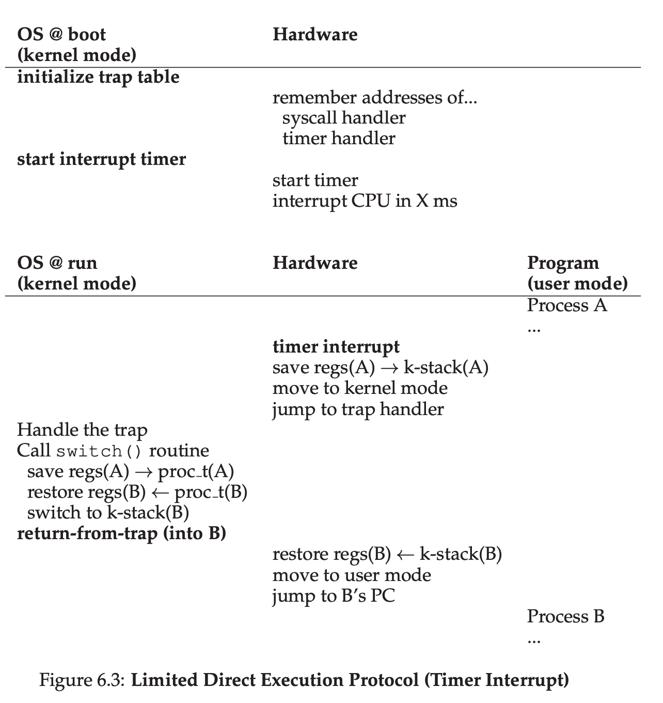
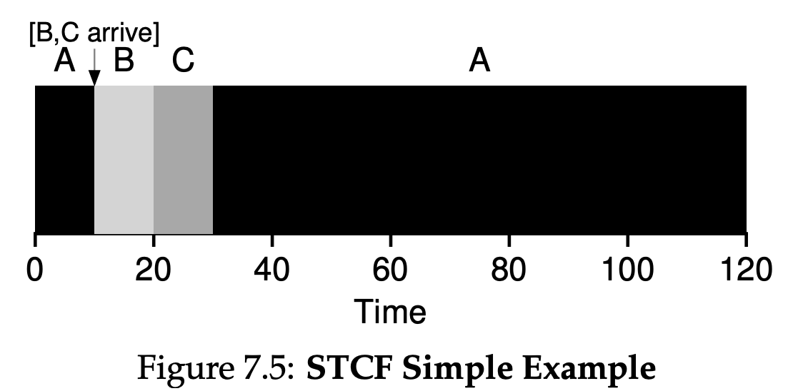
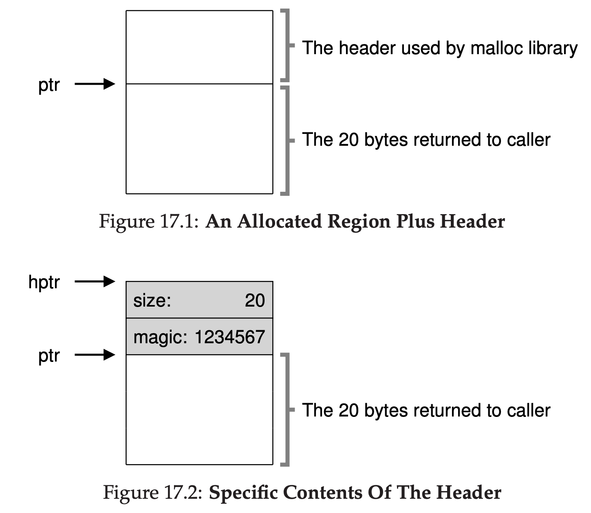

# [OPERATING SYSTEMS](https://pages.cs.wisc.edu/~remzi/OSTEP/)

## Intro

### 2 Introduction
> The primary way the OS does this is through a general technique that we call virtualization. That is, the OS takes a physical resource(such as the processor, or memory, or a disk) and transfroms it into a more general, powerful, and easy-to-use virtual form of itself. Thus, we sometimes refer to the operating system as a virtual machine.

> The OS provides some interface(APIS) that you can call. A typical OS, in fact, exports a few hundred system calls that are available to applications. The OS provides a standard library to applications.

#### 2.1 Virtualizing The CPU
> Turning a single CPU(or a small set of them) into a seemingly infinite number of CPUs and thus allowing many programs to seemingly run at once is what we call virtualizing the CPU.

#### 2.2 Virtualizing Memory
> Each process accesses its own private virtual address space(sometimes just called its address space), which the OS somehow maps onto the physical memory of the machine.

#### 2.3 Concurrency
> We use concurrency to refer a host of problems that arise, and must be addressed, when working on many things at once in the same program.

#### 2.4 Persistence
> The software in the operating system that usually manages the disk is called the file system; it is thus responsible for storing any files the user creates in a reliable and efficient manner on the disk of the system.

> Unlike the abstraction provided by the OS for the CPU and memory, the OS does not create a private, virtualized disk for each application. Rather, it is assumed that often times, users will want to share information that is in files.

## Virutalization

### 4 Processes

#### 4.3 Process Creation: A little More Detail
> The first thing that the OS must do to run a program is to load its code and any static data into memory, into the address space of the proces.

> A process can be in one of three status:
> - Running: In the running state, a process is running on a processor. This means it is executing instructions.
> - Ready: In the ready state, a process is ready to run but for some reason the OS has chosen not to run it at this given moment.
> - Blocked: In the blocked state, a process has performed some kind of operation that makes it not ready to run until some other event take place. A common example: when a process initiates an I/O request to a disk, it becomes blocked and thus some other process can use the processor.

> Being moved from ready to running means the process has been scheduled; being moved from running to ready means the process has been descheduled. Once a process has become blocked(e.g., by initating an I/O operation), the OS will keep it as such util some event occurs(e.g., I/O completion); at that point, the process moves to the ready state again(and potentially immediately to running again, if the OS so decides).

### 5 Process API

#### 5.3 Finally, The exec() System call
> ```
> p3.c
> #include <stdio.h>
> #include <stdlib.h>
> #include <unistd.h>
> #include <string.h>
> #include <sys/wait.h>
> 
> int
> main(int argc, char *argv[])
> {
>     printf("hello world (pid:%d)\n", (int) getpid());
>     int rc = fork();
>     if (rc < 0) {
>         // fork failed; exit
>         fprintf(stderr, "fork failed\n");
>         exit(1);
>     } else if (rc == 0) {
>         // child (new process)
>         printf("hello, I am child (pid:%d)\n", (int) getpid());
>         char *myargs[3];
>         myargs[0] = strdup("wc");   // program: "wc" (word count)
>         myargs[1] = strdup("p3.c"); // argument: file to count
>         myargs[2] = NULL;           // marks end of array
>         execvp(myargs[0], myargs);  // runs word count
>         printf("this shouldn't print out");
>     } else {
>         // parent goes down this path (original process)
>         int wc = wait(NULL);
>         printf("hello, I am parent of %d (wc:%d) (pid:%d)\n",
> 	       rc, wc, (int) getpid());
>     }
>     return 0;
> }
> ```
> The code above is the same as "*ws p3.c*"

#### 5.4 Why? Motivating The API
> The Shell shows you a prompt and then waits for you to type something into it. You then type a command into it; in most cases, the shell then figures out where in the file system the executable resides, calls fork() to create a new child process to run the command, calls some variant of exec() to run the command, and then waits for the command to complete by calling wait(). When the child completes, the shell returns from wait() and prints out a prompt again, ready for your next command.

> ```
> p4.c
> #include <stdio.h>
> #include <stdlib.h>
> #include <unistd.h>
> #include <string.h>
> #include <fcntl.h>
> #include <assert.h>
> #include <sys/wait.h>
> 
> int
> main(int argc, char *argv[])
> {
>     int rc = fork();
>     if (rc < 0) {
>         // fork failed; exit
>         fprintf(stderr, "fork failed\n");
>         exit(1);
>     } else if (rc == 0) {
> 	// child: redirect standard output to a file
> 	close(STDOUT_FILENO); 
> 	open("./p4.output", O_CREAT|O_WRONLY|O_TRUNC, S_IRWXU);
> 
> 	// now exec "wc"...
>         char *myargs[3];
>         myargs[0] = strdup("wc");   // program: "wc" (word count)
>         myargs[1] = strdup("p4.c"); // argument: file to count
>         myargs[2] = NULL;           // marks end of array
>         execvp(myargs[0], myargs);  // runs word count
>     } else {
>         // parent goes down this path (original process)
>         int wc = wait(NULL);
> 	assert(wc >= 0);
>     }
>     return 0;
> }
> ```
> The code above is the same as '*wc p4.c > p4.output*'

### 6 Direct Execution
[os-trap-vs-interrupt](https://www.baeldung.com/cs/os-trap-vs-interrupt)
#### 6.1 Basic Technique: Limited Direct Execution
> Without limits on running programs, the OS wouldn't be in control of anything and thus would be "just a library" -- a very sad state of affairs for an aspiring operating system!

#### 6.2 Problem #1: Restricted Operations
> The hardware assists the OS by providing different modes of execution. In user mode, applications do not have full access to hardware resources. In kernel mode, the OS has access to the full resources of the machine. 

[What is the difference between Trap and Interrupt?](https://stackoverflow.com/questions/3149175/what-is-the-difference-between-trap-and-interrupt)

> To execute a system call, a program must execute a special trap instruction. This  instruction simultaneously jumps into the kernel and raises the privilege level to kernel mode; once in the kernel, the system can now perform whatever privileged operations are needed(if allowed), and thus do the required work for the calling process. When finished, the OS calls a special return-from-trap instruction, which,  as you might expect, returns into the calling user program while simultaneously reducing the privilege level back to user mode.

> 
> There are two phases in the limited direct execution(LDE) protocol. In the first(at boot time), the kernel initializes the trap table,  and the CPU remembers its location for subsequent use. The kernel does so via a priviledged instruction(all priviledged are highlighted in bold). In the second(when running a process), the kernel sets up a few things(e.g., allocating a node on the process list, allocating memory) before using a return-from-trap instruction to start the exeuction of the process; this switches the CPU to user mode and begins running the process. When the process wishes to issue a system call, it traps back into the OS, which handles it and once again returns control via a return-from-trap to the process. The process then completes its work, and returns from main(); this usually will return into some stub code which will properly exit the program(say, by calling the exit() system call, which traps into the OS). At this point, the OS cleans up and we are done.

#### 6.3 Problem #2: Switching Between Process
> A timer device can be programmed to raise an interrupt every so many milliseconds; when the interrupt is raised, the currently running process is halted, and a pre-configured interrupt handler in the OS runs. At this point, the OS has regained control of the CPU, and thus can do what it pleases: stop the current process, and start a different one.

> Note that the hardware has some responsibility when an interrupt occurs, in particular to save enough of the state of the program that was running when the interrupt occurred such that a subsequent return-from-trap instruction will be able to resume the running program correctly. This set of actions is quite similar to the behavior of the hardware during an explicit system-call trap into the kernel, with various registers thus getting saved and thus easily restored by the return-from-trap instruction.

> A cooperative approach: wait for system calls  
> The OS trusts the processes of the system to behave reasonably. Processes that run for too long are assumed to periodically give up the CPU so that the OS can decide to run some other task.  
> A non-cooperative approach: the OS takes control  
> A timer device can be programmed to raise an interrupt every so many milliseconds; when the interrupt is raised, the currently running process is halted, and a pre-configured interrupt handler in the OS runs. At this point, the OS has regained control of the CPU, and thus can do what is pleases: stop the current process, and start a different one.

> A context switch is conceptually simple: all the OS has to do is save a few register values for the currently-executing process(onto its kernel stack, for example) and restore a few for the soon-to-be-executing process(from its kernel stack). By doing so, the OS thus ensures that when the return-from-trap instruction is finally executed, instead of returning to the process that was running, the system resumes execution of another process.

> 
> Process A is running and then is interrupted by the timer interrupt. The hardware saves its registers(onto its kernel stack) and enters the kernel(switch to kernel mode). In the timer interrupt handler, the OS decides to switch from running Process A to Process B. At that point, it calls the switch() routine, which carefully saves current register values(into the process structure of A), restores the registers of Process B(from its process structure entry), and then switches contexts, specifically by changing the stack pointer to use B's kernel stack(and not A's). Finally, the OS returns-from-trap, which restores B's registers and starts running it.
> Note that there are two types of register saves/restores that happen during this protocol. The first is when the timer interrupt occurs; in this case, the user registers of the running process are implicitly saved by the hardware, using the kernel stack of that process. The second is when the OS decides to switch from A to B; in this case, the kernel registers are explicitly saved by software(i.e., the OS), but this time into memory in the process structure of the process. The latter action moves the system from running as if it just trapped into the kernel from A to as if it just trapped into the kernel from B.

### 7 Scheduling: Introduction

#### 7.2 Scheduling Metrics
> The turnaround time of a job is defined as the time at which the job completes minus the time at which the job arrived in the system.
> 

#### 7.3 First In, First Out(FIFO)
> From Figure 7.1, you can see that A finished at 10, B at 20, and C at 30. Thus, the average turnaround time for the three jobs is simply $\frac{10 + 20 + 30}{3} = 20$.
> 

> As you can see in Figure 7.2, Job A runs first for the full 100 seconds before B or C even get a chance to run. Thus, the average turnaround time for the system is high: a painful 110 seconds($\frac{100 + 110 + 120}{3} = 110$).
> 

#### 7.4 Shortest Job First(SJF)
> Figure 7.3 shows the results of running A, B, and C. Hopefully the diagram make it clear why SJF performs much better with regards to average turnaround time. Simply by running B and C before A, SJF reduces average turnaround from 110 seconds to 50($\frac{10 + 20 + 120}{3} = 50$), more than a factor of two improvement.
> 

#### 7.5 Shortest Time-to-Completion First(STCF)
> Any time a new job enters the system, the STCF scheduler determines which of the remaining jobs(including the new job) has the least time left, and schedules that one. Thus, in our example, STCF would preempt A and run B and C to completion; only when they are finished would A's remaining time be scheduled. Figure 7.5 shows an example. The result is a much-improved average turnaround time: 50 seconds($\frac{(120 - 0) + (20 - 10) + (30 - 10)}{3}$).
> 

#### 7.6 A New Metric: Response Time
> We define response time as the time from when the job arrives in a system to the first time it is scheduled.
> 

> As you might be thinking, STCF and related disciplines are not particularly good for response time. If three jobs arrive at the same time, for example, the third job has to wait for the previous two jobs to run in their entirety before being scheduled just once. While great for turnaround time, this approach is quite bad for response time and interactivity. Indeed, imagine sitting at a terminal, typing, and having to wait 10 seconds to see a response from the system just because some other job got scheduled in front of yours: not too pleasant.

#### 7.7 Round Robin
> The basic idea is simple: instead of running jobs to completion, RR runs a job for a time slice(sometimes called a scheduling quantum) and then switches to the next job in the run queue. It repeatedly does so until the jobs are finished.

> Assume three jobs A, B and C arrive at the same time in the system, and that they each wish to run for 5 seconds. An SJF scheduler runs each job to completion before running another. In contrast, RR with a time-slice of 1 second would cycle through the jobs quickly. The average response time of RR is: $\frac{(0 + 1 + 2)}{3} = 1$; for SJF, average response time is: $\frac{(0 + 5 + 10)}{3} = 5$.
> 

> As you can see, the length of the time slice is critical for RR. The shorter it is, the better the performance of RR under the response-time metric. However, making the time slice too short is problematic: suddenly the cost of context switching will dominate overall performance. Thus, deciding on the length of the time slice presents a trade-off to a system designer, making it long enough to amortize the cost of switching without making it so long that the system is no longer responsive.

#### 7.8 Incorporating I/O
> A common approach is to treat each 10-ms sub-job of A as an independent job. Thus, when the system starts, its choice is whether to schedule a 10-ms A or a 50-ms B. With STCF, the choice is clear: choose the shorter one, in this case A. Then, when the first sub-job of A is submitted, and it preempts B and runs for 10 ms. Doing so allows for overlap, with the CPU being used by one process while waiting for the I/O of another process to complete; the system is thus better utilize.
> 

### 8 Scheduling: The Multi-Level Feedback Queue

#### 8.1 MLFQ: Basic Rules
> The MLFQ(Multi-level Feedback Queue) has a number of distinct queues, each assigned a different priority level. At any given time, a job that is ready to run is on a single queue. MLFQ uses priorities to decide which job should run at a given time: a job with higher priority is chosen to run. More than one job may be on a given queue, and thus have the same priority. In this case, we will just use round-robin scheduling among thoes jobs.  
>- Rule 1: If priority(A) > Priority(B), A runs(B doesn't).
>- Rule 2: If priority(A) = Priority(B), A & B run in RR.
> 

> The key to MLFQ scheduling therefore lies in how the scheduler sets priorities. Rather than giving a fixed priority to each job, MLFQ varies the priority of a job based on its observed behavior. If, for example, a job repeatedly relinquishes the CPU while waiting for input from the keyboard, MLFQ will keep its priority high, as this is how an interactive process might behave. If, instead, a job uses the CPU intensively for long periods of time, MLFQ will reduce its priority. In this way, MLFQ will try to learn about processes as they run, and thus use the history of the job to predict its future behavior.

#### 8.2 Attempt #1: How To Change Priority
>- Rule 3: When a job enters the system, it is placed at the hightest priority(the topmost queue).
>- Rule 4a: If a job uses up an entire time slice while running, its priorityis reduced(i.e., it moves down one queue).
>- Rule 4b: If a job gives up the CPU before the time slice is up, it stays at the same priority level.

#### 8.3 Attempt #2: The Priority Boost
>- Rule 5: After some time period S, move all the jobs in the system to the topmost queue.

#### 8.4 Attempt #3: Better Accounting
> Rewrite Rules 4a and 4b to the following single rule:
>- Rule 4: Once a job uses up its time allotment at a given level(regardless of how many times it has given up the CPU), its priority is reduced(i.e., it moves down one queue).

#### 8.5 Tuning MLFQ And Other Issues
> The high-priority queues are usually given short time slices; they are comprised of interactive jobs, after all, and thus quickly alternating between them makes sense. The low-priority queues, in contrast, contain long-running jobs that are CPU-bound; hence, longer time slices work well. Figure 8.7 shows an example in which two jobs run for 20ms at the highest queue(with a 10-ms time slice), 40ms in the middle(20-ms time slice), and with a 40ms time slice at the lowest.
> 

#### 8.6 MLFQ: Summary
> It has multiple levels of queues, and uses feeback to determine the priority of a given job.

> The refined set of MLFQ rules:
>- Rule 1: If Priority(A) > Priority(B), A runs(B doesn't).
>- Rule 2: If Priority(A) = Priority(B), A & B run in round-robin fashion using the time slice(quantum length) of the given queue.
>- Rule 3: When a job enters the system, it is placed at the highest priority(the topmost queue).
>- Rule 4: Once a job uses up its time allotment at a given level(regardless of how many times it has given up the CPU), its priority is reduced(i.e., it moves down one queue).
>- Rule 5: After some time period S, move all the jobs in the system to the topmost queue.

> MLFQ is interesting for the following reason: instead of demanding a priori knowledge of the nature of a job, it observers the execution of a job and prioritizes it accordingly. In this way, it manages to achieve the best of both worlds: it can deliver excellent overall performance(similar to SJF/STCF) for short-running interactive jobs, and is fair and makes progress for long-running CPU-intensive workloads.

### 9 Scheduling: Proportional Share
> Proportional-share is based around a simple concept: instead of optimizing for turnaround or response time, a scheduler might instead try to guarantee that each job obtain a certain precentage of CPU time.

#### 9.1 Basic Concept: Tickets Represent Your Share
> Underlying lottery scheduling is one very basic concept: **tickets**, which are used to represent the share of a resource that a process should receive.
> Imagine two processes, A and B, and further that A has 75 tickets while B has only 25. Thus, what we would like is for A to receive 75% of the CPU and B the remaining 25%.
> The longer these two jobs compete, the more likely they are to achieve the desired percentages.

#### 9.2 Ticket Mechanisms
> Lottery scheduling also provides a number of mechanisms to manipulate tickets in different and sometimes useful ways.
>- *Ticket currency* allows a user with a set of tickets to allocate tickets among their own jobs in whatever currency they would like; the system then automatically converts said currency into the correct global value. For example, assume users A and B have each been given 100 tickets. User A is running two jobs, A1 and A2, and gives them each 500 tickets in A's currency. User B is running only 1 job and gives it 10 tickets. They system converts A1's and A2's allocation from 500 each in A's currency to 50 each in th global currency; similarly, B1's 10 tickets is converted to 100 tickets. The lottery is then held over the global ticket currency to determine which job runs.
> 
>- With *ticket transfer*, a process can temporarily hand off its tickets to another process. This ability is especially useful in a client/server setting, where a client process sends a message to a server asking it to do some work on the client's behalf. To speed up the work, the client can pass the tickets to the server and thus try to maximize the performance of the server while the server si handling the client's request. When finished, the server then transfers the tickets back to the client and all is as before.
>- With *ticket inflation*, a process can temporarily raise or lower the number of tickets it owns. Inflation can be applied in an environment where a group of processes trust one another; in such a case, if any one process knows it needs more CPU time, it can boost its ticket value as a way to reflect that need to the system, all without communicating with any other processes.

#### 9.6 Stride Scheduling
> Each job in the system has a stride, which is inverse in proportion to the number of tickets it has. For example, with jobs A,B and C, with 100, 50 and 250 tickets, respectively, we can compute the stride of each by dividing some large number by the number of tickets each process has been assigned. For instance, if we divide 10000 by each of those ticket values, we obtain the following stride values for A,B and C: 100,200, and 40. We call this value the stride of each process; every time a process runs, we will increment a counter for it(called its pass value) by its stride to track its global progress. The basic idea is simple: at any given time, pick the process to run that has the lowest pass value so far; when you run a process, increment its pass counter by its stride.
> 

#### 9.7 The Linux Completely Fair Scheduler(CFS)
> Whereas most schedulers are based around the concept of a fixed time slice, CFS operates a bit differently. Its goal is simple: to fairly divide a CPU evenly among all competing processes. It does so through a simple counting-based technique known as virtual runtime(vruntime).
> As each process runs, it accumulates vruntime. In the most basic case, each process's vruntime increases at the same rate, in proportion with physical(real) time. When a scheduling decision occurs, CFS will pick the process with the lowest vruntime to run next.

> CFS uses **sched_latency** to determine how long one process should run before considering a switch(effectively determining its time slice but in a dynamic fashion). A typical sched_latency value is 48(milliseconds); CFS divides this value by the number(n) of processes running on the CPU to determine the time slice for a process, and thus ensures that over this period of time, CFS will be completely fair.

> CFS will never set the time slice of a process to less than **min_granularity**, which is usually set to a value like 6ms, ensureing that not too much time is spent in scheduling overhead.

> For example, if there are n = 4 processes running, CFS divides the value of sched_latency by n to arrive at a pre-process time slice of 12ms. CFS then schedules the first job and runs it until it has used 12ms of (virtual) runtime, and then checks to see if there is a job with lower vruntime to run instead. Figure 9.4 shows an example where the four jobs(A,B,C,D) each run for two time slices in this fashion; two of them(C,D) then complete, leaving just two remaining, which then each run for 24ms in round-robin fashion.
> 

> CFS also enables controls over process priority, enabling users or administrators to give some processes a higher share of the CPU. It does this not with tickets, but through a classic UNIX mechanism known as the **nice** level of a process. The nice parameter can be set anywhere from -20 to +19 for a process, with a default of 0. Positive nice values imply lower priority and negative values imply higher priority; when you're too nice, you just don't get as much(scheduling) attention, alas.

> CFS is keeping processing in a **red-black tree**. 
> CFS does not keep all process in this structure; rather, only running(or runnable) processes are kept therein. If a process goes to sleep(say, waiting on an I/O to complete, or for a network packet to arrive), it is removed from the tree and ketp track of elsewhere.

> One problem with picking the lowest vruntime to run next arises with jobs that have gone to sleep for a long period of time. CFS handles this case by altering the vruntime of a job when it wakes up. Specifically, CFS sets the  vruntime of that job to the minimum value found in the tree.

### 10 Multiprocessor Scheduling(Advanced)

#### 10.1 Background: Multiprocessor Architecture
> To understand the new issues surrounding multiprocessor scheduling, we have to understand a new and fundamental difference between single-CPU hardware and multi-CPU hardware. This difference centers around the use of hardware cahces, and exactly how data is shared across multiple processors.
> 

> In a system with a single CPU, there are a hierarchy of hardware caches that in general help the processor run programs faster. Caches are small, fast memories that(in general) hold copies of popular data that is found in the main memory of the system. Main memory, in contrast, hold all of the data, but access to this larger memory is slower. By keeping frequently accessed data in a cache, the system can make the large, slow memory appear to be a fast one.

> Caches are thus based on the notion of locality, of which there are two kinds: **temporal locality** and **spatial locality**. The idea behind temporal locality is that when a piece of data is accessed, it is likely to be accessed again in the near future; imagine variables or even instructions themeselves being accessed over and over again in a loop. The idea behind spatial locality is that if a program accesses a data item at address x, it is likely to access data items near x as well; here, think of a program streaming through an array, or instructions being executed one after the other. Because locality of these types exist in many programs, hardware systems can make good guesses about which data to put in a cache and thus work well.

> Caching with multiple CPUs is much more complicated. Imagine, for example, that a program running on CPU 1 reads a data item(with value D) at address A; because the data is not in the cache on CPU 1, the system fetches it from main memory, and gets the value D. The program then modifies the value at address A, just updating its cache with the new value D'; writing the data through all the way to main memory is slow, so the system will(usually) do that later. Then assume the OS decides to stop running the program and move it to CPU 2. The program then re-reads the value at address A; there is no such data CPU 2's cache, and thus the system fetches the value from main memory, and gets the old value D instead of the correct value D'. Oops!
> This general problem is called the problem of cache coherence.
> The basic solution is provided by the hardware: by monitoring memory accesses, hardware can ensure that basically the "right thing" happens and that the view of a single shared memory is preserved. One way to do this on a bus-based system is to use an old technique known as **bus snooping**; each cache pays attention to memory updates by observing the bus that connects them to main memory. When a CPU then sees an update for a data item it holds in its cache, it will notice the change and either invalidate its copy(i.e., remove it from its own cache) or update it(i.e., put the new value into its cache too). Write-back caches, as hinted as above, make this more complicated(because the write to main memory isn't visible until later), but you can imagine how the basic scheme might work.

#### 10.2 Don't Forget Synchronization
> When accessing shared data items or structures across CPUs, mutual exclusion primitives(such as locks) should likely be used to guarantee correctness.

> Locking is not without problems, in particular with regards to performance. Specifially, as the number of CPUs grows, access to a synchronized shared data structure becomes quites slow.

### 13 The Abstraction: Address Spaces

#### 13.2 Multiprogramming and Time Sharing
> In the diagram, there are three processes(A,B and C) and each of them have a small part of the 512KB physical memory carved out for them. Assuming a single CPU, the OS chooses to run one of the processes(say A), while the others(B and C) sit in the ready queue waiting to run.
> As time sharing become more popular, you can probably guess that new demands were placed on the operating system. In particular, allowing multiple programs to reside concurrently in memory makes protection an important issue; you don't want a process to be able to read, or worse, write some other process's memory.
> 
> When, for example, process A tries to perform a load at address 0(which we will call a virtual address), somehow the OS, in tandem with some hardware support, will have to make sure the load doesn't actually go to physical address 0 but rather to physical address 320KB(where A is loaded into memory). This is the key to virtualization of memory, which underlies every modern computer system in the world.

#### 13.3 The Address Space
> The address space of a process contains all of the memory state of the running program. For example, the **code** of the program(the instructions) have to live in memory somewhere, and thus they are in the address space. The program, while it is running, uses a **stack** to keep track of where it is in the function calll chain as well as to allocate local variables and pass parameters and return values to and from routines. Finally, the **heap** is used for dynamically-allocated, user-managed memory, such as that you might receive from a call to malloc() in C or new in an object-oriented language such as C++ or Java.
> The program code lives at the top of the address space. Code is static, so we can place it at the top of the address space and know that it won't need any more space as the program runs. Next, we have the two regions of the address space that may grow(and shrink) while the program runs. Those are the heap(at the top) and the stack(at the bottom). We place them like this because each wishes to be able to grow, and by putting them at opposite ends of the address space, we can allow such growth: they just have to grow in opposite directions. The heap thus starts just after the code(at 1KB) and grows downward(say when a user requests more memory via malloc()); the stack starts at 16KB and grows upward(say when a user makes a procedure call).
> 

#### 13.4 Goals
> One major goal of a virtual memory(VM) system is transparency. The OS should implement virtual memory in a way that is invisible to the running  program. Thus, the program shouldn't be aware of the fact that memory is virtualized; rahter, the program behaves as if it has its own private physical memory. Behind the scenes, the OS(and hardware) does all the work to multiplex memory among many different jobs, and hence implements the illusion.
> Another goal of VM is effciency. The OS should strive to make the virtualization as effcient as possible, both in terms of time(i.e., not making programs run much more slowly) and space(i.e., not using too much memory for structures needed to support virtualization). In implementing time-efficient virtualization, the OS will have to rely on hardware support, including hardware features such as TLBs.
> Finally, a third VM goal is protection. The OS should make sure to protect processes from one another as well as the OS itself from processes. When one process performs a load, a store, or an instruction fetch, it should not be able to access or affect in any way the memory contents of any other process or the OS itself(that is, anything outside its address space). Protection thus enables us to deliver the property of isolation among processes; each process should be running in its own isolated cocoon, safe from the ravages of other faulty or even malicious processes.

### 14 Interlude: Memory API

#### 14.1 Types of Memory
> In running a C program, there are two types of memory that are allocated. The first is called **stack** memory, and allocations and deallocations of it are managed implicitly by the compiler for you, the programmer; for this reason it is sometimes called automatic memory. 
>```
> void func()
> {
>   int x;// declares an integer on the stack   
> }
>```
>It is for long-lived memory that gets us to the second type of memory, called **heap** memory, where all allocations and deallocations are explicitly handled by you, the programmer. 
>```
> void func()
> {
>   int *x = (int *) malloc(sizeof(int));
> }
>```
> A couple of notes about this small code snippet. First, you might notice that both stack and heap allocation occur on this line: first the compiler knows to make room for a pointer to an integer when it sees your declaration of said pointer(int *x); subsequently, when the program calls malloc(), it requests space for an integer on the heap; the routine returns the address of such an integer(upon success, or NULL on failure), which is then stored on the stack for use by the program.

#### 14.2 The malloc() Call
> The malloc() call is quite simple: you pass it a size asking for some room on the heap, and it either succeeds and gives you back a pointer to the newly-allocated space, or fails and returns NULL.

#### 14.4 Common Errors
>- Forgetting To Allocate Memory
>- Not Allocating Enough Memory
>- Forgetting to Initialize Allocated Memory
>- Forgetting To Free Memory
>- Freeing Memory Before You Are Done With It
>- Freeing Memory Repeatedly
>- Calling free() Incorrectly

> There are really two levels of memory management in the system. The first level of memory management is performed by the OS, which hands out memory to process when they run, and takes it back when processes exit(or otherwise die). The second level of management is within each process, the operating system will reclaim all the memory of the process(including those pages for code, stack, and, as relevant here, heap) when the program is finished running. No matter what the state of your heap in your address space, the OS takes back all of those pages when the process dies, thus ensuring that no memory is lost despite the fact that you didn't free it.

### 15 Mechanism: Address Translation

#### 15.2 An Example
> You can imagine the C-language representation of this code might look like this:
> ```
> void func()
> {
>   int x = 3000;
>   x = x + 3;   
> }
> ```
> The compiler turns this line of code into assembly, which might look something like this(in x86 assembly).
> ```
> 128: movl 0x0(%ebx), %eax  ; load 0+ebx into eax
> 132: addl $0x03, %eax      ; add 3 to eax register
> 135: movl %eax, 0x0($ebx)  ; store eax back to mem
> ```
>- Fetch instruction at address 128
>- Execute this instruction(load from address 15 KB)
>- Fetch instruction at address 132
>- Execute this instruction(no memory reference)
>- Fetch the instruction at address 135
>- Execute this instruction(store to address 15 KB)
> 

> An example of what physical memory might look like once this process's address space has been placed in memory is found in Figure 15.2. In this figure, you can see the OS using the first slot of physical memory for itself, and that it has relocated the process from the example above into the slot starting at physical memory address 32 KB. The other two slots are free(16 KB-32 KB and 48 KB-64 KB).
> 

#### 15.3 Dynamic(Hardware-based) Relocation
> Specifically, we'll need two hardware registers within each CPU: one is called the base register, and the other the bounds(sometimes called a limit register). This base-and-bounds pair is going to allow us to place the address space anywhere we'd like in physical memory, and do so while ensuring that the process can only access its own address space.

> In this setup, each program is written and compiled as if it is loaded at address zero. However, when a program starts running, the OS decides where in physical memory it should be loaded and sets the base register to that value. In the example above, the OS decides to load the process at physical address 32 KB and thus sets the base register to this value.
> Interesting things start to happen when the process is running. Now, where any memory reference is generated by the process, it is translated by the processor in the following manner:
> ```
>  physical address = virtual address + base
> ```
> Each memory reference generated by the process is a virtual address; the hardware in turn adds the contents of the base register to this address and the result is  a physical address that can be issued to the memory system.
> To understand this better, let's trace through what happens when a single instruction is executed. Specifically, let's look at one instruction from our earlier sequence:
> ```
> 128: movl 0x0(%ebx), %eax
> ```
> The program counter(PC) is set to 128; when the hardware needs to fetch this instruction, it first adds the value to the base register value of 32 KB(32768) to get a physical address of 32896; the hardware then fetches the instruction from that physical address. Next, the processor begins executing the instruction. At some point, the process then issues the load from virtual address 15 KB, which the processor takes and again adds to the base register(32 KB), getting the final physical address of 47 KB and thus the desired contents.
> Transforming a virtual address into a physical address is exactly the technique we refer to as address translation; that is, the hardware takes a virtual address the process thinks it is referencing and transforms it into a physical address which is where the data actually resides. Because this relocation of the address happens at runtime, and because we can move address spaces even after the process has started running, the technique is often referred to as dynamic relocation.

> The bounds register is there to help with protection. Specifically, the processor will first check that the memory reference is within bounds to make sure it is legal; in the simple example above, the bounds register would always be set to 16 KB. If a process generates a virtual address that is greater than the bounds, or one that is negative, the CPU will raise an exception, and the process will likely be terminated. The point of the bounds is thus to make sure that all addresses generated by the process are legal and within the "bounds" of the process.

> We should note that the base and bounds registers are hardware structures kept on the chip(on pair per CPU). Sometimes people call the part of the processor that helps with address translation the **memory management unit(MMU)**; as we develop more sophisticated memory-management techniques, we will be adding more circuitry to the MMU.

> A small aside about bound registers, which can be defined in one of two ways. In one way(as above), it holds the size of the address space, and thus the hardware checks the virtual address against it first before adding the base. In the second way, it holds the physical address of the end of the address space, and thus the hardware first adds the base and then makes sure the address is within bounds. Both methods are logically equivalent; for simplicity, we'll usually assume the former method.

#### 15.4 hardware Support: A Summary
>- The OS runs in privileged mode(or kernel mode), where it has access to the entire machine; application run in user mode, where they are limited in what they can do.
>- The hardware must also provide the base and bounds registers themselves; each CPU thus has an additional pair of registers, part of the memory management unit(MMU) of the CPU.
>- The hardware should provide special instructions to modify the base and bounds registers, allowing the OS to change them when different processes run. These instructions are privileged; only in kernel(or privileged)mode can the registers be modified.
>- The CPU must be able to generate exceptions in situations where a user program tries to access memory illegally(with an address that is "out of bounds"); in this case, the CPU should stop executing the user program and arrange for the OS "out-of-bounds" exception handler to run.

### 16 Segmentation
> Although the space between the stack and heap **is not being used** by the process, it is still taking up physical memory when we relocate the entire address space somewhere in physical memory when we relocate the entire address space somewhere in physical memory; thus, the simple approach of using a base and bounds register pair to virtualize memory is wasteful. It also makes it quite hard to run a program when the entire address space doesn't fit into memory; thus, base and bounds is not as flexible as we would like.

#### 16.1 Segmentaion: Generalized Base/Bounds
>Instead of having just one base and bounds pair in our MMU, why not have a base and bounds pair per logical segment of the address space? A segment is just a contiguous portion of the address space of a particular length, and in our canonical address space, we have three logically-different segments: code, stack and heap. What segmentation allows the OS to do is to place each one of those segments in different parts of physical memory, and thus avoid filling physical memory with unsed virtual address space.

> As you can see in the diagram, only used memory is allocated space in physical memory, and thus large address spaces with large amount of unused address space can be accommodated.
>   

> The term **segmentation fault** or violation arises from a memory access on a segmented machine to an illegal address.  

#### 16.2 Which Segment Are We Referring To?
> Let's take our example heap virtual address from above(4200) and translate it, just to make sure this is clear. The virtual address 4200, in binary form, can be seen here:
> 
> As you can see from the picture, the top two bits(01) tell the hardware which segment we are referring to. The bottom 12 bits are the offset into the segment:0000 0110 1000, or hex 0x068, or 104 in decimal. Thus, the hardware simply takes the first two bits to determine which segment register to use, and then takes the next 12 bits as the offset into the segment.

> You may also have noticed that when we use the top two bits, and we only have three segments(code, heap, stack), one segment of the address space goes unused. To fully utilize the virtual address space(and avoid an unused segment), some systems put code in the same segment as the heap and thus use only one bit to select which segment to use.

#### 16.3 What About The Stack?
> The first thing we need is a little extra hardware support. Instead of just base and bounds values, the hardware also needs to know which way the segment grows(a bit, for example, that is set to 1 when the segment grows in the positive direction, and 0 for negative). Our updated view of what the hardware tracks is seen Figure 16.4:
> 

#### 16.4 Support for Sharing
> To support sharing, we need a little extra support from the hardware, in the form of protection bits. Basic support adds a few bits per segment, indicating whether or not a program can read or write a segment, or perhaps execute code that lies within the segment. By setting a code segment to read-only, the same code can be shared across multiple processes, without worry of harming isolation; while each process still thinks that it is accessing its own private memory, the OS is secretly sharing memory which cannot be modified by the process, and thus the illusion is preserved.
> 
> With protection bits, the hardware algorithm described earlier would also have to change. In addition to checking whether a virtual address is within bounds, the hardware also has to check whether a particular access is permissible. If a user process tries to write to a read-only segment, or execute from a non-executable segment, the hardware should raise an execption, and thus let the OS deal with the offending process.

#### 16.6 OS Support
> A program may call malloc() to allocate an object. In some cases, the existing heap will be able to service the request, and thus malloc() will find free space for the object and return a pointer to it to the caller. In others, however, the heap segment itself may need to grow. In this case, the memory-allocation library will perform a system call to grow the heap. The OS will then provide more space, updating the segment size register to the new size, and informing the library of success; the library can then allocate space for the new object and return successfully to the calling program. Do note that the OS could reject the request, if no more physical memory is available, or if it decides that the calling process already has too much.

> Unfortunately, though, no matter how smart the algorithm, external fragmentation(see Figure 16.6 (left)) will still exist; thus, a good algorithm simply attempts to minimize it.
> 

### 17 Free-Space Management

#### 17.1 Assumptions
> void *malloc(size_t size) takes a single parameter, size, which is the number of bytes requested by the application; it hands back a pointer to a region of that size. The complementary routine void free(void *ptr) takes a pointer and frees the corresponding chunk. Note the implication of the interface: the user, when freeing the space, does not inform the library of its size; thus, the library must be able to figure out how big a chunk of memory is when handed just a pointer to it.

> Allocators could also have the problem of internal fragmentation; if an allocator hands out chunks of memory bigger than that requested, any unasked for space in such a chunk is considered internal fragmentaion(because the waste occurs inside the allocated unit) and is another example of space waste.

#### 17.2 Low-level Mechanisms
##### Splitting and Coalescing
> A free list contains a set of elements that describe the free space still remaining in the heap. Thus, assume the following 30-byte heap:
> 
> The free list for this heap would have two elements on it. One entry describes the first 10-byte free segment(bytes 0-9), and one entry describes the other free segment(bytes 20-29):
> 
> As described above, a request for anything greater than 10 bytes will fail(returning NULL); there just isn't a single contiguous chunk of memory of that size available. A request for exactly that size(10 bytes) could be satisfied easily by either of the free chunks. 
> Assume we have a request for just a single byte of memory. In this case, the allocator will perform an action known as splitting: it will find a free chunk of memory that can satisfy the request and split it into two. The first chunk it will return to the caller; the second chunk will remain on the list. Thus, in our example above, if a request for 1 byte were made, and the allocator decided to use the second of the two elements on the list to satisfy the request, the call to malloc() would return 20(the address of the 1-byte allocated region) and the list would end up looking like this:
> 
> In the picture, you can see the list basically stays intact; the only change is that the free region now starts at 21 instead of 20, and the length of that free region is now just 9. Thus, the split is commonly used in allocators when requests are smaller than the size of any particular free chunk.
> A corollary mechanism found in many allocators is known as coalescing of free space. Take our example from above once more(free 10 bytes, used 10 bytes, and another free 10 bytes).
> Given this(tiny) heap, what happens when an application calls free(10), thus returning the space in the middle of the heap? If we simply add this free space back into our list without too much thinking, we might end up with a list that looks like this:
> 
> Note the problem: while the entire heap is now free, it is seemingly divided into three chunks of 10 bytes each. Thus, if a user requests 20 bytes, a simple list traversal will not find such a free chunk, and return failure.
> What allocators do in order to avoid this problem is coalesce free space when a chunk of memory is freed. The idea is simple: when returning a free chunk in memory, look carefully at the addresses of the chunk you are returning as well as the nearby chunks of free space; if the newly-freed space sits right next to one(or two, as in this example) existing free chunks, merge them into a single larger free chunk. Thus, with coalescing, our final list should look like this:
> 
> Indeed, this is what the heap list looked like at first, before any allocations were made. With coalescing, an allocator can better ensure that large free extents are available for the application.

##### Tracking The Size Of Allocated Regions
> You might have noticed that the interface to free(void *ptr) does not take a size parameter; thus it is assumed that given a pointer, the malloc library can quickly determine the size of the region of memory being freed and thus incorporate the space back into the free list.
> To accomplish this task, most allocators store a little bit of extra information in a header block which is kept in memory, usually just before the headed-out chunk of memory. Let's look at an example again(Figure 17.1). In this example, we are examining an allocated block of size 20 bytes, pointed to by ptr; imagine the user called malloc() and stored the results in ptr, e.g., ptr = malloc(20);.
> The header minimally contains the size of the allocated region(in this case, 20); it may also contain additional pointers to speed up deallocation, a magic number to provide additional integirty checking, and other information. Let's assume a simple header which contains the size of the region and a magic number, like this:
>```
> typedef struct{
>   int size; 
>   int magic;
> } header_t;
>```
> The example above would look like what you see in Figure 17.2. When the user calls free(ptr), the library then uses simple pointer arithmetic to figure out where the header begins:
> ```
> void free(void *ptr){
>   header_t *hptr = (header_t *) ptr - 1;
>   ...
> ```
> After obtaining such a pointer to the header, the library can easily determine whether the magic number matches the expected value as a sanity check and calculate the total size of the newly-freed region via simple math(i.e., adding the size of the header to size of the region). Note the small but critical detail in the last sentence: the size of the free region is the size of the header plus the size of the space allocated to the user. Thus, when a user requests N bytes of memory, the library doesn't search for a free chunk of size N; rather, it searches for a free chunk of size N plus the size of the header.
> 

##### Embedding A Free List
> Assume we have a 4096-byte chunk of memory to manage(i.e., the heap is 4KB). To manage this as a free list, we first have to initialize said list; initially, the list should have one entry, of size 4096(minus the header size). Here is the description of a node of the list:
> ```
> typedef struct __node_t{
>     int size;
>     struct __node_t *next;
> } node_t;
> ```
> Now let's look at some code that initializes the heap and puts the first element of the free list inside that space. We are assuming that the heap is built within some free space acquired via a call to the system call mmap(); this is not the only way to build such a heap but serves us well in this example. Here is the code:
> ```
> // mmap() returns a pointer to a chunk of free space
> node_t *head = mmap(NULL, 4096, PROT_READ|PROT_WRITE,MAP_ANON|MAP_PRIVATE, -1, 0);
> head->size = 4096 - sizeof(node_t);
> head->next = NULL;
> ```
> After running this code, the status of the list is that it has a single entry, of size 4088. The head pointer contains the beginning address of this range; let's assume it is 16KB. Visually, the heap thus looks like what you see in Figure 17.3.
> 
> Now, let's imagine that a chunk of memory is requested, say of size 100 bytes. To service this request, the library will first find a chunk that is large enough to accommodate the request; because there is only one free chunk(size: 4088), this chunk will be chosen. Then, the chunk will be split into two: one chunk big enough to service the request(and header, as decribed above), and the remaining free chunk. Assuming an 8-byte header(an integer size and an integer magic number), the space in the heap now looks like what you see in Figure 17.4
> 
> Thus, upon the request for 100 bytes, the library allocated 108 bytes out of the existing one free chunk, returns a pointer(marked ptr in the figure above) to it, stashes the header information immediately before the allocated space for later use upon free(), and shrinks the one free node in the list to 3980 bytes(4088 minus 108).
> Now let's look at the heap when there are three allocated regions, each of 100 bytes(or 108 including the header). A visualization of this heap is shown in Figure 17.5.
> 
> As you can see therein, the first 324 bytes of the heap are now allocated, and thus we see three headers in that space as well as three 100-byte regions being used by the calling program. The free list remains uninteresting: just a single node(pointed to by head), but now only 3764 bytes in size after the three splits. But what happens when the calling program returns some memory via free()?
> In this example, the application returns the middle chunk of allocated memory, by calling free(16500) (the value 16500(= 16384 + 108 + 8) is arrived upon by adding the start of the memory region, 16384(16KB = 16384Bytes), to the 108 of the previous chunk and the 8 bytes of the header for this chunk). This value is shown in the previous diagram by the pointer sptr.
> The library immediately figures out the size of the free region, and then adds the free chunk back onto the free list. Assuming we insert at the head of the free list, the space now looks like this(Figure 17.6).
> 
> Now we have a list that starts with a small free chunk(100 bytes, pointed to by the head of the list) and a large free chunk(3764 bytes). Our list finally has more than one element on it! And yes, the free space is fragmented, an unfortunate but common occurrence.
> One last example: let's assume now that the last two in-use chunks are freed. Without coalescing, you end up with fragmentation(Figure 17.7).
> 
> As you can see from the figure, we now have a big mess! Why? Simple, we forgot to coalesce the list. Although all of the memory is free, it is chopped up into pieces, thus appearing as a fragmented memory despite not being one. The solution is simple: go through the list and merge neighboring chunks; when finished, the heap will be whole again.

#### 17.3 Basic Strategies
##### Best Fit
> Search through the free list and find chunks of free memory that are as big or bigger than the requested size. Then, return the one that is the smallest in that group of candidates. However, there is a cost; naive implementations pay a heavy performance penalty when performing an exhaustive search for the correct free block.

##### Worst Fit
> Find the largest chunk and return the requested amount; keep the remaining(large) chunk on the free list. Worst fit tries to thus leave big chunks free instead of lots of small chunks that can arise from a best-fit approach. However, a full search of free space is required, and thus this approach can be costly.

##### First Fit
> Find the first block that is big enough and returns the requested amount to the user. First fit has the advantage of speed - no exhaustive search of all the free spaces are necessary - but sometimes pollutes the beginning of the free list with small objects.

##### Next Fit
> Keep an extra pointer to the location within the list where one was looking last. The idea is to spread the searches for free space throughout the list more uniformly,thus avoiding splintering of the beginning of the list. An exhaustive search is once again avoided.

### 18 Pagine: Introduction
> Instead of splitting up a process's address space into some number of variable-size logical segments(e.g., code,heap,stack), we divide it into fixed-sized units, each of which we call a **page**. Correspondingly, we view physical memory as an array of fixed-sized slots called **page frame**; each of these frames can contain a single virtual-memory page.

#### 18.1 A simple Example And Overview
> Figure 18.1 presents an example of a tiny address space, only 64 bytes total in size, with four 16-byte pages(virtual pages 0,1,2,3).
> 
> Physical memory, as shown in Figure 18.2, also consists of a number of fixed-sized slot, in this case eight page frames. As you can see in the diagram, the pages of the virtual address space have been placed at different locations throughout physical memory; the diagram also shows the OS using some of physical memory for itself.
> 

> The most important improvement of paging will be flexibility: with a fully-developed paging approach, the system will be able to support the abstraction of an address space effectively, regardless of how a process uses the address space; we won't make assumptions about the direction the heap and stack grow and how they are used. Another advantage is the simplicity of free-space management that paging affords. When the OS wishes to place our tiny 64-byte address space into our eight-page physical memory, it simply finds four free pages; perhaps the OS keeps a free list of all free pages for this, and just grabs the first four free pages off of this list.

> To record where each virtual page of the address space is placed in physical memory, the operating system usually keeps a per-process data structure known as a page table. The major role of the page table is to store address translations for each of the virtual pages of the address space, thus letting us know where in physical memory each page resides.

> It is important to remember that this page table is a per-process data structure. If another process were to run in our example above, the OS would have to manage a different page table for it, as its virtual pages obviously map to different physical pages.

> ```
> mvol <virtual address>, %eax 
> ```
> To translate this virtual address that the process generated, we have to first split it into two components: the virtual page number(VPN), and the offset within the page. For this example, because the virtual address space of the process is 64 bytes, we need 6 bits total for our virtual address($2^{6}$ = 64). Thus, our virtual address can be conceptualized as follows:
> 
> In this diagram, Va5 is the highest-order bit of the virtual address, and Va0 the lowest-order bit. Because we know the page size(16 bytes), we can further divide the virtual address as follows:
> 
> The page size is 16 bytes in a 64-byte address space; thus we need to be able to select 4 pages, and the top 2 bits of the address do just that. Thus, we have a 2-bit virtual page number(VPN). The remaining bits tell us which byte of the page we are interested in, 4 bits in this case; we call this the offset.
> When a process generates a virtual address, the OS and hardware must combine to translate it into a meaningful physical address.
> 

#### 18.2 Where Are Page Tables Stored?
> Because page tables are so big, we don't keep any special on-chip hardware in the MMU to store the page table of the currently-running process. Instead, we store the page table for each process in memory somewhere.

#### 18.3 What's Actually In The Page Table?
