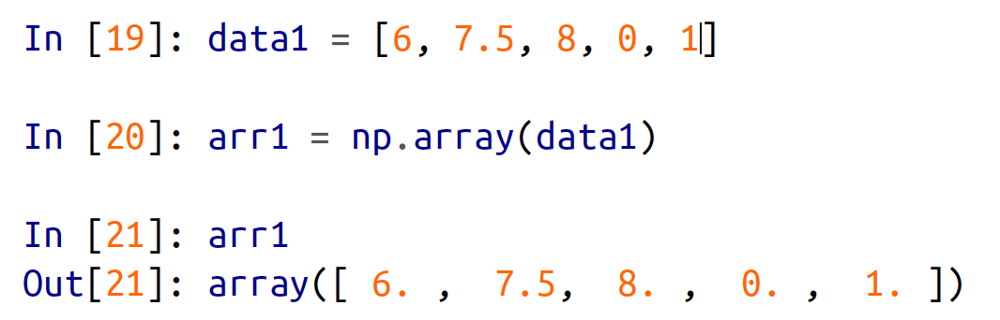
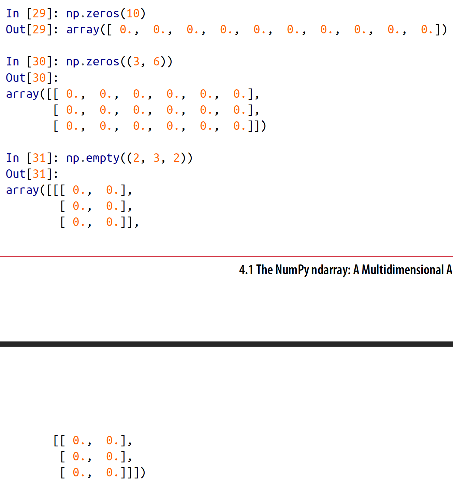
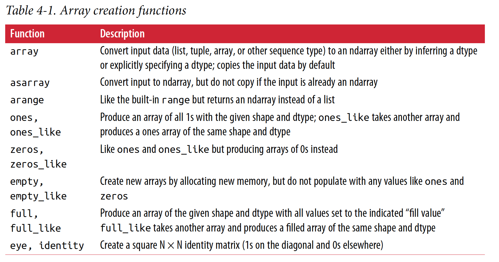
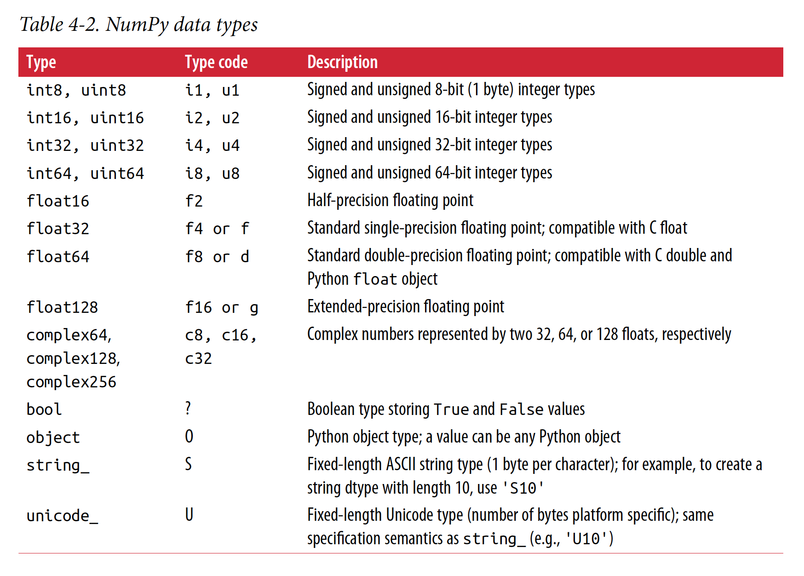
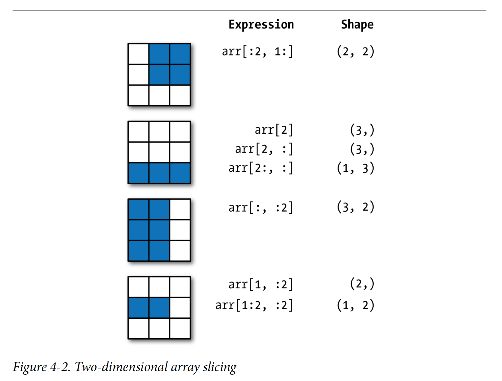

# Python for Data Analysis
[multiprocessing-vs-threading-in-python-what-every-data-scientist-needs-to-know](https://blog.floydhub.com/multiprocessing-vs-threading-in-python-what-every-data-scientist-needs-to-know/)
## CHAPTER 3: Built-in Data Structures, Functions, and Files
### 3.1 Data Structures and Sequences
#### Tuple  
> When you're defining tuples in more complicated expressions, it's often necessary to enclose the values in parantheses.  

> While the objects stored in a tuple may be mutable themselves, once the tuple is created it's not possible to modify which object is stored in each slot. If an object inside a tuple is mutable, such as a list, you can modify it in-place.  
> 
> 

> As a matter of convention, many Python programmers will use the underscore(_) for unwanted variables:
>```
> In[1]: a, b, *_ = values
>```

#### List
> Lists and tuples are semantically similar(though tuples cann't be modified) and can be used interchangeably in many functions.  

> If performance is not a concern, by using append and remove, you can use a Python list as a perfectly suitable "multiset" data structure.  

> Checking whether a list contains a value is a lot slower than doing so with dicts and set, as Python makes a linear scan across the values of the list, whereas it can check the others(based on hash tables) in constant time.  

> Note that list concatenation by addition is a comparatively expensive operation since a new list must be created and the objects copied over. Using extend to append elements to an existing list, especially if you are building up a large list, is usually perferable.  

> The bisect module functions do not check whether the list is sorted, as doing so would be computationally expensive.  

> While the element at the start index is included, the stop index is not included, so that the number of elements in the result is stop - start.  

> zip can take an arbitrary number of sequences, and the number of elements it produces is determined by the shortest sequence.  

### Dict
> dict is likely the most important built-in Python data structure. A more common name for it is hash map or associative array.  

> While the values of a dict can be any Python object, the key generally have to be immutable objects like scalar types(int, float, string) or tuple(all the objects in the tuple need to be immutable, too).  

### Set
> A set is an unordered collection of unique elements.  

> Like dicts, set elements generally must be immutable.  

### Function
> Each function can have positional arguments and keyword arguments. Keyword arguments are most commonly used to specify default values or optional arguments. The main restriction on function arguments is that the keyword arguments must follow the positional arguments(if any).  

## CHAPTER 4: NumPy Basics: Arrays and Vectorized Computation
[Array Dimensions](https://docs.microsoft.com/en-us/dotnet/visual-basic/programming-guide/language-features/arrays/array-dimensions)

[What is vectorization](https://docs.microsoft.com/en-us/archive/blogs/nativeconcurrency/what-is-vectorization)

[Single instruction, multiple data](https://en.wikipedia.org/wiki/Single_instruction,_multiple_data)

[Vectorization](https://www.intel.com/content/www/us/en/developer/articles/technical/vectorization-a-key-tool-to-improve-performance-on-modern-cpus.html#:~:text=Vectorization%20is%20the%20process%20of,to%20multiple%20data%20(SIMD).)

[Numpy Axes, Explained](https://www.sharpsightlabs.com/blog/numpy-axes-explained/)

> The easy way to create an array is to use the array function. This accepts any sequence-like object(including other arrays) and produces a new NumPy array containing the passed data.
> 

> In addition to np.array, there are a number of other functions for creating new arrays. As examples, zeros and ones create arrays of 0s or 1s , respectively, with a given length or shape. empty creates an array without initializing its values to any particular value. To create a higher dimentional array with these methods, pass a tuple for the shape:
> 
> It's not safe to assume that np.empty will return an array of all zeros. In some cases, it may return uninitialized "garbage" values.  

> Since NumPy is focused on numerical computing, the data type, if not specified, will in many cases be float64.  

> 

> 

> Calling astype always creates a new array(a copy of the data), even if the new dtype is the same as the old dtype.  

> An important first distinction from Python's built-in lists is that array slices are views on the original array. This means that the data is not copied, and any modifications to the view will be reflected in the source array.  
> If you want a copy of a slice of an ndarray instead of a view, you will need to explicitly copy the array(arr[5:8].copy()).  
> 

> Selecting data from an array by boolean indexing always creates a copy of the data, even if the returned array is unchanged.  

> Regardless of how many dimensions the array has, the result of fancy indexing is always one-dimensional.  

> Keep in mind that fancy indexing, unlike slicing, always copies the data into a new array.  

> A universal function, or ufunc, is a function that performs element-wise operations on data in ndarray. You can think of them as fast vectorized wrappers for simple functions that take one or more scalar values and produce one or more scalar results.

[unary vs binary](https://overiq.com/python-101/operators-in-python/)

> Using NumPy arrays enables you to express many kinds of data processing tasks as concise array expressions that might otherwise require writing loops. This practice of replacing explicit loops with array expressions is commonly referred to as vectorization.  

[Array programming with NumPy](https://www.nature.com/articles/s41586-020-2649-2)

## CHAPTER 5: Getting Started with pandas

[Pandas Axis Explained](https://railsware.com/blog/python-for-machine-learning-pandas-axis-explained/)

> The biggest different is that pandas is designed for working with tabular or heterogeneous data. NumPy, by contrast, is best suited for working with homogeneous numerical array data.  

> A Series is one-dimensional array-like object containing a sequence of values and an associated array of data labels, called its index.

> Should you have data contained in a Python dict, you can create a Series from it by passing the dict.  

> A DataFrame represents a rectangular table of data and contains an ordered collection of columns, each of which can be a different value type(numeric, string, boolean, etc.). Two-dimensional, size-mutable, potentially heterogeneous tabular data. 

> A column in a DataFrame can be retrived as a Series either by dict-like notation or by attribute.  

> Rows can also be retrieved by position or name with the special loc attribute.  

> Assigning a column that doesn't exist will create a new column. The del keyword will delete columns as with a dict.  

> If the nested dict is passed to the DataFrame, pandas will interpret the outer dict keys as the columns and the inner keys as the row indices.  

> pandas's Index Object are responsible for holding the axis labels and other metadata(like the axis name or names). Any array or other sequence of labels you use when constructing a Series or DataFrame is internally converted to an Index.  

> Index objects are immutable and thus can't be modified by the user.  

> Unlike Python sets, a pandas Index can contain duplicate labels.  

> Many functions, like drop, which modify the size or shape of a Series or DataFrame, can manipulate an object in-place without returning a new object. Be careful with inplace, as it destroys any data that is dropped.  

> By default, arithmetic between DataFrame and Series matches the index of the Series on the DataFrame's columns, broadcasting down the rows.  

> If you prefer regular names instead of numbers with DataFrame, each axis has a string alias. "axis 0" has two aliases: 'index' and 'rows'. "axis 1" has only one: 'columns'.  

> Any missing values are sorted to the end of the Series by default.  

## CHAPTER 6: Data Loading, Storage, and File Formats
