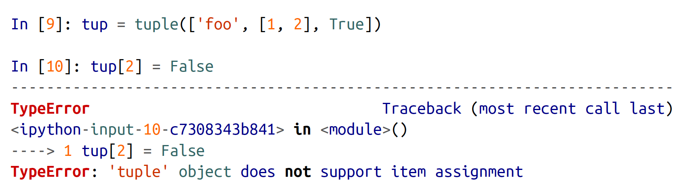
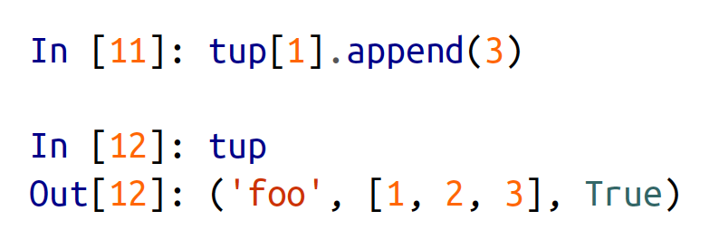

# Python for Data Analysis
[multiprocessing-vs-threading-in-python-what-every-data-scientist-needs-to-know](https://blog.floydhub.com/multiprocessing-vs-threading-in-python-what-every-data-scientist-needs-to-know/)
## CHAPTER 3: Built-in Data Structures, Functions, and Files
### 3.1 Data Structures and Sequences
#### Tuple  
> When you're defining tuples in more complicated expressions, it's often necessary to enclose the values in parantheses.  

> While the objects stored in a tuple may be mutable themselves, once the tuple is created it's not possible to modify which object is stored in each slot. If an object inside a tuple is mutable, such as a list, you can modify it in-place.  
> 
> 

> As a matter of convention, many Python programmers will use the underscore(_) for unwanted variables:
>```
> In[1]: a, b, *_ = values
>```

#### List
> Lists and tuples are semantically similar(though tuples cann't be modified) and can be used interchangeably in many functions.  

> If performance is not a concern, by using append and remove, you can use a Python list as a perfectly suitable "multiset" data structure.  

> Checking whether a list contains a value is a lot slower than doing so with dicts and set, as Python makes a linear scan across the values of the list, whereas it can check the others(based on hash tables) in constant time.  

> Note that list concatenation by addition is a comparatively expensive operation since a new list must be created and the objects copied over. Using extend to append elements to an existing list, especially if you are building up a large list, is usually perferable.  

> The bisect module functions do not check whether the list is sorted, as doing so would be computationally expensive.  

> While the element at the start index is included, the stop index is not included, so that the number of elements in the result is stop - start.  

> zip can take an arbitrary number of sequences, and the number of elements it produces is determined by the shortest sequence.  

### Dict
> dict is likely the most important built-in Python data structure. A more common name for it is hash map or associative array.  

> While the values of a dict can be any Python object, the key generally have to be immutable objects like scalar types(int, float, string) or tuple(all the objects in the tuple need to be immutable, too).  

### Set
> A set is an unordered collection of unique elements.  

> Like dicts, set elements generally must be immutable.  

### Function
> Each function can have positional arguments and keyword arguments. Keyword arguments are most commonly used to specify default values or optional arguments. The main restriction on function arguments is that the keyword arguments must follow the positional arguments(if any).  
