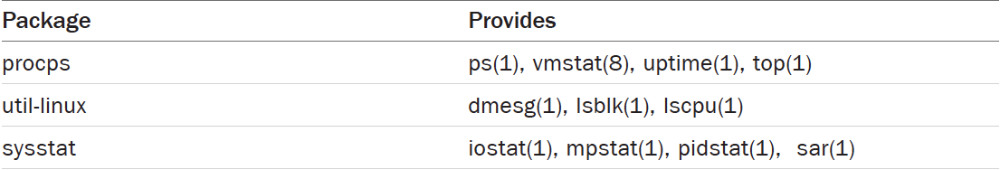
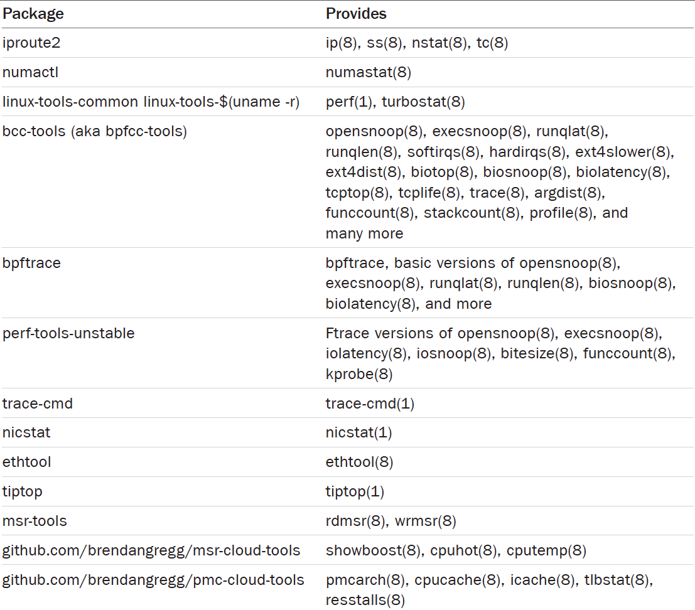

# System Performance
## Chapter 2: Methodologies
### 2.4 Perspectives
#### 2.4.1 Resource Analysis
> Metrics best suited for resource analysis include:
> 1. IOPS 
> 2. Throughput
> 3. Utilization
> 4. Saturation

#### 2.4.2 Workload Analysis
> Metrics best suited for workload analysis include:
> 1. Throughput(transactions per second)
> 2. Latency

### 2.5 Methodology
#### 2.5.9 The USE Method
> For every resource, check utilization, saturation, and errors.

> These terms are defined as follows:
> 1. Resources: All physical server functional components(CPU,buses,...). Some software resources can also be examined, provided that the metrics make sense. 
> 2. Utilization: For a set time interval, the percentage of time that the resource was busy servering work. While busy, the resource may still be able to accept more work; the degree to which it cannot do so is identified by saturation. 
> 3. Saturation: The degree to which the resource has extra work that it can't service, often waiting on a queue. Another term for this is pressure.
> 4. Errors: The count of error events.

#### 2.5.10 The RED Method
> For every service, check the request rate, errors, and duration.

> The metrics are:
> 1. Request rate: The number of service requests per second.
> 2. Errors: The number of requests that failed.
> 3. Duration: The time for requests to complete(consider distribution statistics such as percentile in addition to the average).

#### 2.5.15 Event Tracing
> When performing event tracing, look for the following information:
>- Input: All attributes of an event request: type, direction, size, and so on.
>- Times: Start time, end time, latency(difference)
>- Result: Error status, result of event(e.g., successful transfer size)

## Chapter 3: Operating Systems
### 3.2 Background
#### 3.2.2 Kernal and User Modes
> The Kernel runs in a special CPU mode called kernel mode, allowing full access to devices and the execution of privileged instructions.

> User programs(processes) run in user mode, where they request privileged operations from the kernel via system calls, such as for I/O.
#### 3.2.4 Interrupt
> An interrupt is a signal to the processor that some event has occurred that needs processing, and interrupts the current execution of the prcessor to handle it. It typically causes the processor to enter kernel mode if it isn't already, save the current thread state, and then run an interrupt service routine(ISR) to process the event.

> There are asynchronous interrupts generated by external hardware and synchronous interrupts generated by software instructions.

#### 3.2.10 File Systems
> The top-level directories include etc for system configuration files, usr for system-supplied user-level programs and libraries, dev for device nodes, var for varying files including system logs, tmp for temporary files, and home for user home directories.

## Chapter 4: Observability Tools
### 4.1 Tool Coverage
#### 4.1.2 Crsis Tools
> Large companies have OS and performance teams who ensure that production systems have all of these packages installed. 
> 
> 

> In container environments, it may be desirable to create a privileged debugging container that has full access to the system and all tools installed. The image for this container can be installed on container hosts and deployed when needed.

## Chapter 5: Applications
### 5.1 Application Basics
#### 5.1.2 Optimize the Common Case
> One way to efficiently improve application performance is to find the most common code path for the production workload and begin by improving that. If the application is CPU-bound, that may ean the code paths that are frequently on-CPU. If the application is I/O-bound, you should be looking at the code paths that are frequently lead to I/O.

### 5.2 Application Performance Techniques
#### 5.2.1 Selection an I/O Size
> For efficiency, the more data transferred by each I/O, the better.

> There's a downside when the application doesn't need larger I/O sizes. A database performing 8 Kbyte random reads may run more slowly with a 128 Kbyte disk I/O size, as 120 Kbytes of data transfer is wasted. This introduces I/o latency, which can be lowered by selecting a small er I/o size that more closely matches what the application is requesting. Unnecessarily larger I/O sizes can also wate cahce space.