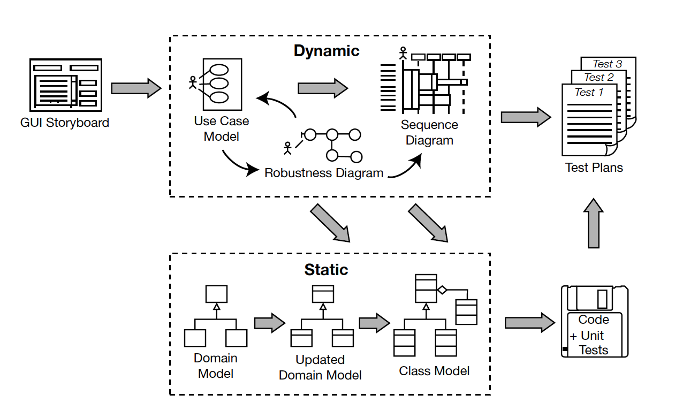

<------ what ------>
1. 产品负责编写用户故事。（user story）
2. 开发负责梳理故事中的名词和动词，汇总去重。
3. 产品和开发确认汇总去重后的词库，保证理解一致。
4. 产品和开发确认词库中每一个词语对应的英文，保证理解一致。（gloosary）
5. 开发根据词库中的名词，不包含具体属性及方法，首先罗列聚合（has-a）关系，然后再梳理多态（is-a）关系，两个形成静态域模型。（model domain）   
    a. Focus on real-world (problem domain) objects.  
    b. Use generalization (is-a) and aggregation (has-a) relationships to show how the objects relate to each other.   
    c. Limit your initial domain modeling efforts to a couple of hours.  
    d. Organize your classes around key abstractions in the problem domain.   
    e. Don’t mistake your domain model for a data model.   
    f. Don’t confuse an object (which represents a single instance) with a database table (which contains a collection of things).   
    g. Use the domain model as a project glossary.   
    h. Do your initial domain model before you write your use cases, to avoid name ambiguity.   
    i. Don’t expect your final class diagrams to precisely match your domain model, but there should be some resemblance between them.   
    j. Don’t put screens and other GUI-specific classes on your domain model.   
6. 产品和开发根据词库（名词 -> 动词 -> 名词）编写动态使用用例，包括：成功场景、失败场景及对应处理方法。（text）   
    a. Follow the two-paragraph rule.  
    b. Organize your use cases with actors and use case diagrams.  
    c. Write your use cases in active voice.   
    d. Write your use case using an event/response flow, describing both sides of the user/system dialogue.   
    e. Use GUI prototypes and screen mock-ups.   
    f. Remember that your use case is really a runtime behavior specification.   
    g. Write the use case in the context of the object model.   
    h. Write your use cases using a noun-verb-noun sentence structure.   
    i. Reference domain classes by name.   
    j. Reference boundary classes (e.g., screens) by name.   
7. 5到6步骤会反复执行。使用用例是在域模型范围内进行编写，随着使用用例的扩展，可能存在域模型无法满足，此时需要调整域模型以适应使用用例。   
    a. Make sure your domain model describes at least 80% of the most important abstractions from your problem domain (i.e., real-world objects), in nontechnical language that your end users can understand.   
    b. Make sure your domain model shows the is-a (generalization) and has-a (aggregation) relationships between the domain objects.   
    c. Make sure your use cases describe both basic and alternate courses of action, in active voice.   
    d. Make sure that passive voice, functional requirements (i.e., “shall” statements), are not absorbed into and “intermangled” with the active voice use case text.    
    e. Make sure you’ve organized your use cases into packages and that each package has at least one use case diagram.   
    f. Make sure your use cases are written in the context of the object model.     
    g. Make sure your use cases are written in the context of the user interface.     
    h. Make sure you’ve supplemented your use case descriptions with some sort of storyboard, line drawing, screen mock-up, or GUI prototype.   
    i. Review the use cases, domain model, and screen mock-ups/GUI prototypes with end users, stakeholders, and marketing folks, in addition to more technical members of your staff.   
    j. Structure the review around our “eight easy steps to a better use case.”     
        j1. Remove everything that’s out of scope.   
        j2. Change passive voice to active voice.   
        j3. Check that your use case text isn’t too abstract.   
        j4. Accurately reflect the GUI.   
        j5. Name participating domain objects.   
        j6. Make sure you have all the alternate courses.   
        j7. Trace each requirement to its use cases.   
        j8. Make each use case describe what the users are trying to do.   
8. 与产品确认使用用例，保证理解一致。   
<------ what ------>   
<------ how ------>   
9. 开发根据使用用例（名词 -> 动词 -> 名词）和域模型编写鲁棒图。（Robustness diagram）   
    a. Paste the use case text directly onto your robustness diagram.   
    b. Take your entity classes from the domain model, and add any that are missing.   
    c. Expect to rewrite (disambiguate) your use case while drawing the robustness diagram.   
    d. Make a boundary object for each screen, and name your screens unambiguously.   
    e. Remember that controllers are only occasionally real control objects; they are more typically logical software functions.   
    f. Don’t worry about the direction of the arrows on a robustness diagram.   
    g. It’s OK to drag a use case onto a robustness diagram if it’s invoked from the parent use case.   
    h. The robustness diagram represents a preliminary conceptual design of a use case, not a literal detailed design.   
    i. Boundary and entity classes on a robustness diagram will generally become object instances on a sequence diagram, while controllers will become messages.   
    j. Remember that a robustness diagram is an “object picture” of a use case, whose purpose is to force refinement of both use case text and the object model.   
9. 开发编写动态时序图。（uml sequence diagram）   
    a. Understand why you’re drawing a sequence diagram, to get the most out of it.   
    b. Draw a sequence diagram for every use case, with both basic and alternate courses on the same diagram.   
    c. Start your sequence diagram from the boundary classes, entity classes, actors, and use case text that result from robustness analysis.   
    d. Use the sequence diagram to show how the behavior of the use case (i.e., all the controllers from the robustness diagram) is accomplished by the objects.   
    e. Make sure your use case text maps to the messages being passed on the sequence diagram. Try to line up the text and message arrows.   
    f. Don’t spend too much time worrying about focus of control.   
    g. Assign operations to classes while drawing messages. Most visual modeling tools support this capability.   
    h. Review your class diagrams frequently while you’re assigning operations to classes, to make sure all the operations are on the appropriate classes.   
    i. Prefactor your design on sequence diagrams before coding.   
    j. Clean up the static model before proceeding to the CDR.   
10. 与产品确认时序图，保证理解一致。   
11. 7到9步骤会反复执行。   
12. 通过 域模型 + 时序图 保证产品、开发和测试理解一致。   
13. 开发根据静态域模型编写静态类图。（uml class diagram）   
14. 测试根据动态使用用例和时序图编写测试用例。（test case）   
15. 设计师根据使用用例进行静态UI原型1对1设计。     
16. 开发通过静态类图进行Clean Architecture编码及附带单元测试。（code + unit test）   
    a. Be sure to drive the code directly from the design.   
    b. If coding reveals the design to be wrong in some way, change it. But also review the process.   
    c. Hold regular code inspections.   
    d. Always question the framework’s design choices.   
    e. Don’t let framework issues take over from business issues.   
    f. If the code starts to get out of control, hit the brakes and revisit the design.   
    g. Keep the design and the code in sync.   
    h. Focus on unit testing while implementing the code.   
    i. Don’t overcomment your code (it makes your code less maintainable and more difficult to read).   
    j. Remember to implement the alternate courses as well as the basic courses.   
17. 考虑数据存储形式。（DBMS/NoSQL/Cache）   
18. 开发考虑协议及提供对外接口文档。（RESTful API / RPC / Websocket）   
19. 测试根据对外接口文档结合测试用例编写业务流程测试脚本。（postman + mock）   
20. 前端使用测试提供的脚本对接后台mock服务。   
21. 通过 接口文档 + 业务测试脚本 + 前端对接mock服务 保证开发、测试和前端理解一致。   
<------ how ------>

> 

