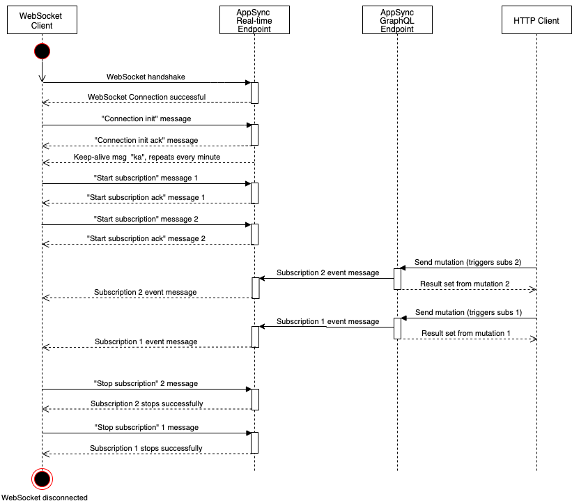
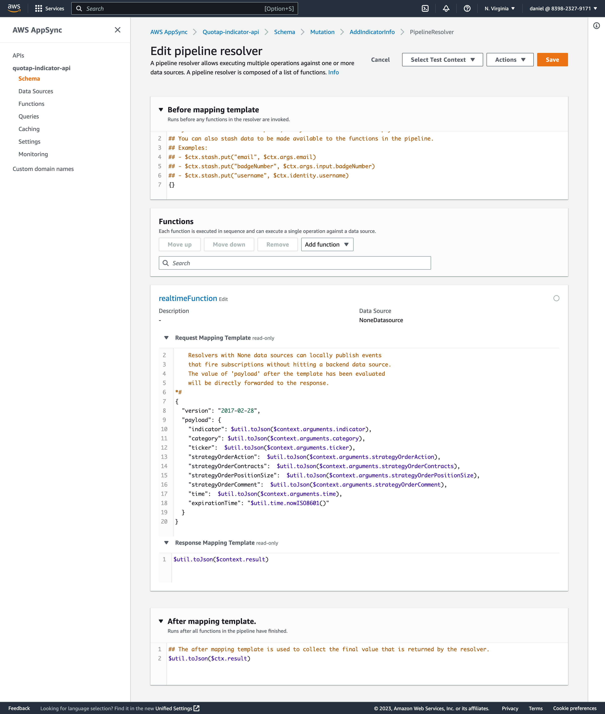
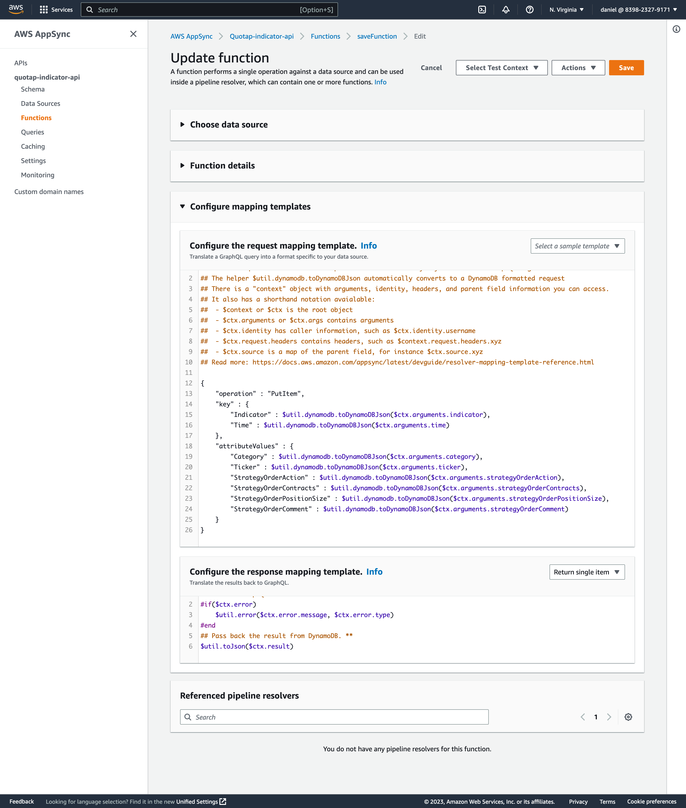

1. create schema ([schema demo](schema.graphql))
2. config mutation with a resolver
   - NoneDatasource
   
   - Dynamodb
   
3. aws appsync get-graphql-api --api-id xxxxx
   get realtime endpoint and graphql endpoint
4. connect to realtime websocket endpoint
   - add header: Sec-WebSocket-Protocol=graphql-ws
   - add params: header={"host":"xxxx.appsync-realtime-api.us-east-1.amazonaws.com","x-api-key":"xxxx"}(stringify and base64 encode)
   - add params: payload={}(stringify and base64 encode)
   - example:     
      - header:asdfasdfasdfasdfsdfmJ6bmd0cWw0d2ttZnQzYnEuYXBwc3luYy1hcGkudXMtZWFzdC0xLmFtYXpvbmF3cy5jb20iLCJ4LWFwaS1rZXkiOiJkYTIteHoyaW02d2c3amFwaGQ2ZjJ0dDY0anRoeHUifQ==
      - payload:e30=
   - after connection, client send message: { "type": "connection_init" }
   - then, client send message: {"id":"e1149ef0-cf23-4cb8-9fcb-152ae4fd1e69","payload":{"data":"{\"query\":\"subscription MySub {\\n addedIndicatorInfo {\\n indicator\\n category\\n ticker\\n strategyOrderAction\\n strategyOrderContracts\\n strategyOrderPositionSize\\n time\\n}\\n }\",\"variables\":{}}","extensions":{"authorization":{"host":"xxxxx.appsync-api.us-east-1.amazonaws.com","x-api-key":"xxxxx"}}},"type":"start"}
5. send mutation to graphql endpoint
   - example: 
> ```
>   curl --location --request POST 'https://xxxxxxx.appsync-api.us-east-1.amazonaws.com/graphql' \
> --header 'x-api-key: xxxxxxx' \
> --header 'Content-Type: application/json' \
> --data-raw '{"query":"mutation RTIndicator {\n\taddIndicatorInfo(indicator: \"VOL\", category: \"FX\",ticker:\"EURUSD\",strategyOrderAction:\"sell\",strategyOrderContracts:\"2\",strategyOrderPositionSize:\"-1\",strategyOrderComment:\"MA2CrossSE\",time:\"2019-08-27T09:56:00Z\") {\n\t\tindicator\n\t\tcategory\n\t\tticker\n\t\tstrategyOrderAction\n        strategyOrderContracts\n        strategyOrderPositionSize\n        strategyOrderComment\n        time\n\t}\n}","variables":{}}'
>```
6. realtime endpoint will receive message.
   - example: 
>```
> {
>    "id": "ee849ef0-cf23-4cb8-9fcb-152ae4fd1e69",
>    "type": "data",
>    "payload": {
>        "data": {
>            "addedIndicatorInfo": {
>                "indicator": "VOL",
>                "category": "FX",
>                "ticker": "EURUSD",
>                "strategyOrderAction": "sell",
>                "strategyOrderContracts": "2",
>                "strategyOrderPositionSize": "-1",
>                "time": "2019-08-27T09:56:00Z"
>            }
>        }
>    }
>}
>```