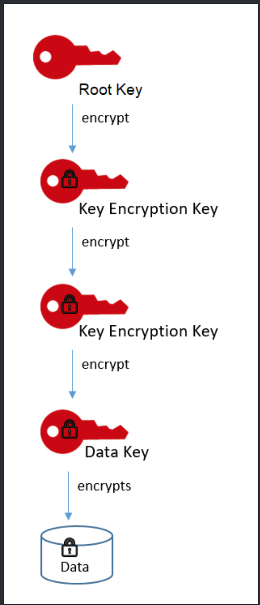

# [AWS Cryptography Services](https://docs.aws.amazon.com/crypto/latest/userguide/awscryp-overview.html)

## AWS cryptographic services and tools
### What is cryptography?
> Cryptography has four primary goals:
>- Confidentiality - Makes information available to only authorized users.
>- Data Integrity - Ensures that information has not been manipulated.
>- Authentication - Confirms the authenticity of information or the identity of a user.
>- Nonrepudiation - Prevents a user from denying prior commitments or actions.

### Cryptography concepts
>1. asymmetric and symmetric encryption
> Symmetric encryption uses the same secret key to perform both the encryption and decryption processes.
> Asymmetric encryption, also known as public-key encryption, uses two keys, a public key for encryption and a corresponding private key for decryption.

>2. client-side and server-side encryption
> Client-side encryption is encrypting data at or close to its source, such as encryption data in the application or service that generates it.
> Server-side encryption is encrypting data at its destination, that is, the application or service that receives it.

>3. envelope encryption
> A strategy for protecting the encryption keys that you use to encrypt your data. First, you encrypt plaintext data with a data key. Then, to protect the data key, you encrypt the data key, you encrypt it under another key, known as a key encryption key.

> Encrypting the date key is more efficient than reencrypting the data under the new key because it is quicker and produces a much smaller ciphertext.
> 

>4.  key encryption key
> In envelope encryption, a key encryption key is an encryption key that is used to encrypt a data key or another key encryption key. To protect the key encryption key, it is encrypted by using a root key.

>> Serveral AWS services provide key encryption keys.
>>- The HSMs in a AWS CloudHSM cluster generate encryption keys that can be used as data keys, key encryption keys, or root keys.
>>- You can ask AWS Key Management Service(AWS KMS) to generate a data key, then use that key as a key encryption key outside of AWS KMS.

#### Cryptographic algorithms
##### Symmetric algorithms
> AWS cryptographic tools and services support two widely used symmetric alogrithms.
>- AES - Advanced Encryption Standard
>- Triple DES

> Symmetric key encryption requires that all intended message recipients have access to the shared key. Therefore, a secure communication channel must be established among the participants so that the key can be transmitted to each along with the ciphertext. This presents practical problems and limits the use of direct symmetric key exchange.

> Symmetric key ciphers may be either block ciphers or stream ciphers. A block cipher divides the plaintext messaged into fixed-length strings called blocks and encrypts one block at a time.

> Both AES and Triple DES are block ciphers.

##### Asymmetric algorithms
> AWS tools typically support RSA and Elliptic Curve Cryptography(ECC) asymmetric alogrithms.

> The RSA alogrithm is based on the practical difficulty of factoring the product of two large prime numbers. Elliptic curve cryptography is based on the difficulty of finding the discrete logarithm of a random point on an ellipic curve given a publicly known pint.

### AWS cryptographic services and tools
#### AWS CloudHSM
> AWS CloudHSM is a cryptographic service for creating and maintaining hardware security modules in your AWS environment.

> When you use an HSM from AWS CloudHSM, you can perform a variety of cryptographic tasks:
>- Gerenate, store, import, export, and manage cryptographic keys, including symmetric keys and asymmetric key pairs.
>- Use symmetric and asymmetric algorithms to encrypt and decrypt data.
>- Use cryptographic hash functions to compute message digests and hash-based message authentication codes(HMACs).
>- Cryptographically sign data(including code signing) and verify signatures.
>- Generate cryptographically secure random data.

> AWS CloudHSM organizes HSMs in clusters, which are automatically synchronized collections of HSMs within a given Availability Zone(AZ). By adding more HSMs to a cluster and distributing clusters across AZs, you can load balance the cryptographic operations being performed within your cloud environment and provide redundancy and high availability in case of AZ failure. Additionally, AWS CloudHSM periodically generates and stores backups of your clusters, making CloudHSM data recovery secure and simple.

> The keys that you generate in AWS KMS are protected by FIPS 140-2 validated cryptographic modules. If you want a managed service for creating and controlling encryption keys, but do not want or need to operate your own HSM, consider using AWS key Management Serivce(KMS).

