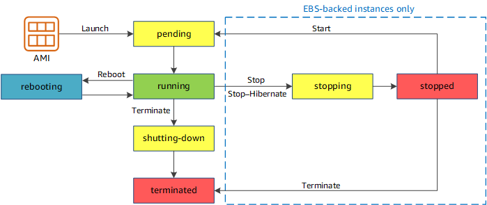

# EC2
## Instances

### Instances
#### Instance purchasing options
##### Spot Instances
###### Spot Instance interruptions
> Spot Instance interruption notices
>> A Spot Instance interruption notice is a warning that is issued two minutes before Amazon EC2 stops or terminates your Spot Instance. If you specify hibernation as the interruption behavior, you receive an interruption notice, but you do not receive a two-minute warning because the hiberation process begins immediately.  
>> The best way for you to gracefully handle Spot Instance interruptions is to architect your application to be fault-tolerant. To accompolish this, you can take advantage of Spot Instance interrupt notices. We recommend that you check for these interruption notices every 5 seconds.  
>> The interruption notices are made available as a CloudWatch event and as items in the instance metadata on the Spot Instance. Events are emitted on a best effort basis.   
> [ECS Spot Instance Interruption](https://ec2spotworkshops.com/ecs-spot-capacity-providers/module-1/spot_inturruption_handling.html)
### Instance lifecycle
> Notice that you can't stop and start an instance store-backed instance.
> 

> When you hibernate an instance, we signal the operating system to perform hibernation(suspend-to-disk), which saves the contents from the instance memory(RAM) to your Amazon EBS root volume.
> When you hibernate your instance, it enters the stopping state, and then the stopped state. We don't charge usage for a hibernated instance when its is in the stopped state, but we do charge while it is in the stopping state, unlike when you stop an instance without hibernating it. We don't charge usage for data transfer fees, but we do charge for the storage for any Amazon EBS volumes, including storage for the RAM data.

## Fleets
### EC2 Fleet
#### Work with EC2 Fleets
> The fleet request must include a launch template that defines the information that the fleet needs to launch an instance, such as an AMI, instance type, subnet or Availability Zone, and one or more security groups.

> EC2 Fleets can only be created using the AWS CLI.

### Spot Fleet
> A Spot Fleet is a set of Spot Instances and optionally On-Demand Instances that is launched based on criteria that you specify.

## Networking
### Regions and Zones
> When you launch an instance, you select a Region and a virtual private cloud(VPC), and then you can either select a subnet from one of the Availability Zones or let us choose one for you.

## Security
### Security Groups
#### Security group rules
> Security groups are stateful -- If you send a request from your instance, the response traffic for that request is allowed to flow in regardless of inbound secruity group rules. For VPC security groups, this also means that responses to allowed inbound traffic are allowed to flow out, regardless of outbound rules.  

> If there is more than one rule for a specific port, Amazon EC2 applies the most permissive rule.  

#### Connection tracking
> Your security groups use connection tracking to track information about traffic to and from the instance. Rules are applied based on the connection state of the traffic to determine if the traffic is allowed or denied. With this approach, security groups are stateful. This means that responses to inbound traffic are allowed to flow out of the instance regardless of outbound secruity group rules, and vice versa.  

> For protocols other than TCP, UDP, or ICMP, only the IP address and protocol number is tracked. If your instance sends traffic to another host, and the host sends the same type of traffic to your instance within 600 seconds, the security group for your instance accepts it regardless of inbound security group rules. The security group accepts it because it's regarded as response traffic for the original traffic.  

> When you change a security group rule, its tracked connetions are not immediately interrupted. The security group continues to allow packets until existing connections time out. To ensure that traffic is immediately interrupted, or that all traffic is subject to firewall rules regardless of the tracking state, you can use a network ACL for your subnet.  

> Not all flows of traffic are tracked. If a security group rule permits TCP or UDP flows for all traffic(0.0.0.0/0 or ::/0) and there is a corresponding rule in the other direction that permit all response traffic(0.0.0.0/0 or ::/0) for all ports(0 - 65535), then that flow of traffic is not tracked, unless it is part of an automatically tracked connection. The response traffic for an untracked flow is allowed based on the inbound or outbound rule that permits the response traffic, not based on tracking information.  
## Storage
### Amazon EBS
#### EBS volumes
##### EBS volume types
> io2 Block Express volumes are suited for workloads that benefit from a single volume that provide sub-millsecond latency, and supports higher IOPS, higher throughput, and larger capacity than io2 volumes.
##### Attach a volume to multiple instances
> Amazon EBS Multiple-Attach enables you to attach a single Provisioned IOPS SSD(io1 or io2) volume to multiple instances that are in the same Availability Zone.  
#### EBS snapshots
##### Create snapshots
> You can take a snapshot of an attached volume that is use. However, snapshots only capture data that has been written to your Amazon EBS at the time the snapshot command is issued. This might exclude any data that has been cached by any applications or the operating system. If you can't pause all file writes to the volume, you should unmount the volume from within the instance, issue the snapshot command, and then remount the volume to ensure a consistent and complete snapshot. You can remount and use your volume while the snapshot status is pending.

### Instance store
> This storage is located on disks that are physically attached to the host computer. Instance store is ideal for temporary storage of information that changes frequently, such as buffers, caches, scratch data, and other temporary content, or for data that is replicated across a fleet of instances, such as a load-balanced pool of web servers.

