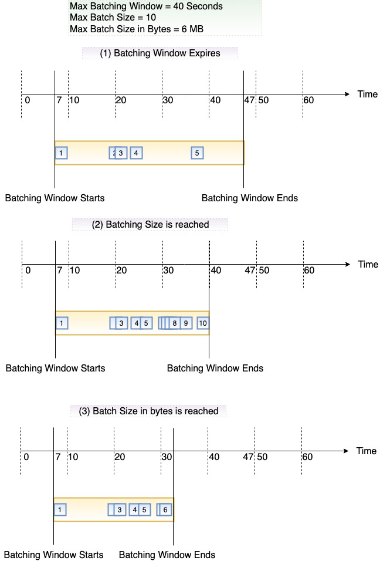

# AWS Lambda(Developer Guid)
## Lambda foundations
### Concepts
> An event is a JSON-formatted document that contains data for a Lambda function to process.

## Configuring functions
### Versions
> A function version includes the following information:
>- The function code and all associated dependencies.
>- The lambda runtime that invokes the functions.
>- All the function settings, including the environment variables.
>- A unique Amazon Resource Name(ARN) to identify the specific version of the function.  

> You can change the function code and settings only on the unpublished version of a function. When you publish a version, Lambda locks the code and most of the settings to maintain a consistent experience for users of that version.  

## Invoking functions
### Synchronous invocation
> When you invoke a function synchronously, Lambda runs the function and waits for a response. When the function completes, Lambda returns the response from the function's code with additional data, such as the version of the function that was invoked.

### Asynchronous invocation
> Several AWS services, such as Amazon Simple Storage Service(Amazon S3) and Amazon Simple Notification Service, invoke functions asynchronously to process events. When you invoke a function asynchronously, you don't wait for a response from the function code. 

### Event source mapping
> The following diagram illustrates these three conditions. Suppose a batching window begins at t = 7 seconds. In the first scenario, the batching window reaches its 40 second maximum at t = 47 seconds after accumulating 5 records. In the second scenario, the batch size reaches 10 before the batching window expires, so the batching window ends early. In the third scenario, the maximum payload size is reached before the batch size or the batching window expires, so the batch ends early.
> 

> As an alternative to an on-failure destination, you can configure your function with a dead-letter queue to save discard events for further processing.  
## Working with other services
### API Gateway
> For a custom integration, the event is the body of the request. For a proxy integration, the event has a defined structure.
### CloudFront(Lambda@Edge)
> Lambda@Edge lets you run Node.js and Python Lambda functions to customize content that CloudFront delivers, executing the functions in AWS locations closer to the viewer. The functions run in response to CloudFront events, without provisioning or managing servers. You can use Lambda functions to change CloudFront requests and responses at the following points:
>1. After CloudFront receives a request from a viewer(view request)
>2. Before CloudFront forwards the request to the origin(origin request)
>3. After CloudFront receives the response from the origin(origin response)
>4. Before CloudFront forwards the response to the viewer(viewer response)

## Lambda Quotas
> Function timeout is 900 seconds(15 Minutes)

## API reference
### Actions
#### CreateEventSourceMapping
> Note that because you can only change MaximumBatchingWindowInSeconds in increments of seconds, you cannot revert back to the 500 ms default batching window after you have changed it. To restore the default batching window, you must create a new event source mapping.

[AWS Lambda Execution context in Java demystified](https://blog.ippon.tech/lambda-execution-context-demystified/)