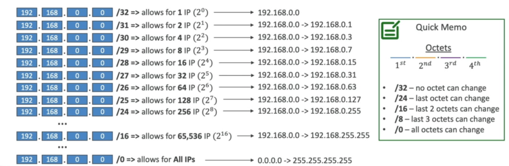

# Amazon Virtual Private Cloud

> 

## Subnets
> The first four IP addresses and the last IP address in each subnet CIDR block are not available for your use, and they cann't be assigned to a resource, such as an EC2 instance. For example, in a subnet with CIDR block 10.0.0.0/24, the following five IP addresses are reserved:
>- 10.0.0.0: Network address.
>- 10.0.0.1: Reserved by AWS for the VPC router.
>- 10.0.0.2: Reserved by AWS. The IP address of the DNS server is the base of the VPC network range plus two. For VPCs with multiple CIDR blocks, the IP address of the DNS server is located in the primary CIDR. We also reserve the base of each subnet range plus two for all CIDR blocks in the VPC. 
>- 10.0.0.3: Reserved by AWS for future use.
>- 10.0.0.255: Network broadcast address. We do not support broadcast in a VPC, therefore we reserve this address.

### Network ACLs
> The client that initiates the request chooses the ephemeral port range. The range varies depending on the client's operating system.
>>- Many linux kernels(including the Amazon Linux Kernel) use ports 32768 - 61000.
>>- Requests originating from Elastic Load Balancing use ports 1024 - 65535.
>>- Windows operating systems through Windows Server 2003 use ports 1025 - 5000.
>>- Windows Server 2008 and later versions use ports 49152 - 65535.
>>- A NAT gateway uses ports 1024 - 65535.
>>- AWS Lambda functions use ports 1024 - 65535.

> In practice, to cover the different types of clients that might initiate traffic to public-facing instances in your VPC, you can open ephemeral ports 1024 - 65535. However, you can also add rules to the ACL to deny traffic on any malicious ports within that range. Ensure that you place deny rules eariler in the table than the allow rules that open the wide range of ephemeral ports.  

