# [Application Architecture Guide](https://docs.microsoft.com/en-us/azure/architecture/guide/)

## Application architecture fundamentals
| Traditional on-premises | Modern cloud |
| ----------- | ----------- |
| Monolithic | Decomposed |
| Designed for predictable scalability | Designed for elastic scale |
| Relational database | Polyglot persistence(mix of storage technologies) |
| Synchronized processing| Asynchronous processing |
| Design to avoid failure(MTBF) | Design for failure(MTTR) |
| Occasional large updates| Frequent small updates |
| Maunal management| Automated self-management |
| Snowflake servers| Immutable infrastructure |
[MTBF & MTTR](https://www.atlassian.com/incident-management/kpis/common-metrics)

### Architecture styles
#### Overview
> N-tier is a traditional architecture for enterprise applications. Dependencies are managed by dividing the application into layers that perform logical functions, such as presentation, business logic, and data access. N-tier is a natural fit for migrating existing applications that already use a layered architecture. For this reason, N-tier is most often seen in infrastructure as a service(IaaS) solutions, or application that use a mix of IaaS and managed services.

> For a purely PaaS solution, consider a Web-Queue-Worker architecture. In this style, the application has a web front end that handles HTTP requests and a back-end worker that performs CPU-intensive tasks or long-running operations. The front end communicates to the worker through an asynchronous message queue.

> A microservices application is composed of many small, independent services. Each service implements a single business capability. Services are loosely coupled, communicating through API contracts.

> Event-Driven Architectures use a publish-subscribe(pub-sub) model, where producers publish events, and consumers subscribe to them. The producers are independent from the consumers, and consumers are independent from each other. Consider an event-driven architecture for applications that ingest and process a large volume of data with very low latency, such as IoT solutions. The style is also useful when different subsystems must perform different types of processing on the same event data.

> Big data divides a very large dataset into chunks, performing parallel processing across the entire set, for analysis and reporting. Big Compute, also called high-performance compute(HPC), makes parallel computations across a large number(thousands) of cores. Domains include simulations, modeling, and 3-D rendering.

| Architecture style | Dependency management | Domain type|
| ----------- | ----------- | ----------- |
| N-tier | Horizontal tiers divided by subnet | Traditional business domain. Frequently of updates is low. |
| Web-Queue-Worker | Front and backend jobs, decoupled by async messaging | Relatively simple domain with some resource intensive tasks.|
| Miscroservices | Vertially(functionally) decomposed services that call each other through APIs | Complicated domain. Frequent updates. |
| Event-driven architecture | Producer/consumer. Independent view per sub-system. | IoT and real-time systems |
| Big data | Divide a huge dataset into small chunks. Parallel processing on local datasets. | Batch and real-time data analysis. Predictive analysis using ML. |
| Big compute | Data allocation to thousand of cores. | Compute intensive domains such as simulation. |

> Here are some of the types of challenges to consider when selecting an architecture style:
>- Complexity
>- Asynchronous messaging and eventual consistency
>- Inter-service communication
>- Manageability

#### Big compute
> 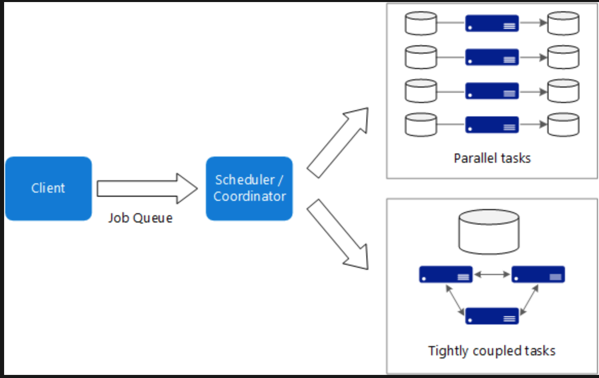
> When to use this architecture
>- Computationally intensive operations such as simulation and number crunching.
>- Simulations that are computationally intensive and must be split across CPUs in mulitple computers(10 - 1000s).
>- Simulations that require too much memory for one computer, and must be split across multiple computers.
>- Long-running computations that would take too long to complete on a single computer.
>- Smaller computations that must be run 100s or 1000s of times, such as Monte Carlo simulation.

#### Big data
> 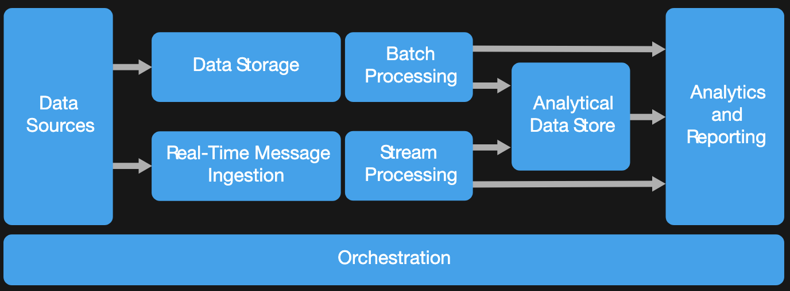
> Most big data architectures include some or all of the following components:
>- Data source: All big data solutions start with one or more data sources.
>- Data storage: Data for batch processing operations is typically stored in a distributed file store that can hold high volumes of large files in various formats.
>- Batch processing: Because the data sets are so large, often a big data solution must process data files using long-running batch jobs or filter, aggregate, and otherwise prepare the data for analysis. Usually these jobs involve reading source files, processing them, and writing the output to new files.
>- Real-time message ingestion: If the solution includes real-time sources, the architecture must include a way to capture and store real-time messages for stream processing. This might be a simple data store, where incoming messages are dropped into a folder for processing. However, many solutions need a message ingestion store to act as a buffer for messages, and to support scale-out processing, reliable delivery, and other message queuing semantics.
>- Stream processing: After capturing real-time messages, the solution must process them by filtering, aggregating, and  otherwise preparing the data for analysis. The processed stream data is then written to an output sink.
>- Analytical data store: Many big data solutions prepare data for analysis and then serve the processed data in a structured format that can be queried using analytical tools.
>- Analysis and reporting: The goal of most big data solutions is to provide insignts into the data through analysis and reporting.
>- Orchestration: Most big data solutions consist of repeated data processing operations, encapsulated in workflows, that transform source data, move data between multiple sources and sinks, load the processed data into an analytical data store, or push the results straight to a report or dashboard.

> When to use this architecture
>- Store and process data in volumes too large for a traditional database.
>- Transform unstructured data for analysis and reporting.
>- Capture, process, and analyze unbounded streams of data in real time, or with low latency.

#### Event-driven architecture style
> 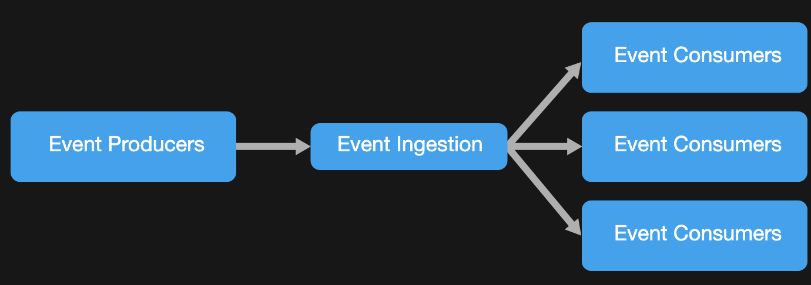
> An event driven architecture can use a pub/sub model or an event stream model.
>- Pub/Sub: The messaging infrastructure keeps track of subscriptions. When an event is published, it sends the event to each subscriber. After an event is received, it cannot be replayed, and new subscribers do not see the event.
>- Event streaming: Events are written to a log. Events are strictly ordered(within a partition) and durable. Clients don't subscribe to the stream, instead a client can read from any part of the stream. The client is responsible for advancing its position in the stream. That means a client can join at any time, and can replay events.

> When to use this architecture
>- Multiple subsystems must process the same event.
>- Real-time processing with minimum time lag.
>- Complex event processing, such as pattern matching or aggregation over time windows.
>- High volume and high velocity of data, such as IoT.

#### Microservices architecture style
> A bounded context is a natural division within a business and provides an explicit boundary within which a domain model exists.
> 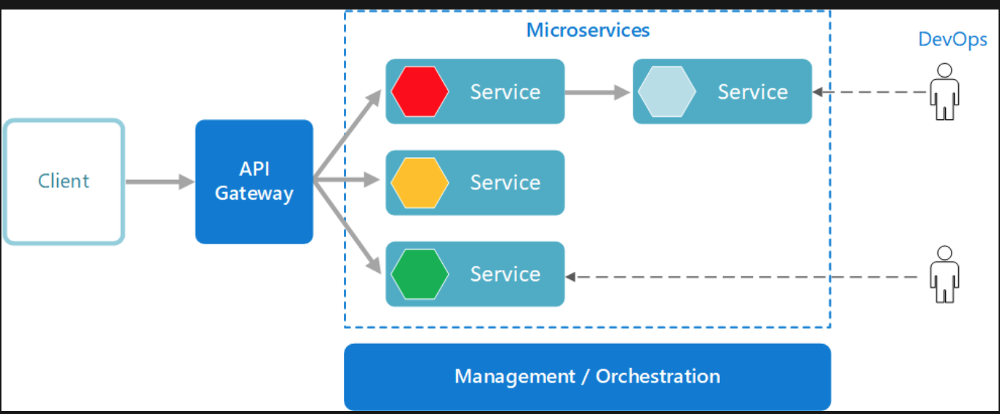

> What are miscroservices?
>- Microservices are small, independent, and loosely coupled. A single small team of developers can write and maintain a service.
>- Each service is a separate codebase, which can be managed by a small development team.
>- Services can be deployed independently. A team can update an existing service without rebuilding and redeploying the entire application.
>- Services are responsible for persisting their own data or external state. This differs from the traditional model, where a separate data layer handles data persistence.
>- Services communicate with each other by using well-defined APIs. Internal implementation details of each service are hidden from other services.
>- Supports polyglot programming, For example, services don't need to share the same technology stack, libraries, or frameworks.

> Besides for the services themselves, some other components appear in a typical microservices architecture:
>- Management/orchestration. This component is responsible for placing services on nodes, identifying failures, rebalancing services across nodes, and so forth. Typically this component is an off-the-shelf technology such as Kubernetes, rather than something custom built.
>- API Gateway. The API gateway is the entry point for clients. Instead of calling services directly, clients call the API gateway, which forwards the call to the appropriate services on the back end.

> Benefits
>- Agility. Because microservices are deployed independently, it's easier to manage bug fixes and feature releases. You can update a service without redeploying the entire application, and roll back an update if something goes wrong. In many traditional applications, if a bug is found in one part of the application, it can block the entire release process. New features may be held up waiting for a bug fix to be integrated, tested, and published.
>- Small, focused teams. A microservice should be small enough that a single feature team can build, test, and deploy it. Small team sizes promote greater agility. Large teams tend be less productive, because communication is slower, management overhead gose up, and agility diminishes.
>- Small code base. In a monolithic application, there is a tendency over time for code dependencies to become tangled. Adding a new feature requires touching code in a lot of places. By not sharing code or data stores, a microservice architecture minimizes dependencies, and that makes it easier to add new features.
>- Mix of technologies. Teams can pick the technology that best fits their service, using a mix of technology stacks as appropriate.
>- Fault isolation. If an individual microservice becomes unavailable, it won't disrupt the entire application, as long as any upstream microservices are designed to handle faults correctly.
>- Scalability. Services can be scaled independently, letting you scale out subsystems that require more resources, without scaling out the entire application. 
>- Data isolation. It is much eaiser to perform schema updates, because only a single microservice is affected. In a monolithic application, schema updates can become very challenging, because different parts of the application may all touch the same data, making any alterations to the schema risky.

#### N-tier architecture style
> 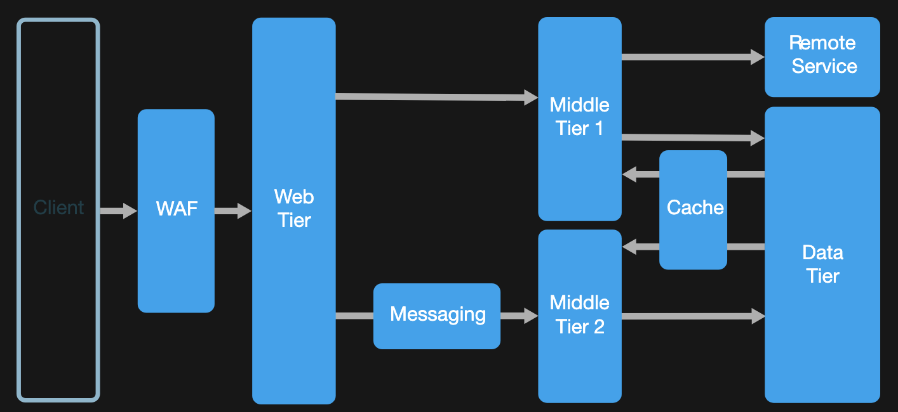

> N-tier architectures are typically implemented as infrastructure-as-service(IaaS) applications, with each tier running on a separate set of VMs.
>- Simple web applications.
>- Unified development of on-premises and cloud application.

#### Web-Queue-Worker architecture style
> 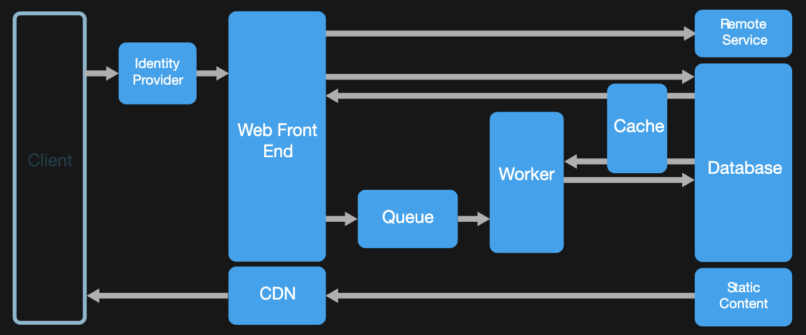

> When to use this architecture
>- Applications with a relatively simple domain.
>- Applications with some long-running workflows or batch operations.
>- When you want to use managed services, rather than infrastructure as a service(IaaS).

### Design principles for Azure applications
> IaaS is like having a box of parts. You can build anything, but you have to assemble it yourself. PaaS options are easier to configure and administer. You don't need to provision VMs, set up VNets, manage pathces and updates, and all of the other overhead associated with running software on a VM.

> Your application may have specific requirements that make an IaaS approach more suitable. However, even if your application is based on IaaS, look for places where it may be natural to incorporate PaaS options.

> Public facing services should expose a RESTful API over HTTP. Backend services might use an RPC-style messaging protocol for performance reasons.

> When services expose well-defined APIs, you can develop and test against those APIs. That way, you can develop and test an individual service without spinning up all of its dependent services.(Of course, you would still perform integration and load testing against the real services.)

> Function requirements let you judge whether the application does the right thing. Nonfunctional requirements let you judge whether the application does those things well.

### Technology choices
#### Choose a compute service
> 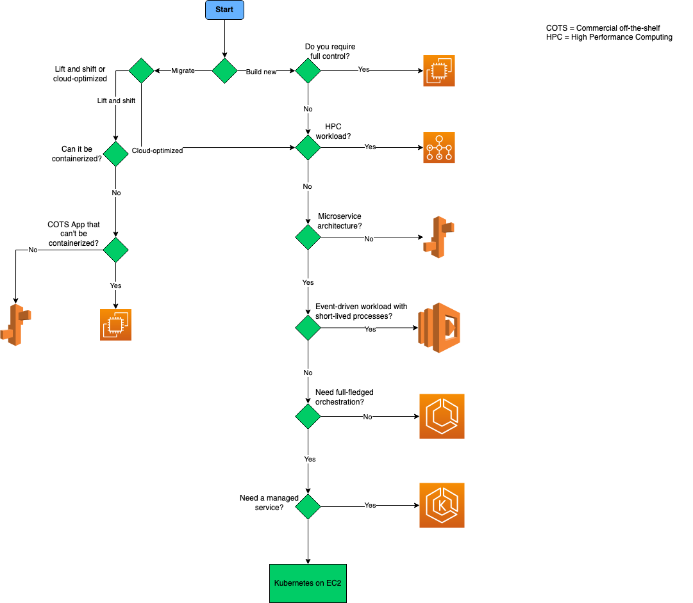
> 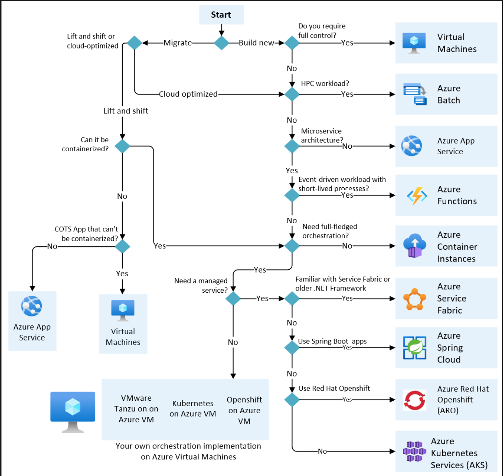
> Definitions:
>- "Lift and shift" is a strategy for migrating a workload to the cloud without redesigning the application or making code changes. Also called rehost.
>- Cloud optimized is a strategy for migrating to the cloud by refactoring an application to take advantage of cloud-native features and capabilities.

> Infrastructure-as-a-Service(IaaS) lets you provision individual VMs along with the associated networking and storage components. Then you deploy whatever software and applications you want onto those VMs.  

> Platform-as-a-Service(PaaS) provides a managed hosting environment, where you can deploy your application without needing to manage VMs or networking resources.

> Functions-as-a-Service(FaaS) goes even further in removing the need to worry about the hosting environment. In a FaaS model, you simply deploy your code and the service automatically runs it.

> For a microservices architecture, two approaches are especially popular:
>- A service orchestrator that manages services running on dedicated nodes(VMs). An orchestrator handles tasks related to deploying and managing a set of services. These tasks include placing services on nodes, monitoring the health of services, restarting unhealthy services, load balancing network traffic across service instances, service discovery, scaling the number of instances of a service, and applying configuration updates.
>- A serverless architecture using functions as service(FaaS). This approach tends to favor small granular functions that are coordinated using event-based triggers.

#### Choose a container option
> Decision tree for bare-metal Kubernetes at the edge
> 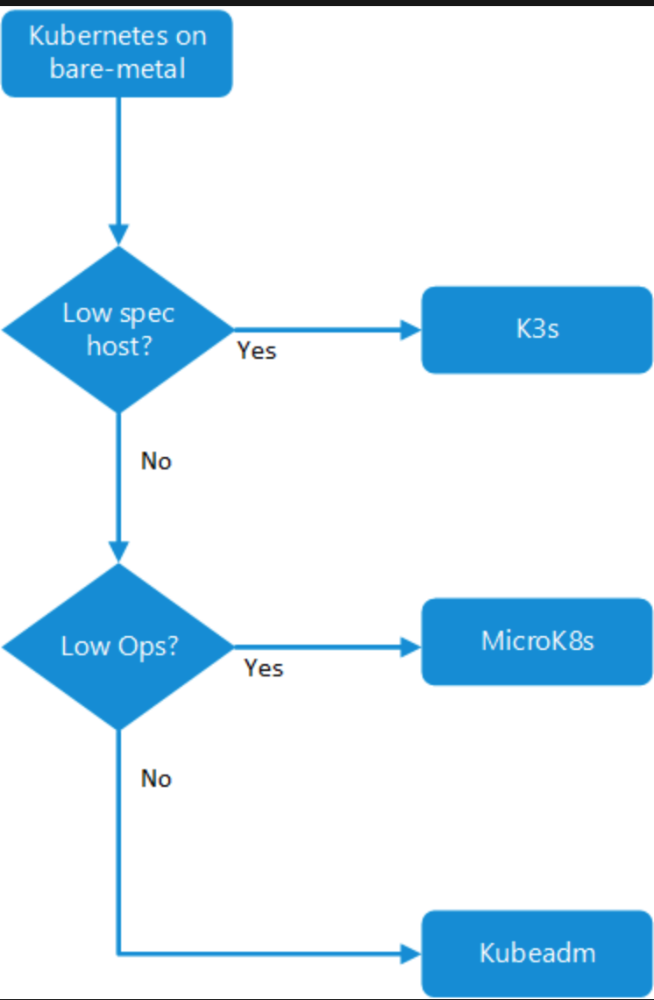

#### Choose a data store
> Relational database is very useful when strong consistency guarantees are important - where all changes are atomic, and transactions always leave the data in a consistent state. However, an RDBMS generally can't scale out horizontally without sharding the data in some way. Also, the data in an RDBMS must be normalized, which isn't appropriate for every data set.

> Relational database Workload
>- Records are frequently created and updated.
>- Multiple operations have to be completed in a single transaction.
>- Relationships are enfored using database constraints.
>- Indexes are used to optimize query performance.

> Relational Data type
>- Data is highly normalized.
>- Database schemas are required and enforced.
>- Many-to-many relationships between data entities in the database.
>- Constraints are defined in the schema and imposed on any data in the database.
>- Data requires high integrity. Indexes and relationships need to be maintained accurately.
>- Data requires strong consistency. Transactions operate in a way that ensures all data are 100% consistent for all users and processes.
>- Size of individual data entries is small to medium-sized.


> A key/value store associates each data value with a unique key. Most key/value stores only support simple query, insert, and delete operations. To modify a value(either partially or completely), an application must overwrite the existing data for the entire value. In most implementations, reading or writing a single value is an atomic operation.

> Key/value store Workload
>- Data is accessed using a single key, like a dictionary.
>- No joins, lock, or unions are required.
>- No aggregation mechanisms are used.
>- Secondary indexes are generally not used.

> Key/value store Data type
>- Each key is associated with a single value.
>- There is no schema enforcement.
>- No relationships between entities.

> A document database stores a collection of documents, where each document consist of named fields and data. The data can be simple values or complex elements such as lists and child collections. Document are retrived by unique keys.

> Document database Workload
>- Insert and update operations are common.
>- No object-relational impedance mismatch. Documents can better match the object structures used in application code.
>- Individual documents are retrived and written as a single block.
>- Data requires index on multiple fields.

> Document databse Data type
>- Data can be managed in de-normalized way.
>- Size of individual document data is relatively small.
>- Each document type can use its own schema.
>- Documents can include optional fields.
>- Documents data is semi-structured, meaning that data types of each field are not strictly defined.

> A graph database stores two types of infromation, nodes and edges. Edges specify relationships between nodes. Nodes and edges can have properties that provide information about that node or edge, similar to columns in a table. Edges can also have a direction indicating the nature of the relationship.

> Graph database Workload
>- Complex relationships between data items involving many hops between related data items.
>- The relationship between data items are dynamic and change over time.
>- Relationships between objects are first-class citizens, without requiring foreign-keys and joins to traverse.

> Graph database Data type
>- Nodes and relationships
>- Nodes are similar to table rows or JSON documents.
>- Relationships are just as important as nodes, and are exposed directly in the query language.
>- Composite objeccts, such as a person with multiple phone numbers, tend to be broken into separate, smaller nodes, combined with traversable relationships.

> Data analytics stores provide massively parallel solutions for ingesting, storing, and analyzing data. The data is distributed across multiple servers to maximize scalability. Large data file formats such as delimiter files(CSV), parquet, and ORC are widely used in data analytics.

> Data analytics Workload
>- Data analytics
>- Enterprise BI

>- Data analytics Data type
>- Historical data from multiple sources.
>- Usually denormalized in a "star" or "snowflake" schema, consisting of fact and dimension tables.
>- Usually loaded with new data on a scheduled basis.
>- Dimension tables often include multiple historic versions of an entity, referred to as a slowly changing dimension.

> A column-family database organizes data into rows and columns. In its simplest form, a column family database can appear very similar to a relational database, at least conceptually. The real power of a column-family database lies in its denormalized approach to structuring sparse data. You can think of a column-family database as holding tabular data with rows and columns, but the columns are divided into groups known as column families. Each column family holds a set of columns that are logically related together and are typically retrived or manipulated as a unit. Other data that is accessed separately can be stored in separate column families. Within a column family, new columns can be added dynamically, and rows can be sparse(that is, a row doesn't need to have a value for every column). Unlike a key/value store or a document database, most column-family database store data in key order, rather than by computing a hash. Many implementations allow you to create indexes over specific columns in a column-family. Indexes let you retrive data by columns value, rather than row key.

> Column-family database Workload
>- Most column-family databases perform write operations extremely quickly.
>- Update and delete operations are rare.
>- Designed to provide high throughput and low-latency access.
>- Supports easy query access to a particular set of fields within a much larger record.
>- Massively scalable.

> Column-family database Data type
>- Data is stored in tables consisting of a key column and one or more column familes.
>- Specific columns can vary by individual rows.
>- Individual cells are accessed via get and put commands.
>- Multiple rows are returned using a scan command. 

> A search engine database allows applications to search for information held in external data stores. A search engine database can index massive volumes of data and provide near real-time access to these indexes.

> Search engine database Workload
>- Data indexes from multiple sources and services.
>- Queries are ad-hoc and can be complex.
>- Full text search is required.
>- Ad hoc self-service query is required.

> Search engine database Data type
>- Semi-structured or unstructured text
>- Text with reference to structured data

> Time series data is a set of values organized by time. Time series database typically collect large amounts of data in real time from a large number of sources. Update are rare, and deletes are often done as bulk operations. Although the records written to a time-series database are generally small, there are often a large number of records, and total data size can grow rapidly.

> Time series database Workload
>- Records are generally appended sequentially in time order.
>- An overwhelming proportion of operations(95% - 99%) are written.
>- Update are rare.
>- Deletes occur in bulk, and are made to contiguous blocks or records.
>- Data is read sequentially in either ascending or descending time order, often in parallel.

> Time series database Data type
>- A timestamp is used as the primary key and sorting mechanism.
>- Tags may define additional information about the type, origin, and other information about the entry.

> Object storage is optimized for storing and retriving large binary objects(images, files, videos and audio streams, large application data objects and documents, virtual machine disk images). Large data files are also popularly used in this model, for example, delimiter file(CSV), parquet, and ORC. Object stores can manage extremely large amounts of unstructured data.

> Object storage Workload
>- Identified by key.
>- Content is typically an asset such as a delimiter, image, or video file.
>- Content must be durable and external to any application tier.

> Object storage Data type
>- Data size is large.
>- Value is opaque.

> Sometimes, using simple flat files can be the most effective means of storing and retriving information. Using file shares enables files to be accessed across a network. Given appropriate security and concurrent access control mechanisms, sharing data in this way can enable distributed services to provide highly scalable data access for performing basic, low-level operations such as simple read and write requests.

> Shared files Workload
>- Migration from existing apps that interact with the file system.
>- Requires SMB interface.

> Shared files Data type
>- Files in a hierarchical set of folders.
>- Accessible with standard I/O libraries.

> 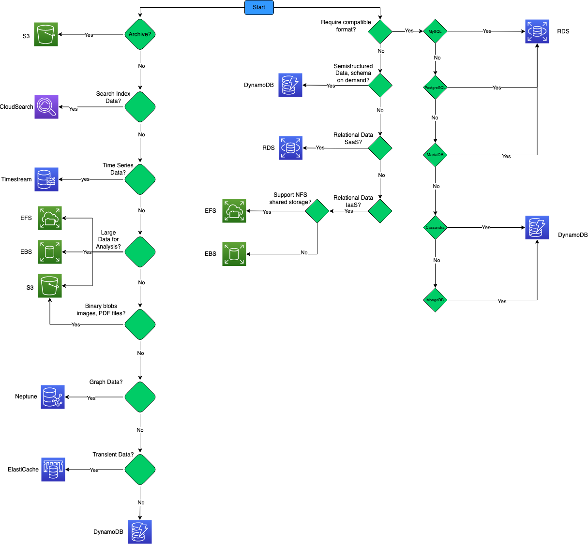
> 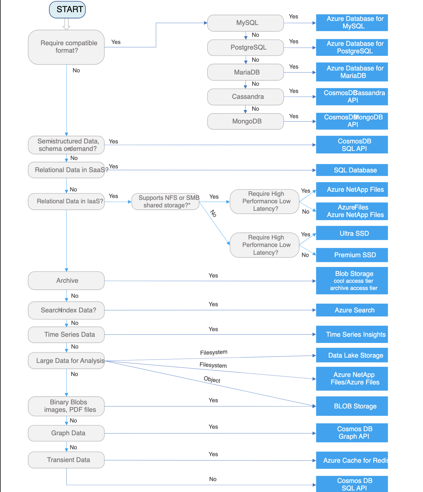

> Critieria for choosing a data store
>> General considerations
>>> Functional requirements
>>>- Data format. What type of data are you intending to store? Common types include transactional data, JSON objects, telemetry data, search indexes, or flat files.
>>>- Data size. How large are the entities you need to store? Will these entities need to be maintained as a single document, or can they be split across multiple documents, tables, collections, and so forth?
>>>- Scale and structure. What is the overall amount of storage capacity you need? Do you anticipate partitioning your data?
>>>- Data relationships. Will you data need to support one-to-many or many-to-many relationships? Are relationships themselves an important part of the data? Will you need to join or otherwise combine data from within the same dataset, or from external datasets?
>>>- Consistency model. How important is it for updates made in one node to appear in other nodes, before further changes can be made? Can you accept eventual consistency? Do you need ACID guarantees for transactions?
>>>- Schema flexibility. What kind of schemas will you apply to your data? Will you use a fixed schema, a schema-on-write approach, or a schema-on-read approach?
>>>- Concurrency. What kind of concurrency mechanism do you want to use when updating and synchronizing data? Will the application perform many updates that could potentially conflict. If so, you may require record locking and pessimistic concurrency control. Alternatively, can you support optimistic concurrency control? If so, is simple timestamp-based concurrency control enough, or do you need the added functionality of multi-version concurrency control?
>>>- Data movement. Will you solution need to perform ETL tasks to move data to other stores or data warehouses?
>>>- Data lifecycle. Is the data write-once, read-many? Can it be moved into cool or cold storage?
>>>- Other supported features. Do you need any other specific features, such as schema validation, aggregation, indexing, full-text search, MapReduce, or other query capabilities?

>>> Non-functional requirements
>>>- Performance and scalability. What are your data performance requirements? Do you have specific requirements for data ingestion rates and data processing rates? What are the acceptable response times for querying and aggregation of data once ingested? How large will you need the data store to scale up? Is your workload more read-heavy or write-heavy?
>>>- Reliablility. What overall SLA do you need to support? What level of fault-tolerance do you need to provide for data consumers? What kind of backup and restore capabilities do you need?
>>>- Replication. Will your data need to be distributed among multiple replicas or regions? What kind of data replication capabilities do you require?
>>>- Limits. Will the limits of a particular data store support your requirements for scale, number of connections, and throughput?

>>> Management and cost
>>>- Manage service. When possible, use a managed data service, unless you require specific capabilities that can only be found in an IaaS-hosted data store.
>>>- Region availability. For managed services, is the service available in all regions? Does your solution need to be hosted in certain regions?
>>>- Portability. Will your data need to be migrated to on-premises, external datacenters, or other cloud hosting environments?
>>>- Licensing. Do you have a preference of a proprietary versus OSS license type? Are there any other external restrictions on what type of license you can use?
>>>- Overall cost. What is the overall cost of using the service within your solution? How many instances will need to run, to support your uptime and throughput requirements? Consider operations costs in this calculation. One reason to prefer managed services is the reduced operational cost.
>>>- Cost effectiveness. Can you partition your data, to store it more cost effectively? For example, can you move large objects out of an expensive relational database into an object store?

>>> Security
>>>- Security. What type of encryption do you require? Do you need encryption at rest? What authentication mechanism do you want to use to connect to your data?
>>>- Auditing. What kind of audit log do you need to generate?
>>>- Networking requirements. Do you need to restrict or otherwise manage access to your data from other network resources? Does data need to be accessible only from inside the cloud environment? Does the data need to be accessible from specific IP addresses or subnet? Does it need to be accessible from applications or services hosted on-premises or in other external datacenters?

>>> Devops
>>>- Skill set. Are there particular programming languages, operating systems, or other technology that your team is particular adept at using? Are there others that would be difficult for your team to work with?
>>>- Clients. Is there good client support for your development languages?

> The databases that a business uses to store all its transactions and records are called online transaction processing(OLTP) databases. These databases usually have records that are entered one at a time. Often they contain a great deal of information that is valuable to the organization. The databases that are used for OLTP, however, were not designed for analysis. Therefore, retrieving answers from these databases is costly in terms of time and effort. OLAP systems were designed to help extract this business intelligence information from the data in a highly performant way. This is because OLAP databases are optmized for heavey read, low write workloads.

> Transactional data is information that tracks the interactions related to an organization's activities. These interactions are typically busniess transactions, such as payments received from customers, payments made to supplies, products moving through inventory, orders taken, or services delivered. Transactional events, which represent the transactions themselves, typically contain a time dimension, some numerical values, and references to other data.

> Transactions typically need to be atomic and consistent. Atomicity means that an entire transaction always succeeds or fails as one unit of work, and is never left in a half-completed state. If a transaction cannot be completed, the database system must roll back any steps that were already done as part of that transaction. In a traditional RDBMS, this rollback happens automatically if a transaction cannot be completed. Consistency means that transactions always leave the data in a valid state.

> A non-relational database is a database that does not use the tabular schema of rows and columns found in most traditional database systems. Instead, non-relational databases use a storage model that is optimized for the specific requirements of the type of data being stored.

#### Choose a network service
> 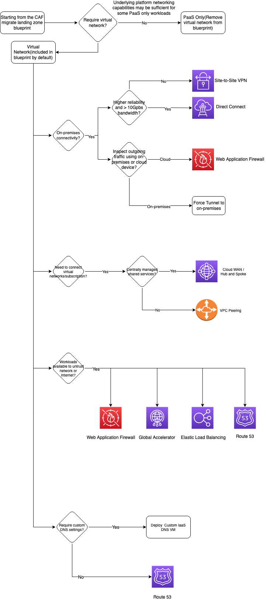
> 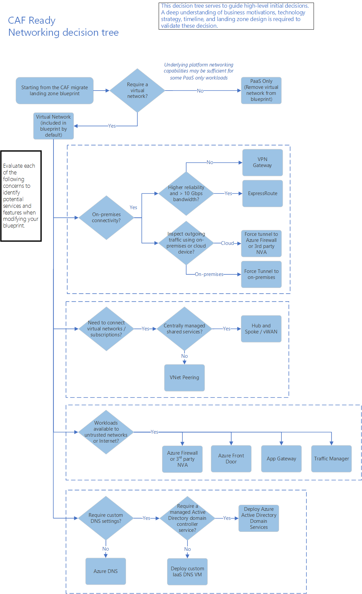

> 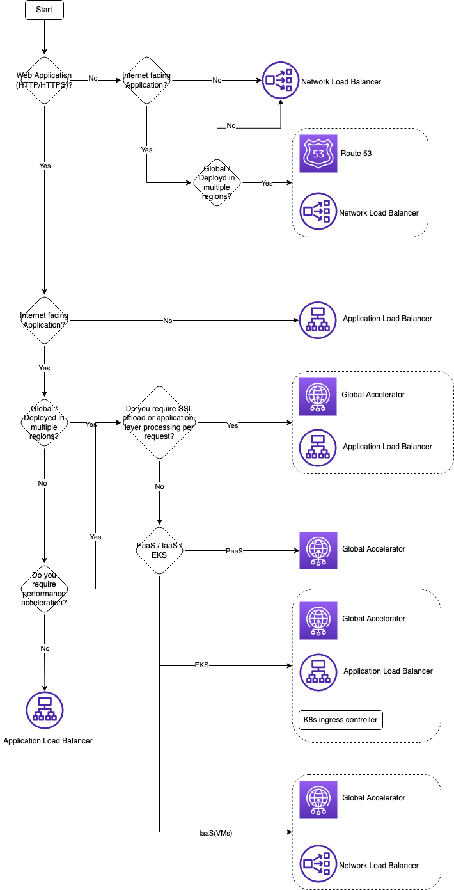
> 

#### Choose a messaging service
>- An event is a lightweight notification of a condition or a state change. The publisher of the event has no expectation about how the event is handled. The consumer of the event decides what to do with the notification. Events can be discrete units or part of a series. The events are time-ordered and interrelated. The consumer needs the sequenced series of events to analyze what happened.

>- A message is raw data produced by a service to be consumed or stored elsewhere. The message contains the data that triggered the message pipline. The publisher of the message has an expectation about how the consumer handles the message. A contract exists between the two sides.

> Messages can be classified into two main categories: If the producer expects an action from the consumer, that message is a command. If the message informs the consumer that an action has taken place, then the message is an event.

### Best practices for cloud application
#### API design
> A resource in REST doesn't have to be based on a single physical data item. For example, an order resource might be implemented internally as several tables in a relational database, but presented to the client as a single entity. Avoiding creating APIs that simply mirror the internal structure of a database. The purpose of REST is to model entities and the operations that an application can perform on those entities. A client should not be exposed to the internal implementation.

> Considering the relationships between different types of resources and how you might expose these associations. For example, the /customer/5/orders might represent all of the orders for customer 5. You could also go in the order direction, and represent the association from an order back to a customer with a URL such as /orders/99/customer. However, extending this model too far can become cumbersome to implement. A better solution is to provide navigable links to assocated resources in the body of the HTTP response message. 

> Avoiding requiring resource URIs more complex than collection/item/collection.

> Avoiding introducing dependencies between the web API and the underlying data source. For example, if your data is stored in a relational database, the web API doesn't need to expose each table as a collection of resources. In fact, that's probably a poor design. Instead, think of the web API as an abstraction of the database. If necessary, introduce a mapping layer between the database and the web API. That way, client applications are isolated from changes to the underlying database schema.

> PUT requests must be idempotent. If a client submits the same PUT request multiple times, the results should always be the same(the same resource will be modified with the same values). POST and PATCH requests are not guaranteed to be idempotent.

#### API implementation
> The HTTP protocol provides the chunked transfer encoding mechanism to stream large data objects back to a client. When the client sends an HTTP GET request for a large object, the web API can send the reply back in piecemeal chunks over an HTTP connection. The length of the data in the reply may not be known initially(it might be generated), so the server hosting the web API should send a response message with each chunk that specifies the Transfer-Encoding: Chunked header rather than a Content-Length header. The client application can receive each chunk in turn to build up the complete response. The data transfer completes when the server sends back a final chunk with zero size.

> It is important to ensure that the web API is implemented to maintain responsiveness under a heavy load, to be scalable to support a highly varing workload, and to guarantee availability for clients that perform business-critical operations.
>- Providing asynchronous support for long-running requests.
>> The web API can perform some initial checking to validate the  request, initiate a separate task to perform the work, and then return a response message with HTTP code 202(Accepted). The task could run asynchronously as part of the web API processing, or it could be offloaded to a background task. The web API should also provide a mechanism to return the results of the processing to the client application. You can achieve this by providing a polling mechanism for client applications to periodically query whether the processing has finished and obtain the result, or enabling the web API to send a notification when the operation has completed.
>- Ensure that each request is stateless.
>- Track clients and implement throttling to reduce the chances of DOS attacks.
>- Manage persistent HTTP connections carefully.

#### Autoscaling
> If the solution implements a long-running task, design this task to support both scaling out and scaling in. Without due care, such a task could prevent an instance of a process from being shut down cleanly when the system scales in, or it could lose data if the process is forcibly terminated. Ideally, refactor a long-running task and break up the processing that it performs into smaller, discrete chunks.

#### Background jobs
> Ideally, background tasks are "fire and forget" operations, and their execution progress has no impact on the UI or the calling process.

#### Caching
> If an application choose not to cache this data on the basis that the cached information will nearly always be outdated, then the same consideration could be true when storing and retriving this information from the data store. In the time it takes to save and fetch this data, it might have changed. In a situation such as this, consider the benefits of storing the dynamic information directly in the cache instead of in the persistent data store. If the data is noncritical and does not require auditing, then it doesn't matter if the occasional change is lost.

> Consider implementing a local, private cache in each instance of an application, together with the shared cache that all application instances access. When the application retrives an item, it can check first in its local cache, then in the shared cache, and finally in the original data store. The local cache can be populated using the data in either the shared cache, or in the database if the shared cache is unavailable. This approach requires careful configuration to prevent the local cache from becoming too stale with respect to the shared cache. However, the local cache acts as a buffer if the shared cache is unreachable.
> 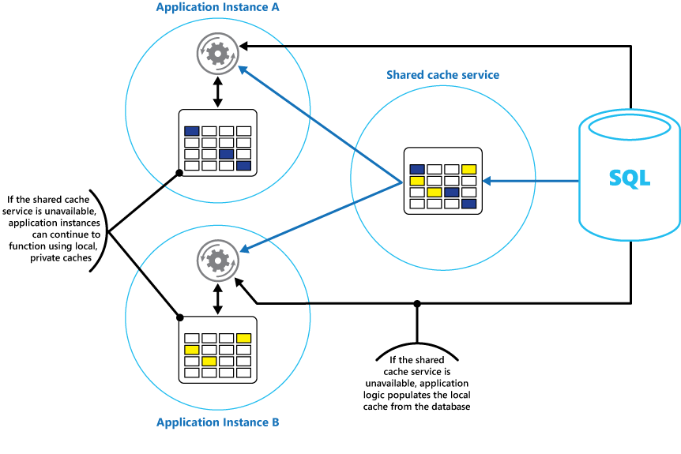

> If a shared cache is large, it might be beneficial to partition the cached data across nodes to reduce the chances of contention and improve scalability.

#### Content Delivery Network
> CDNs are typically used to deliver static content such as images, style sheets, documents, client-side script, and HTML pages. The major advantages of using a CDN are lower latency and faster delivery of content to users, regardless of their geographical location in relation to the datacenter where the application is hosted. CDNs can also help to reduce load on a web application, because the application does not have to service requests for the content that is hosted in the CDN.

#### Data paritioning
> Vertical partitioning operates at the entity level within a data store, partially normalizing an entity to break it down from a wide item to a set of narrow items. It is ideally suited for column-oriented data stores such as HBase and Cassandra.

> Use business requirements to determine the critical queries that must always perform quickly.

> If cross-partition joins are necessary, run parallel queries over the partitions and join the data within the application.

#### Message encoding considerations
> The producer of the message defines the message shape based on the business logic and the information it wants to send to the consumer(s).

> As business requirements change, the shape is expected to change, and the schema will evolve. Versioning allows the producer to indicate schema updates that might include new features.

#### Monitoring and diagnostics
> A more advanced system might include a predictive element that performs a cold analysis over recent and current workloads.
>- The rate of requests directed at each service or subsystem.
>- The response times of these requests.
>- The volume of data flowing into and out of each service.

> Health monitoring provides an immediate view of the current health of the system, availability monitoring is concerned with tracking the availability of the system and its components to generate statistics about the uptime of the system.

> You can calculate the percentage availability of a service over a period of time by using the following formula:
>```
> %Availability = ((Total Time - Total Downtime) / Total time) * 100
>```
> This is useful for SLA purposes.

### Performance tuning and antipatterns
> Performance is frequently measured in terms of throughput, response time, and availability.

> Performance targets should explicitly include a target load. Also, not all users will receive exactly the same level of performance, even when accessing the system simultanously and performing the same work.

#### Performance antipatterns
>1. Busy Database  
> Many database systems can run code. Examples include stored procedures and triggers. Often, it's more efficient to perform this processing close to the data, rather than transmitting the data to a client application for processing. However, overusing these features can hurt performance.
>2. Busy Front End 
> Performing asynchronous work on a large number of background threads can starve other concurrent foreground tasks of resources, deceasing response times to unacceptable levels. This problem typically occurs when an application is developed as monolithic piece of code, with all of the business logic combined into a single tier shared with the presentation layer.
>3. Chatty I/O 
> The cumulative effect of a large number of I/O requests can have a significant impact on performance and responsiveness.
>4. Extraneous Fetching 
> More than needed data is retrived for a business operation, often resulting in unnecessary I/O overhead and reduced responsiveness. e.g. For each request, the database returned 80,503 bytes, but the response to the client only contained 19,855 bytes, about 25% of the size of the database response. 
>5. Improper Instantiation  
> Sometimes new instances of a class are continually created, when it si  meant to be created once and then shared.  
> object thats can't be shared -> not thread-safe -> new object.  
> singleton object -> thread-safe -> object pool
>6. Monolithic Persistence  
> Putting all of an application's data into a single data store can hurt performance, either because it leads to resource contention, or because the data store is not a good fit for some of the data.  
>7. No Caching  
> When a cloud application that handles concurrent requests, repeatedly fetches the same data. This can reduce performance and scalability.
>8. Noisy Neighbor  
> The problem occurs when one tenant's performance is degraded because of the activities of another tenant.
>9. Retry Storm  
> When a service is unavailable or busy, having clients retry their connections too frequently can cause the service to struggle to recover, and can make the problem worse.
>10. Synchronous I/O  
> Blocking the calling thread while I/O completes can reduce performance and affect vertical scalability.

### Architecture for startup
> Kent Beck describes a three-stage process of software product innovation. Those stages are explore, expand, and extract.
> 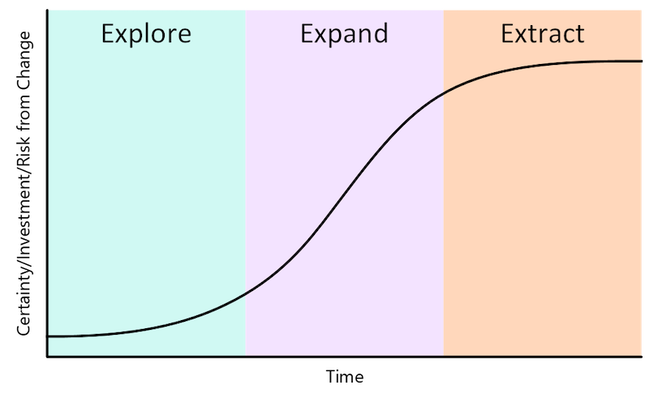
>- Explore  
> This stage requires discipline. It's easy to overinvest in an idea that you could test with less time and energy. A technologist finds it especially easy to fall into this trap. To make architectural choices that ease exploration, remember that you're exploring. You don't yet know if the current product idea is one that will scale.  
> During the exploration phase, you need to optimize for speed, cost, and optionality. Speed is about how fast you can build and move forward with an idea, or move onto the next idea. Cost is how much you're spending to run your infrastructure. Optionality describes how fast you can change directions given the current architecture.  
> It's important to balance cost, speed, and optionality. Too much focus on cost limits speed and optionality. Too much focus on speed can lead to increased costs and fewer options. Designing for too many options builds complexity, which increases costs and reduces speed.
>- Expand  
> Once your startup finds grownth through exploration, you shift gears to expansion. You focus on removing any blockages to your product's and company's continued growth. From a technical perspective, you solve infrastructure scale challenges and increase development velocity. The goals are to meet your new customers' needs and advance your product roadmap.  
> In early startup stages, any architecture extension should be just-in-time. The extension should take only as much time and energy as needed to test the next hypothesis. Be ready to remove extension to reduce complexity. Look for product features that your customers aren't using as opportunities to simplify your architecture and reduce your infrastructure spending.
>- Extract  
> In the extraction phase, the pace of growth slows as you reach the limits of the market opportunity. Because you expanded through the previous phase, there's now a lot to lose, so you take a more cautious approach. Margin expansion, cost reduction, and efficiency improvements characterize the extraction phase. During the extraction phase, be careful not to compromise the product for the customers you won in the expansion phase.

> In a product's initial explore stage, you need to optimize deployment for speed, cost, and optionality. Optionality refers to how fast you can change directions within a given architecture.  
> A business in the expand and extract phases of product development might use a service-oriented or microservice architecture. This type of deployment architecture is rarely right for a startup that hasn't yet found product/market fit or commercial traction.  
> For a core startup stack, a simple monolithic design is best. This design limits the time spent managing infrastructure, while providing ample ability to scale as the startup wins more customers.

> Bugs aren't caused by complexity, but a complex stack makes it easier to ship bugs. Not all sophisticated architectures are a waste of energy, but they waste your resources if you haven't yet found product/market fit. Your first startup stack should be simple and get out of your way, so you can concentrate on product development.

> The following simple diagram shows the recommended core startup stack. These components are enough to get your product off the ground and into the hands of your customers. For 80 percent of startups, this stack is all you need to test the basic hypotheses built into your product. Startups working in machine learning, internet of things(IoT), or highly regulated enviroments might require more components.
> 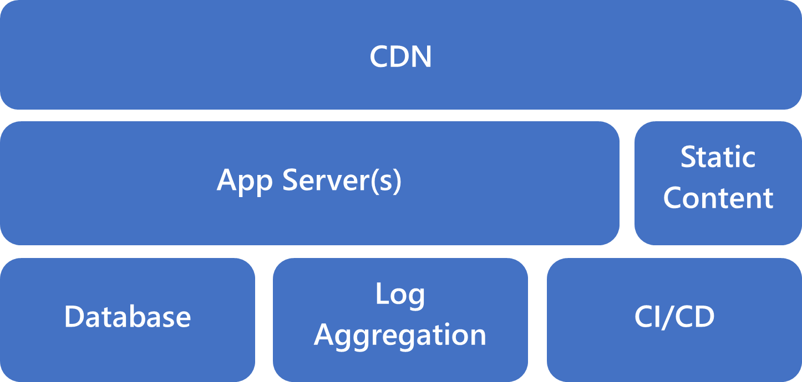

## Design pattern
### Data management patterns
>- Cache-Aside  
> Caching is more effective for relatively static data, or data that is read frequently.  
> Implementing the Cache-Aside pattern doesn't guarantee consistency between the data store and the cache.  
>- CQRS  
> CQRS separates reads and writes into different models, using commands(should be task-based) to update data, and queries to read data.
>- Event Sourcing  
> Instead of storing just the current state of the data in a domain, use an append-only store to record the full series of actions taken on that data.  
> The event store is the permanent source of information, and so the event data should never be updated. The only way to update an entity to undo a change is to add a compensating event to the event store.  
> Systems that predomainantly add data rather than updating it.
>- Index Table  
> Create indexes over the fields in data stores that are frequently referenced by queries.
>- Materialized View  
> Generate prepopulated views over the data in one or more data stores when the data isn't ideally formatted for required query operations.
>- Sharding  
> Divide a data store into a set of horizontal partitions or shards. This can improve scalability when storing and accessing large volumes of data.  
> Use this pattern when a data store is likely to need to scale beyond the resources available to a single storage node, or to improve performance by reducing contention in a data store.
>- Static Content Hosting  
> In most cloud hosting environments, you can put some of an application's resources and static pages in a storage service. The storage service can serve requests for these resources, reducing load on the compute resources that handle other web requests.  
> For maximum performance and availability, consider using a content delivery network(CDN) to cache the contents of the storage container in multiple datacenters around the world.  
>- Valet Key  
> Use a token that provides clients with restricted direct access to a specific resource, in order to offload data transfer from the application.

### Design and implementation  
>- Ambassador  
> Ambassador services can be deployed as a sidecar to accompany the lifecyle of a consuming application or service.
> 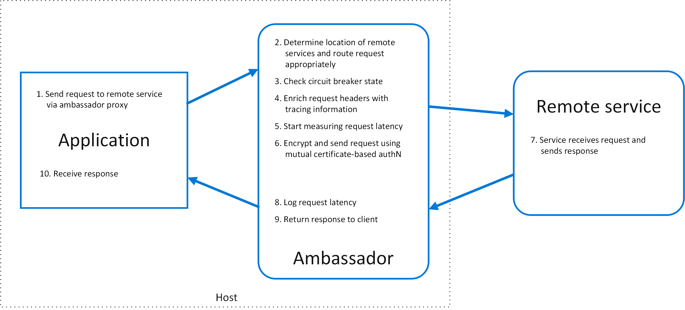
>- Anti-corruption Layer  
> Isolate the different subsystems by placing an anti-corruption layer between them. This layer translates communications between the two systems, allowing one system to remain unchanged while the other can avoid compromising its design and technological approach.  
> 
>- Backends for Frontends  
> Create one backend per user interface. Fine-tune the behavior and performance of each backend to best match the needs of the frontend environment, without worrying about affecting other frontend experiences.
> 
>- Compute Resource Consolidation  
> A common approach is to look for tasks that have a similar profile concerning their scalability, lifetime, and processing requirements. Grouping these together allows them to scale as a unit.

