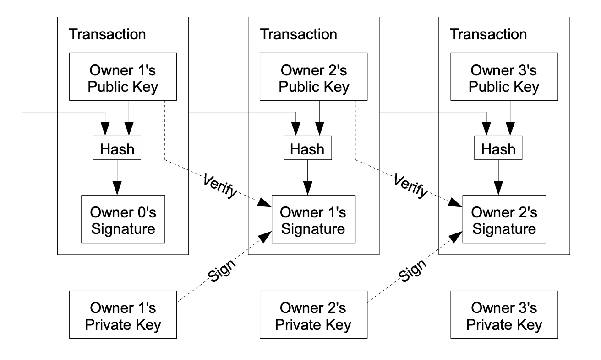

# [Bitcoin](https://bitcoin.org/bitcoin.pdf)

## 1. Introduction
> In this paper, we propose a solution to the double-spending problem using a peer-to-peer distributed timestamp server to generate computational proof of the chronological order of transactions. The system is secure as long as honest nodes collectively control more CPU power than any cooperating group of attacker nodes.

## 2.Transaction
> We define an electronic coin as a chain of digital signatures. Each owner transfers the coin to the next by digitially signing a hash of the previous transaction and the public key of the next owner and adding these to the end of the coin.
> 

## 4. Proof-of-work
> The proof-of-work involves scanning for a value that when hashed, such as with SHA-256, the hash begins with a number of zero bits.
[hashcash.py](hashcash.py)

> If the majority were based on one-IP-address-one-vote, it could be subverted by anyone able to allocate many IPs. Proof-of-work is essentially one-CPU-one-vote. The majority decision is represented by the longest chain, which has the greatest proof-of-work effort invested in it. If a majority of CPU power is controlled by honest nodes, the honest chain will grow the fastest and outpace any competing chains. To modify a past block, an attacker would have to redo the proof-of-work of the block and all blocks after it and then catch up with and surpass the work of the honest nodes.

