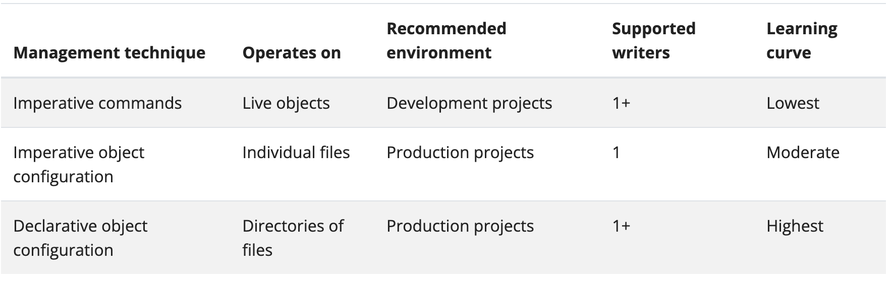
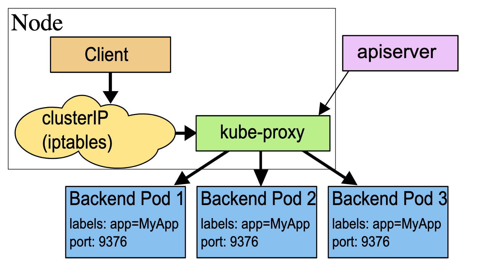
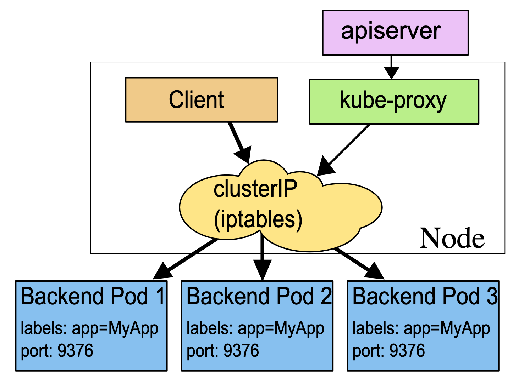
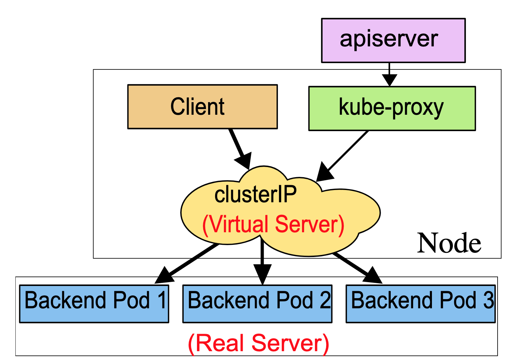

# [Kubernetes](https://kubernetes.io/docs/home/)

## Concepts
### Overview
#### Kubernetes Components
> A Kubernetes cluster consist of a set of worker machines, called nodes, that run containerized applications. Every cluster has at least one worker node.

> The worker nodes host the Pods that are the components of the application workload. The control plane manages the worker nodes and the Pods in the cluster. In production environments, the control plane usually runs across multiple computers and a cluster usually runs multiple nodes, providing fault-tolerance and high availability.
> 

##### Control Plane Components
> The control plane's components make global decisions about the cluster, as well as detecting and responding to cluster events.

###### kube-apiserver
> The API server is a components of the Kubernetes control plane that expose the Kubernetes API. The API server is the front end for the Kubernetes control plane.

###### etcd
> Consistent and highly-available key value store used as Kubernetes' backing store for all cluster data.

###### kube-scheduler
> Control plane component that watches for newly created Pods with no assigned node, and selects a node for them to run on.

> Factors taken into account for scheduling decisions include: individual and collective resource requirements, hardware/software/policy constraints, affinity and anti-affinity specifications, data locality, inter-workload interference, and deadlines.

###### kube-controller-manager
> Control plane component that runs controller processes.
>- Node controller: Responsible for noticing and responding when nodes go down.
>- Job controller: Watches for Job objects that represent one-off tasks, then creates Pods to run those tasks to completion.
>- Endpoint controller: Populates the Endpoints object(that is, joins Services & Pods).
>- Service Account & Token controllers: Create default accounts and API access tokens for new namespaces.

###### cloud-controller-manager
> A Kubernetes contorl plane component that embeds cloud-specific control logic. The cloud controller manager lets you link your cluster into your provider's API, and seperates out the componenets that interact with that cloud platform from components that only interact with your cluster.
>- Node controller: For checking the cloud provider to determine if a node has been deleted in the cloud after it stops responding.
>- Route controller: For setting up routes in the underlying cloud infrastructure.
>- Service controller: For creating, updating and deleting cloud provider load balancers.

##### Node Components
> Node components run on every node, maintaining running pods and providing the Kubernetes runtime environment.

###### kubelet
> An agent that runs on each node in the cluster. It makes sure that containers are running in a Pod.

> The Kubelet doesn't manage containers which were not created by Kubernetes.

###### kube-proxy
> kube-proxy is a network proxy that runs on each node in your cluster, implementing part of the Kubernetes Service concept.

> kube-proxy maintains network rules on nodes. These network rules allow network communication to your Pods from network sessions inside or outside of your cluster.

###### Container runtime
> The container runtime is the software that is responsible for running containers.

##### Addons
> Addons use Kubernetes resources to implement cluster features. Because these are providing cluster-level features, namespaced resources for addons belong within the kube-system namespace.

###### DNS
> While the other addons are not strictly required, all Kubernetes clusters should have cluster DNS.

> Containers started by Kubernetes automatically include this DNS server in their DNS searches.

#### The Kubernetes API
> The core of Kubernetes' control plane is the API server. The API server exposes an HTTP API that lets end users, different parts of your cluster, and external components communicate with one another.

> The Kubernetes API lets you query and manipulate the state of API objects in Kubernetes.

> Most operations can be performed through the kubectl command-line interface or other command-line tools, such as kubeadm, which in turn use the API. However, you can also access the API directly using REST calls.

#### Working with Kubernetes Objects
##### Understanding Kubernetes Objects
> A Kubernetes object is a "record of intent" -- once you create the object, the Kubernetes system will constantly work to ensure that object exists. By creating an object, you're efficiently telling the Kubernetes system what your cluster's workload to look like; this is your cluster's desire state.

> Almost every Kubernetes object includes two nested object fields that govern the object's configuration: the object spec and the object status. For objects that have a spec, you have to set this when you create the object, providing a description of the characteristics you want the resource to have: its desire state.

> The status describes the current state of the object, supplied and updated by the Kubernetes system and its components. The Kubernetes control plane continually and actively manages every object's actual state to match the desired state you supplied.

> When you create an object in Kubernetes, you must provide the object spec that describes its desired state, as well as some basic information about the object. When you use the Kubernetes API to create the object, that API request must include that information as JSON in the request body. Most often, you provide the information to kubectl in a .yaml file. kubectl converts the information to JSON when making the API request.

> In the .yaml file for the Kubernetes object you want to create, you'll need to set values for the following fields:
>- apiVersion - Which version of the Kubernetes API you're using to create this object
>- kind - What kind of object you want to create
>- metadata - Data that helps uniquely identify the object, including a name string, UID, and optional namespace
>- spec -  What state you desire for the object

##### Kubernetes Object Management
> 

###### Imperative commands
>- When using imperative commands, a user operates directly on live objects in a cluster. The user provides operations to the kubectl command as arguments or flags.
>```
> kubectl create deployment nginx --image nginx
>```

###### Imperative object configuration
> In imperative object configuration, the kubectl command speicifies the operation(create, replace, etc.), optional flags and at least one file name. The file speicified must contain a full definition of the object in YAML or JSON format.
>```
> kubectl create -f nginx.yaml
>```

###### Declarative object configuration
> When using declarative object configuration, a user operates on object configuration files stored locally, however the user does not define the operations to be taken on the files. Create, update, and delete operations are automatically detected per-object by kubectl. This enables working on directories, where different operations might be needed for different objects.
>```
> kubectl diff -f configs/
> kubectl diff -R -f configs/
>```

##### Object Names and IDs
> Each object in your cluster has a Name that is unique for that type of resource. Every Kubernetes object also has a UID that is unique across your whole cluster.

###### Names
> A client-provided string that refers to an object in a resource URL, such as /api/v1/pods/some-name .

##### Namespace
> In Kubernetes, namespaces provides a mechanism for isolating groups of resources within a single cluster. Names of resources need to be unique within a namespace, but not across namespaces. Namespace-based scoping is applicable only for namespaced objects(e.g. Deployments, Services, etc) and not for cluster-wide objects(e.g. StorageClass, Nodes, PersistentVolumes, etc).

> Namespaces are intended for use in environments with many users spread across multiple teams, or projects. For clusters with a few to ten of users, you should not need to create or think about namespaces at all. Start using namespaces when you need the features they provide.

> Namespaces provide a scope for names. Names of resources need to be unique within a namespace, but not across namespaces. Namespaces cannot be nested inside one another and each Kubernetes resource can only be in one namespace.

> Namespaces are a way to divide cluster resources between  multiple users.

> It's not necessary to use multiple namespaces to seperate slightly different resources, such as different versions of the same software: use labels to distinguish resources within the same namespace.

> Kubernetes starts with four initial namespaces:
>- default The default namespace for objects with no other namespace    
>- kube-system The namespace for objects created by the Kubernetes system
>- kube-public This namespace is created automatically and is readable by all users. This namespace is mostly reserved for cluster usage, in case that some resources should be visible and readable publicly throughout the whole cluster. The public aspect of this namespace is only a convention, not a requirement.
>- kube-node-lease This namespace holds Lease objects associated with each node. Node leases allow the kubelet to send heartbeats so that the control plane can detect node failure.

> When you create a Service, it creates a corresponding DNS entry. This entry is of the form <service-name>.<namespace-name>.svc.cluster.local, which means that if a container only uses <service-name>, it will resolve to the service which is local to a namespace. This is useful for using the same configuration across multiple namespaces such as Development, Staging and Production.

> Most Kubernetes resources are in some namespaces. However namespace resources are not themselves in a namespace. And low-level resources, such as nodes and persistentVolumes, are not in any namespace.

##### Labels and Selectors
> Labels are key/value pairs that are attached to objects, such as pods. Labels are intended to be used to specify identifying attributes of objects that are meaningful and relevant to users, but do not directly imply sematics to the core system. Labels can be used to organize and to select subsets of objects. Labels can be attached to objects at creation time and subsequently added and modified at any time. Each object can have a set of key/value labels defined. Each key must be unique for a given object.

> Valid label keys have two segments: an optional prefix and name, seperated by a slash(/). The prefix is optional. If specified, the prefix must be a DNS subdomain: a series of DNS labels seperated by dots(.). If the prefix is omitted, the label key is presumed to be private to the user. Automated system components which add labels to end-user objects must specify a prefix.

> Via a label selector, the client/user can  identify a set of objects. The label selector is the core grouping primitive in Kubernetes. The Api currently supports two types of selectors: equality-based and set-based.
>- Equality- or inequality-based requirements allow filtering by label keys and values. Matching objects must satisfy all of the specified label contraints, though they may have additional labels as well. Three kinds of operators are admitted =,==,!=.
>- Set-based label requirements allow filtering keys according to a set of values. Three kinds of operators are supported: in,notin and exists(only the key identifier). 

> Set-based requirements can be mixed with equality-based requirements.

##### Annotations
> You can use either labels or annotations to attach metadata to Kubernetes objects. Labels can be used to select objects and to find collections of objects that satisfy certain conditions. In contrast, annotations are not used to identify and select objects.

> Valid annotation keys have two segments: an optional prefix and name, seperated by a slash(/). The prefix is optional. If specified, the prefix must be a DNS subdomain: a series of DNS labels seperated by dots(.). If the prefix is omitted, the annotation key is presumed to be private to the user. Automated system components which add annotations to end-user objects must specify a prefix.

##### Field Selectors
> Field selectors let you select Kubernetes resources based on the value of one or more resource fields.

> You can use the =, ==, and != operators with field selectors.

##### Finalizers
> Finalizers are namespaced keys that tell Kubernetes to wait until specific conditions are met before it fully deletes resources marked for deletion.

> You can use finalizers to control garbage collection of resources by alerting controllers to perform specific cleanup tasks before deleting the target resource.

### Cluster Architecture
#### Nodes
> Kubernetes runs your workload by placing containers into Pods to run on Nodes. A node may be a virtual or physical machine, depending on the cluster. Each node is managed by the control plane and contains the services necessary to run Pods.

> The componenets on a node include the kubelet, a container runtime, and the kube-proxy.

> There are two main ways to have Nodes added to the API server:
>1. The kubelet on a node self-registers to the control plane
>2. You(or another human user) manually add a Node object

> A Node's status contains the following information:
>- Address
>- Conditions
>- Capacity and Allocatable
>>- The fields in the capacity block indicate the total amount of resources that a Node has. 
>>- The allocatable block indicates the amount of resources on a Node that is available to be consumed by normal Pods.
>- Info

> Heartbeats, sent by Kubernetes nodes, help your cluster determine the availability of each node, and to take action when failure are detected.

> The node controller is a Kubernetes control plane component that manages various aspects of nodes.

> The node controller has multiple roles in a node's life. The first is assigning a CIDR block to the node when it is registered. The second is keeping the node controller's internal list of nodes up to date with the cloud provider's list of available machines. The third is monitoring the node's health.

> Nodes that self register report their capacity during registration. If you manually add a Node, then you need to set the node's capacity information when you add it.

> The Kubernetes scheduler ensures that there are enough resources for all the Pods on a Node. The scheduler checks that the sum of the requests of containers on the node is no greater than the node's capacity. That sum of requests includes managed by kubelet, but excludes any containers started directly by the container runtime. and also excludes any processes running outside of the kubelet's control.

#### Control Plane-Node Communication
> Kubernetes has a "hub-and-spoke" API pattern. All API usage from nodes(or the pods they run) terminates at the apiserver. None of the other control plane components are designed to expose remote services.

> There are two primary communication paths from the control plane(apiserver) to the nodes. The first is from the apiserver to the kubelet which runs on each node in the cluster. The second is from the apiserver to any node, pod, or service through the apiserver's proxy functionality.

#### Controllers
> In Kubernetes, controllers are control loops that watch the state of your cluster, then make or request changes where needed. Each controller tries to move the current cluster state closer to the desired state.

> A controller tracks at least one Kubernetes resource type. These objects have a spec field that represents the desired state. The controller(s) for that resource are responsible for making the current state come closer to that desired state.

> Kubernetes takes a cloud-native view of systems, and is able to handle constant change. Your cluster could be changing at any point as work happens and control loops automatically fix failures. This means that, potentially, your cluster never reaches a stable state. As long as the controllers for your cluster are running and able to make useful changes, it doesn't matter if the overall state is stable or not.

> As a tenet of its design, Kubernetes uses lots of controllers that each manage a particular aspect of cluster state. Most commonly, a particular control loop(controller) uses one kind of resource as its desired state, and has a different kind of resource that it manages to make that desired state happen.

> Kubernetes comes with a set of built-in controllers that run inside the kube-controller-manager. These built-in controllers provide important core behaviors.

#### Container Runtime Interface(CRI)
> The CRI is a plugin interface which enables the kubelet to use a wide variety of container runtimes, without having a need to recompile the cluster components.

> The Container Runtime Interface(CRI) is the main protocol for the communication between the kubelet and Container Runtime.

> The Kubernetes Container Runtime Interface defines the main gRPC protocol for the communication between the cluster components kubelete and container runtime.

#### Garbage Collection
> Many objects in Kubernetes link to each other through owner references. Owner references tell the control plane which objects are dependent on others. Kubernetes uses owner references to give the control plane, and other API clients, the opportunity to clean up related resources before deleting an object. In most cases, Kubernetes manages owner references automatically.

> Kubernetes checks for and deletes objects that no longer have owner references. When you delete an object, you can control whether Kubernetes deletes the object's dependents automatically, in a process called cascading deletion. There are two types of cascading deletion, as follows:
>- Foreground cascading deletion: The object itself cann't be deleted before all the objects that it owns are deleted.
>- Background cascading deletion: The object itself is deleted, after which the GC deletes the objects that it owned.

> By default, Kubernetes uses background cascading deletion unless you manually use foreground deletion or choose to orphan the dependent objects.

> When Kubernetes deletes an owner object, the dependents left behind are called orphan objects. By default, Kubernetes deletes dependent objects.

> The kubelet performs garbage collection on unused images every five minutes and on unused containers every minutes. You should avoid using external garbage collection tools, as these can break the kubelet behavior and remove containers that should exist.

> Kubernetes manages the lifecycle of all images through its images manager, which is part of the kubelet, with the cooperation of cadvisor. 

> Disk usage above the configured HighThresholdPercent value triggers garbage collection, which deletes images in order based on the last time they were used, starting with the oldest first. The kubelet deletes images until disk usage reaches the LowThresholdPercent value.

### Containers
> Kubernetes supports container runtimes such as containerd, CRI-O, and any other implementation of the Kubernetes CRI.

#### Images
> A container image represents binary data that encapsulates an application and all its software dependencies. Container images are executable software bundles that can run standalone and that make very well defined assumptions about their runtime environment.

> You typically create a container image of your application and push it to a registry before referring to it in a Pod.

> If you don't specify a registry hostname, Kubernetes assumes that you mean the Docker public registry.

> If you don't specify a tag, Kubernetes assumes you mean the tag latest.

> You should avoid using the :latest tag when deploying containers in production as it is harder to track which version of the image is running and more difficult to roll back properly.

> To make sure the Pod always uses the same version of a container image, you can specify the image's digest; replace image-name:tag with image-name@digest.

> When using image tags, if the image registry were to change the code that the tag on that image represents, you might end up with a mix of Pods running the old and new code. An image digest uniquely identifies a specific version of the image, so Kubernetes runs the same code every time it starts a container with that image name and digest specified. Specifying an image fixes the code that you run so that a change at the registry cann't lead to that mix of versions.

> Pre-pulled images can be used to preload certain images for speed or as an alternative to authenticating to a private registry.

> Specifying imagePullSecrets on a Pod is the recommended approach to run containers based on images in private registers.

#### Container environment
> The Pod name and namespace are available as environment variables through the downward API.

> User defined environment variables from the Pod definition are also available to the Containers, as are any environment variables specified statically in the Docker image.

#### Container Lifecycle Hooks
> There are two hooks that are exposed to Containers:
>- PostStart: This hook is executed immediately after a container is created. However, there is no guarantee that the hook will execute before the container ENTRYPOINT.
>- PreStop: This hook is called immediately before a container is terminated due to an API request or management event such as a liveness/startup probe failure, preemption, resource contention and others. The Pod's termination grace period countdown begins before the PreStop hook is executed, so regardless of the outcome of the handler, the container will eventually terminate within the Pod's termination grace period.

> Hook handler calls are synchronous within the context of the Pod containing the Container. This means that for a PostStart hook, the Container ENTRYPOINT and hook fire asynchronously. However, if the hook takes too long to run or hangs, the Container cannot reaching a running state.
> PreStop hooks are not executed asynchronously from the signal to stop the Containers; the hook must complete its execution before the TERM signal can be sent. If a PreStop hook hangs during execution, the Pod's phase will be Terminating and remain there until the Pod is killed after its terminationGracePeriodSeconds expires.

> If either a PostStart or PreStop hook fails, it kills the Container.

> Users should make their hook handlers as lightweight as possible. There are cases, however, when long running commands make sense, such as when saving state prior to stopping a Container.

> Hook delivery is intended to be at least once, which means that a hook may be called multiple times for any given event. It's up to the hook implementation to handle this correctly.

### Workloads
> A workload is an application running on Kubernetes. Whether your workload is a single component or several that work together, on Kubernetes you run it inside a set of pods. In Kubernetes, a Pod represents a set of running containers on your cluster.

> To make life considerably easier, you don't need to manage each Pod directly. Instead, you can use workload resources that manage a set of pods on your behalf. These resources configure controllers that make sure the right number of the right kind of pod are running, to match the state you specified.

> Kubernetes provides several built-in workload resources:
>- Deployment and ReplicaSet: Deployement is a good fit for managing a stateless application workload on your cluster, where any Pod in the Deployment is interchangable and can be replaced if needed.
>- StatefulSet: Lets you run one or more related Pods that do track state somehow.
>- DaemonSet: Defines Pods that provide node-local facilities. These might be fundamental to the operation of your cluster, such as a networking helper tool, or be part of an add-on.
>- Job and CronJob: Defines tasks that run to completion and then stop. Jobs represent one-off task, whereas CronJob recur according to a schedule.

#### Pods
[Eight Ways to Create a Pod](https://www.cyberark.com/resources/threat-research-blog/eight-ways-to-create-a-pod)

> Pods are the smallest deployable units of computing that you can create and manage in Kubernetes.

> A Pod is a group of one or more containers, with shared storage and network resources, and a specification for how to run the containers. A Pod's contents are always co-localed and co-scheduled, and run in a shared context. A Pod models an application-specific "logical host": it contains one or more application containers which are relatively tightly coupled.

> Usually you don't need to create Pods directly, even singleton Pods. Instead, create them using workload resources such as Deployment or Job. If your Pods need to track state, consider the StatefulSet resource.

> Pods in a Kubernetes cluster are used in two main ways:
>- Pods that run a single container. The "one-container-Pod" model is the most common Kubernetes use cases; in this case, you can think of a Pod as a wrapper around a single container; Kubernetes manages Pods rather than managing the containers directly.
>- Pods that run multiple containers that need to work together. A Pod can encapsulate an appliation composed of mulitple co-located containers that are tightly coupled and need to share resources. Those co-located containers form a single cohesive unit of service. The Pod wraps these containers, storage resources, and an ephemeral network identify together as a single unit.

> Each Pod is meant to run a single instance of a given application. If you want to scale your application horizontally, you should use multiple Pods, one for each instance. In Kubernetes, this is typically referred to as replication. Replicated Pods are usually created and managed as a group by a workload resource and its controller.

> Pods are designed to support multiple cooperating processes(as containers) that form a cohesive unit of service. The containers in a Pod are automatically co-located and co-scheduled on the same physical or virtual machine in the cluster. The containers can share resources and dependencies, communicate with one another, and coordinate when and how they are terminated.

> Pods are designed as relatively ephemeral, disposable entities. When a Pod gets created(directly by you, or indirectly by a controller), the new Pod is scheduled to run on a Node in your cluster. The Pod remains on that Node until the Pod finished execution, the Pod object is deleted, the Pod is evicted for lack of resources, or the Node fails.

> Controllers for workload resources create Pods from a pod template and manage those Pods on your behalf.

> PodTemplates are specifications for creating Pods, and are included in workload resources such as Deployments, Jobs, and DaemonSets.

> Each controller for a workload resource uses the PodTemplate inside the workload object to make actual Pods. The PodTemplate is part of the desired state of whatever workload resource you used to run your app.

> Modifying the pod template or switching to a new pod template has no direct effect on the Pods that already exist. If you change the pod template for a workload resource, that resource needs to create replacement Pods that use the updated template. For example, the StatefulSet controller ensures that the running Pods match the current pod template for each StatefulSet object. If you edit the StatefulSet to change its pod template, the StatefulSet starts to create new Pods based on the updated template. Eventually, all of the old Pods are replaced with new Pods, and the update is complete.

> On Nodes, the kubelet does not directly observe or manage any of the details around pod templates and updates; those details are abstracted away. That abstraction and separation of concerns simplifies system semantics, and makes it feasible to extend the cluster's behavior without changing existing code.

> When the Pod template for a workload resource is changed, the controller creates new Pods based on the updated template instead of updating or patching the existing Pods.

> Pods enable data sharing and communication among their constituent containers.
>- Storage in Pods: A Pod can specify a set of shared storage volumes. All containers in the Pod can access the shared volumes, allowing those containers to share data. Volumes also allow persistent data in a Pod to survive in case one of the containers within needs to be restarted.
>- Pod networking: Each Pod is assigned a unique IP address for each address family. Every container in a Pod shares the network namespace, including the IP address and network ports. Inside a Pod, the containers that belong to the Pod can communicate with one another using localhost. When containers in a Pod communicate with entities outside the Pod, they must coordinate how they use the shared network resources(such as ports). The containers in a Pod can communicate with each other using standard inter-process communication like SystemV semaphores or POSIX shared memory. Containers in different Pods have distinct IP addresses and can not communicate by IPC without special configuration. Containers that want to interact with a container running in a different Pod can use IP networking to communicate.

> Static Pods are managed directly by the kubelet daemon on a specific node, without the API server observing them. Whereas most Pods are managed by the control plane, for static Pods, the kubelet directly supervises each static Pod(and restarts it if it fails).

> Static Pods are always bound to one Kubelet on a specify node. The main use for static Pods is to run a self-hosted control plane: in other words, using the kubelet to supervise the individual control plane components.

> The kubelet automatically tries to create a mirror Pod on the Kubernetes API server for each static Pod. This means that the Pods running on a node are visible on the API server, but cannot be controlled from there.

##### Pod Lifecycle
> Pods follow a defined lifecycle, starting in the Pending phase, moving through Running if at least one of its primary containers starts OK, and then through either the Succeeded or Failed phases depending on whether any container in the Pod terminated in failure.

> Whilst a Pod is running, the kubelet is able to restart containers to handle some kind of faults. Within a Pod, Kubernetes tracks different container states and determines what action to take to make the Pod healthy again.

> In the Kubernetes API, Pods have both a specification and an actual status. The status for a Pod object consists of a set of Pod conditions. You can also inject custom readiness information into the condition data for Pod, if that is useful to your application.

> Pods are only scheduled once in their lifetime. Once a Pod is scheduled(assigned) to a Node, the Pod runs on that Node until it stops or is terminated.

> If a Node dies, the Pods scheduled to that node are scheduled for deletion after a timeout period.

> Pods do not, by themselves, self-heal. If a Pod is scheduled to a node that then fails, the Pod is deleted; likewise, a Pod won't survive an eviction due to a lack of resources or Node maintenance. Kubernetes uses a higher-level abstraction, called a controller, that handles the work of managing the relatively disposable Pod instances.

> A given Pod(as defined by a UID) is never "rescheduled" to a different node; instead, that Pod can be replaced by a new, near-identical Pod, with even the same name if desired, but with a different UID.

> When something is said to have the same lifetime as a Pod, such as volume, that means that the thing exist as long as that specific Pod(with that exact UID) exist. If that Pod is deleted for any reason, and even if an identical replacement is created, the related thing is also destroyed and created a new.

> If a node dies or is disconnected from the rest of the cluster, Kubernetes applies a policy for setting the phase of all Pods on the lost node to Failed.

> Once the scheduler assigns a Pod to a Node, the kubelet starts creating containers for that Pod using a container runtime. There are three possible container states: Waiting, Running, and Terminated.

> The restartPolicy applies to all containers in the Pod. restartPolicy only refers to restarts of the containers by the kubelet on the same node. After containers in a Pod exit, the kubelet restarts them with an exponential back-off delay(10s, 20s, 40s, ...), that is capped at five minutes. Once a container has executed for 10 minutes without any problems, the kubelet resets the restart backoff timer for that container.

> A Pod has a PodStatus, which has an array of PodConditions through which the Pod has or has not passed:
>- PodScheduled
>- ContainersReady
>- Initialized
>- Ready

> There are four different ways to check a container using a probe. Each probe must define exactly one of these four mechanisms:
>- exec: Executes a specified command inside the container. The diagnostic is considered successful if the command exits with a status code of 0.
>- grpc: Performs a remote procedure call using gRPC The target should implement gRPC health checks. 
>- httpGet: Perform an HTTP Get request against the Pod's IP address on a specified port and path.
>- tcpSocket: Performs a TCP check against the Pod's IP address on a specified port.

> Each probe has one of three results:
>- Success
>- Failure
>- Unknown

>- The kubelet can optionally perform and react to three kinds of probes on running containers:
>- livenessProbe: Indicates whether the container is running.
>- readinessProbe: Indicates whether the container is ready to respond to requests.
>- startupProbe: Indicates whether the application within the container is started.

> When you request deletion of a Pod, the cluster records and tracks the intended grace period before the Pod is allowed to be forcefully killed. With that forceful shutdown tracking in place, the kubelet attempt graceful shutdown. Typically, the container runtime sends a TERM signal to the main process in each container. Once the grace period has expired, the KILL signal is sent to any remaining processes, and the Pod is then deleted from the API Server. If the kubelet or the container runtime's management service is restarted while waiting for processes to terminate, the cluster retires from the start including the full original grace period.

> When a force deletion is performed, the API server doesn't wait for confirmation from the kubelet that the Pod has been terminated on the node it was running on. It removes the Pod in the API immediately so a new Pod can be created with the same name. On the node, Pods that are set to terminate immediately will still be given a small grace period before being force killed.

> For failed Pods, the API objects remain in the cluster's API until a human or controller process explicitly removes them. The control plane cleans up terminated Pods, when the number of Pods exceeds the configured threshold. This avoids a resource leak as Pods are created and terminated over time.

##### Init Containers
> Init containers that run before app containers in a Pod. Init containers can contain utilities or setup scripts not present in an app image.

> If a Pod's init container fails, the kubelet repeatedly restarts that init container until it succeeds. However, if the Pod has a restartPolicy of Never, and an init container fails during startup of that Pod, Kubernetes treats the overall Pod as failed.

> If you specify multiple init containers for a Pod, kubelet runs each init container sequentially. Each init container must succeed before the next can run. When all of the init containers have run to completion, kubelet initializes the application containers for the Pod and runs them as usual.

> During Pod startup, the kubelet delays running init containers until the networking and storage are ready. Then the kubelet runs the Pod's init containers in the order they appear in the Pod's spec.

> A Pod cannot be Ready until all init containers have succeeded. The ports on an init container are not aggregated under a Service. A Pod that is initializing is in the Pending state but should have a condition Initialized set to false.

> If the Pod restarts, or is restarted, all init containers must execute again.

> Changes to the init container spec are limited to the container image field. Altering an init container image field is equivalent to restarting the Pod.

> Because init containers can be restarted, retires, or re-executed, init container code should be idempotent. In particular, code that writes to files on EmptyDirs should be prepared for the possibility that an output file already exists.

> The Pod will not be restarted when the init container image is changed, or the init container completion record has been lost due to garbage collection.

##### Pod Topology Spread Constraints
> You can use topology spread constraints to control how Pods are spread across your cluster among failure-domains such as region, zones, nodes, and other user-defined topology domains. This can help to achieve high availability as well as efficient resource utilization.

##### Disruptions
> Pods do not disappear until someone(a person or a controller) destroys them, or there is an unavoidable hardware or system software error. We call these unavoidable cases involuntary disruption to an application.

> We call other cases voluntary disruptions. These include both actions initiated by the application owner and those initiated by a Cluster Administrator.

##### Ephemeral Containers
> A special type of container that runs temporarily in an existing Pod to accomplish user-inititated actions such as troubleshooting. You use ephemeral containers to inspect services rather than to build applications.

#### Workload Resources
##### Deployments
> You describe a desired state in a Deployment, and the Deployment Controller changes the actual state to the desired state at a controlled rate. You can define Deployments to create new ReplicaSets, or to remove existing Deployments and adopt all their resources with new Deployments.

> The pod-template-hash label is added by the Deployment controller to every ReplicaSet that a Deployment creates or adopts. Do not change this label.

> A Deployment's rollout is triggered if and only if the Deployment's Pod template is changed, for example if the labels or container images of the template are updated. Other updates, such as scaling the Deployment, do not trigger a rollout.

> Deployment ensures that only a certain number of Pods are down while they are being updated. By default, it ensures that at least 75% of the desired number of Pods are up(25% max unavailable). <br/>
> Deployment also ensures that only a certain number of Pods are created above the desired number of Pods. By default, it ensures that at most 125% of the desired number of Pods are up(25% max surge).<br/>
> For example, if you look at the above Deployment closely, you will see that it first created a new Pod, then deleted some old Pods, and created new ones. It does not kill old Pods until a sufficient number of new Pods have come up, and does not create new Pods until a sufficient number of old Pods have been killed.

> If you update a Deployment while an existing rollout is in progress, the Deployment creates a new ReplicaSet as per the update and start scaling that up, and rolls over the ReplicaSet that it was scaling up previously - it will add it to its list of old ReplicaSets and start scaling it down.

> It is generally discouraged to make label selector updates and it is suggested to plan your selectors up front. In any case, if you need to perform a label selector update, exercise great caution and make sure you have grasped all of the implications.

> Kubernetes marks a Deployment as progressing when one of the following tasks is performed:
>- The Deployment creates a new ReplicaSet.
>- The Deployment is scaling up its newest ReplicaSet.
>- The Deployment is scaling down its oldest ReplicaSet(s).
>- New Pods become ready or available.

> Kubernetes marks a Deployment as complete when it has the following characteristics:
>- All of the replicas associated with the Deployment have been updated to the lastest version you've specified, meaning any updates you've requested have been completed.
>- All of the replicas associated with the Deployment are available.
>- No old replicas for the Deployment are running.

> Your Deployment may get stuck trying to deploy its newest ReplicaSet without ever completing.
>- Insufficient quota
>- Readiness probe failures
>- Image pull errors
>- Insufficient permissions
>- Limit ranges
>- Application runtime misconfiguration

##### ReplicaSet
> A ReplicaSet's purpose is to maintain a stable set of replica Pods running at any given time. As such, it is often used to guarantee the availability of a specified number of identical Pods.

> A ReplicaSet is defined with fields, including a selector that specifies how to identify Pods it can acquire, a number or replicas indicating how many Pods it should be maintaining, and a pod template specifying the data of new Pods it should create to meet the number of replicas crtieria. A ReplicaSet then fullfills its purpose by creating and deleting Pods as needed to reach the desired number. When a ReplicaSet needs to create new Pods, it uses its Pod template.

> A Deployment is a higher-level concept that manages ReplicaSets and provides declarative updates to Pods along with a lot of other useful features. Therefore, we recommend using Deployment instead of directly using ReplicaSets, unless you require custom update orchestration or don't require updates at all.

> While you can create bare Pods with no problem, it is strongly recommended to make sure that the bare Pods do not have labels which match the selector of one of your ReplicaSets. The reason for this is because a ReplicaSet is not limited to owning Pods specified by its template -- it can acquire other Pods in the manner specified in the other workloads.

> You can delete a ReplicaSet without affecting any of its Pods using kubectl delete with the --cascade=orphan option.<br>
> Once the original is deleted, you can create a new ReplicaSet to replace it. As long as the old and new .spec.selector are the same, then the new one will adopt the old Pods. However, it will not make any effort to make existing Pods match a new, different pod template. To update Pods to a new spec in a controlled way, use a Deployment, as ReplicaSets do not support a rolling update directly.

> You can remove Pods from a ReplicaSet by changing their labels. This technique may be used to remove Pods from service for debugging, data recovery, etc. Pods that are removed in this way will be replaced automatically.

> A ReplicaSet can be easily scaled up or down by simply updating the .spec.replicas field. The ReplicaSet controller ensures that a desired number of Pods with a matching label selector are available and operational.

> When scaling down, the ReplicaSet controller chooses which pods to delete by sorting the available pods to prioritize scaling down pods based on the following general algorithm:
>1. Pending(and unschedulable) pods are scaled down first.
>2. If controller.kubernetes.io/pod-deletion-cost annotation is set, then the pod with the lower value will come first.
>3. Pods on nodes with more replicas come before pods on nodes with fewer replicas.
>4. If the Pods' creation timer differ, the pod that was created more recently comes before the older pod. 
>5. If all of the above match, then selection is random.

> Using the controller.kubernetes.io/pod-deletion-cost annotation, users can set a preference regarding which pods to remove first when downscaling a ReplicaSet.

> ReplicaSets are the successors to ReplicationControllers. The two serve the same purpose, and behave similarly, except that a ReplicationController does not support set-based selector requirements as described in the labels user guide. As such, ReplicaSets are preferred over ReplicationControllers

##### StatefulSets
> Like a Deployment, a StatefulSet manages Pods that are based on an identical container spec. Unlike a Deployment, a StatefulSet maintains a sticky identity for each their Pods. Theses pods are created from the same spec, but are not interchangable: each has a persistent identifier that it maintains across any rescheduling.

> If you want to use storage volumes to provide persistence for your workload, you can use a StatefulSet as part of the solution. Although individual Pods in a StatefulSet are susceptble to failure, the persistent Pod identifiers make it earier to match existing volumes to the new Pods that replace any that have failed.

> StatefulSets are valuable for applications that require one or more of the following.
>- Stable, unique network identifiers.
>- Stable, persistent storage.
>- Ordered, graceful deployment and scaling.
>- Ordered, automated rolling updates.

> Limitation
>- The storage for a given Pod must either be provisioned by a PersistentVolumeProvisioner based on the requested storage class, or pre-provisioned by an admin.
>- Deleting and/or scaling a StatefulSet down will not delete the volumes associated with StatefulSet. This is done to ensure date safey, which is generally more valuable than an automatic purge of all related StatefulSet resources.
>- StatefulSets currently require a Headless Service to be responsible for the network identify of the Pods. You are responsible for creating this Service.
>- StatefulSets do not provide any guarantees on the termination of pods when a StatefulSet is deleted. To achieve ordered and graceful termination of the pods in the StatefulSet, it is possible to scale the StatefulSet down to 0 prior to deletion.
>- When using Rolling Updates with the default Pod Management Policy (OrderedReady), it's possible to get into a broken state that requires manual intervention to repair.

##### DaemonSet
> A DaemonSet ensures that all(or some) Nodes run a copy of a Pod. As nodes are added to the cluster, Pods are added to them. As nodes are removed from the cluster, those Pods are garbage collected. Deleting a DaemonSet will clean up the Pods it created.

>- For a StatefulSet with N replicas, when Pods are being deployed, they are created sequentially, in order from {0 ... N-1}.
>- When Pods are being deleted, they are terminated in reverse order, from{N -1 ... 0}.
>- Before a scaling operation is applied to a Pod, all of its predecessors must be Running and Ready.
>- Before a Pod is terminated, all of its successors must be completely shutdown.

##### Jobs
> A Job creates one or more Pods and will continue to retry execution of the Pods until a specified number of them successfully terminate. As Pods successfully complete, the Job tracks the successful completions. When a specified number of successful completions is reached, the task is complete. Deleting a Job will clean up the Pods it created. Suspending a Job will delete its active Pods until the Job is resumed again.

> There are three main types of task suitable to run as a Job:
>1. Non-parallel Jobs
>2. Parallel Jobs with a fixed completion count
>3. Parallel Jobs with a work queue

> When a Job completes, no more Pods are created, but the Pods are usually not deleted either. Keeping them around allows you to still view the logs of completed pods to check for errors, warnings, or other diagnostic output. The job object also remains after it is completed so that you can view its status. It is up to the user to delete old jobs after noting their status.

##### Automatic Clean-up for Finished Jobs
> The TTL-after-finished controller is only supported for Jobs. A cluster operator can use this feature to clean up finished Jobs(either Complete or Failed) automatically by specifying the .spec.ttlSecondsAfterFinished field of a Job. When the TTL-after-finished controller cleans up a job, it will delete it cascadingly, that is to say it will delete its dependent objects together with it.

##### CronJob
> A CronJob creates Jobs on a repeating schedule.

> The CronJob is only responsible for creating Jobs that match its schedule, and the Job in turn is responsible for the management of the Pods it represents.

##### ReplicationController
> A ReplicationController ensures that a specified number of pod replicas are running at any one time.

### Services, Load Balancing, and Networking
> Kubernetes imposes the following fundamental requirements on any networking implementation:
>- pods on a node can communicate with all pods on all nodes without NAT
>- agents on a node can communicate with all pods on that node

> For those platforms that support Pods running in the host network:
>- pods in the host network of a node can communiate with all pods on all nodes without NAT

> Kubernetes IP addresses exist at the Pod scope - containers within a Pod share their network namespaces - including their IP address and MAC address. This means that containers within a Pod can all reach each other's ports on localhost. This also means that containers within a Pod must coordinate port usage, but this is no different from processes in a VM.

> Kubernetes networking addresses four concerns:
>- Containers within a Pod use networking to communicate via loopback.
>- Cluster networking provides communication between different Pods.
>- The Service resource lets you expose an application running in Pods to be reachable from outside your cluster.
>- You can also use Services to publish services only for consumption inside your cluster.

#### Service
> An abstract way to expose an application running on a set of Pods as a network service.

> In Kubernetes, a Service is an abstract which defines a logical set of Pods and a policy by which to access them.

> The controller for the Service selector continuously scans for Pods that match its selector, and then POSTs any updates to an Endpoint object.

> If an Endpoints resource has more than 1000 endpoints then a Kubernetes v1.22(or later) cluster annotates that Endpoints with endpoints.kubernetets.io/over-capacity: truncated. This annotation indicates that the affected Endpoints object is over capacity and that the endpoints controller has truncated the number of endpoints to 1000.

> In userspace mode, kube-proxy watches the Kubernetes control plane for the addition and removal of Service and Endpoint objects. For each Service it opens a port on the local node. Any connection to this "proxy port" are proxies to one of the Service's backend Pods. kube-proxy takes the SessionAffinity setting of the Service into account when deciding which backend Pod to use. By default, kube-proxy in userspace mode chooses a backend via a round-robin algorithm.
> 

> In iptables mode, kube-proxy watches Kubernetes control plane for the addition and removal of Service and Endpoint objects. For each Service, it installs iptables rules, which capture traffic to the Serivce's clusterIP and port, and redirect that traffic to one of the Service's backend sets. For each Endpoint object, it installs iptables rules which select a backend Pod. By default, kube-proxy in iptables mode chooses a backend at random.
> 

> If kube-proxy is running in iptables mode and the first Pod that's selected does not respond, the connection fails. This is different from userspace mode: in that scenario, kube-proxy would detect that the connection to the first Pod had failed and would automatically retry with a different backend Pod.

> In ipvs mode, kube-proxy watches Kubernetes Services and Endpoints, calls netlink interface to create IPVS rules accordingly and synchronize IPVS rules with Kubernetes Services and Endpoints periodically.<br>
> IPVS provides more options for balancing traffic to backend Pods:
>- rr: round-robin
>- lc: least connection
>- dh: destination hashing
>- sh: source hashing
>- sed: shortest expected delay
>- nq: never queue
> 

> Kubernetes supports 2 primary modes of finding a Service - environment variables and DNS.

> For some parts of your application you may want to expose a Service onto an external IP address, that's outside of your cluster.
>- ClusterIP: Expose the Service on a cluster-internal IP. This is the default ServiceType.
>- NodePort: Exposes the Service on each Node's IP at a static port.
>- LoadBalancer: Exposes the Service externally using a cloud provider's load balancer.
>- ExternalName: Maps the Service to the contents of the externalName field, by returning a CNAME record with its value.

> One of the philosophies of Kubernetes is that you should not be exposed to situations that could cause your actions to fail through no fault of your own. For the design of the Service resource, this means not making you choose your own port number if that choice might collide with someone else's choice. That is an ioslation failure.

> Unlike Pod IP addresses, which actually route to a fixed destination, Service IPs are not actually answered by a single host. Instead, kube-proxy uses iptables to define virtual IP addresses which are transparently redirected as needed. When clients connect to the VIP, their traffic is automatically transported to an appropriate endpoint. The environment variables and DNS for Services are actually poplulated in terms of the Service's virtual IP address(and port).

> kube-proxy supports three proxy modes - userspace, iptables, and IPVS - which each operate slightly differently.

#### Topology-aware traffic routing with topology keys


