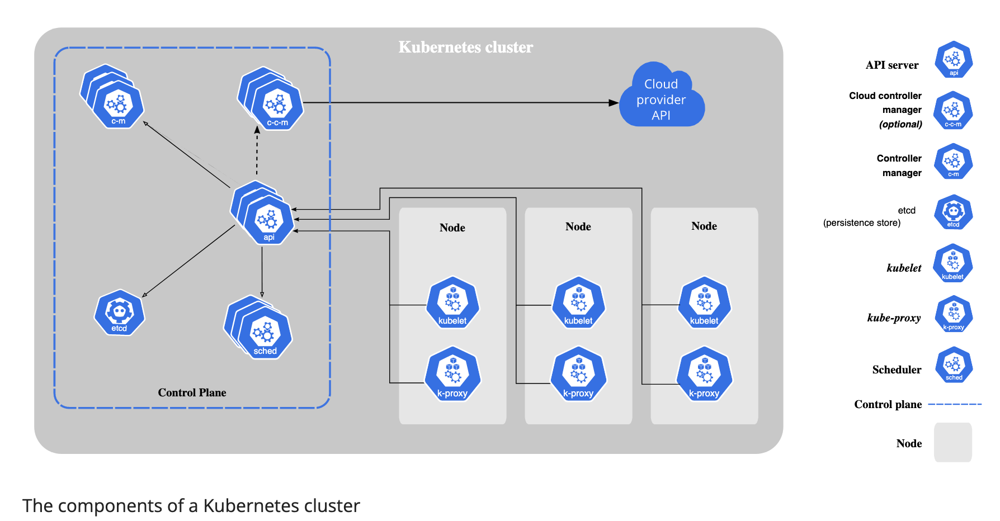

# [Kubernetes](https://kubernetes.io/docs/home/)

## Concepts
### Overview
#### Kubernetes Components
> A Kubernetes cluster consist of a set of worker machines, called nodes, that run containerized applications. Every cluster has at least one worker node.

> The worker nodes host the Pods that are the components of the application workload. The control plane manages the worker nodes and the Pods in the cluster. In production environments, the control plane usually runs across multiple computers and a cluster usually runs multiple nodes, providing fault-tolerance and high availability.
> 

##### Control Plane Components
> The control plane's components make global decisions about the cluster, as well as detecting and responding to cluster events.

###### kube-apiserver
> The API server is a components of the Kubernetes control plane that expose the Kubernetes API. The API server is the front end for the Kubernetes control plane.

###### etcd
> Consistent and highly-available key value store used as Kubernetes' backing store for all cluster data.

###### kube-scheduler
> Control plane component that watches for newly created Pods with no assigned node, and selects a node for them to run on.

> Factors taken into account for scheduling decisions include: individual and collective resource requirements, hardware/software/policy constraints, affinity and anti-affinity specifications, data locality, inter-workload interference, and deadlines.

###### kube-controller-manager
> Control plane component that runs controller processes.
>- Node controller: Responsible for noticing and responding when nodes go down.
>- Job controller: Watches for Job objects that represent one-off tasks, then creates Pods to run those tasks to completion.
>- Endpoint controller: Populates the Endpoints object(that is, joins Services & Pods).
>- Service Account & Token controllers: Create default accounts and API access tokens for new namespaces.

###### cloud-controller-manager
> A Kubernetes contorl plane component that embeds cloud-specific control logic. The cloud controller manager lets you link your cluster into your provider's API, and seperates out the componenets that interact with that cloud platform from components that only interact with your cluster.
>- Node controller: For checking the cloud provider to determine if a node has been deleted in the cloud after it stops responding.
>- Route controller: For setting up routes in the underlying cloud infrastructure.
>- Service controller: For creating, updating and deleting cloud provider load balancers.

##### Node Components
> Node components run on every node, maintaining running pods and providing the Kubernetes runtime environment.

###### kubelet
> An agent that runs on each node in the cluster. It makes sure that containers are running in a Pod.

> The Kubelet doesn't manage containers which were not created by Kubernetes.

###### kube-proxy
> kube-proxy is a network proxy that runs on each node in your cluster, implementing part of the Kubernetes Service concept.

> kube-proxy maintains network rules on nodes. These network rules allow network communication to your Pods from network sessions inside or outside of your cluster.

###### Container runtime
> The container runtime is the software that is responsible for running containers.

##### Addons
> Addons use Kubernetes resources to implement cluster features. Because these are providing cluster-level features, namespaced resources for addons belong within the kube-system namespace.

###### DNS
> While the other addons are not strictly required, all Kubernetes clusters should have cluster DNS.

> Containers started by Kubernetes automatically include this DNS server in their DNS searches.

#### The Kubernetes API
> The core of Kubernetes' control plane is the API server. The API server exposes an HTTP API that lets end users, different parts of your cluster, and external components communicate with one another.

> The Kubernetes API lets you query and manipulate the state of API objects in Kubernetes.

> Most operations can be performed through the kubectl command-line interface or other command-line tools, such as kubeadm, which in turn use the API. However, you can also access the API directly using REST calls.

#### Working with Kubernetes Objects
##### Understanding Kubernetes Objects
> A Kubernetes object is a "record of intent" -- once you create the object, the Kubernetes system will constantly work to ensure that object exists. By creating an object, you're efficiently telling the Kubernetes system what your cluster's workload to look like; this is your cluster's desire state.

> Almost every Kubernetes object includes two nested object fields that govern the object's configuration: the object spec and the object status. For objects that have a spec, you have to set this when you create the object, providing a description of the characteristics you want the resource to have: its desire state.

> The status describes the current state of the object, supplied and updated by the Kubernetes system and its components. The Kubernetes control plane continually and actively manages every object's actual state to match the desired state you supplied.

> When you create an object in Kubernetes, you must provide the object spec that describes its desired state, as well as some basic information about the object. When you use the Kubernetes API to create the object, that API request must include that information as JSON in the request body. Most often, you provide the information to kubectl in a .yaml file. kubectl converts the information to JSON when making the API request.

> In the .yaml file for the Kubernetes object you want to create, you'll need to set values for the following fields:
>- apiVersion - Which version of the Kubernetes API you're using to create this object
>- kind - What kind of object you want to create
>- metadata - Data that helps uniquely identify the object, including a name string, UID, and optional namespace
>- spec -  What state you desire for the object

