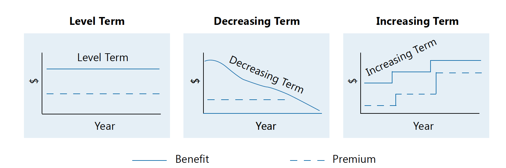
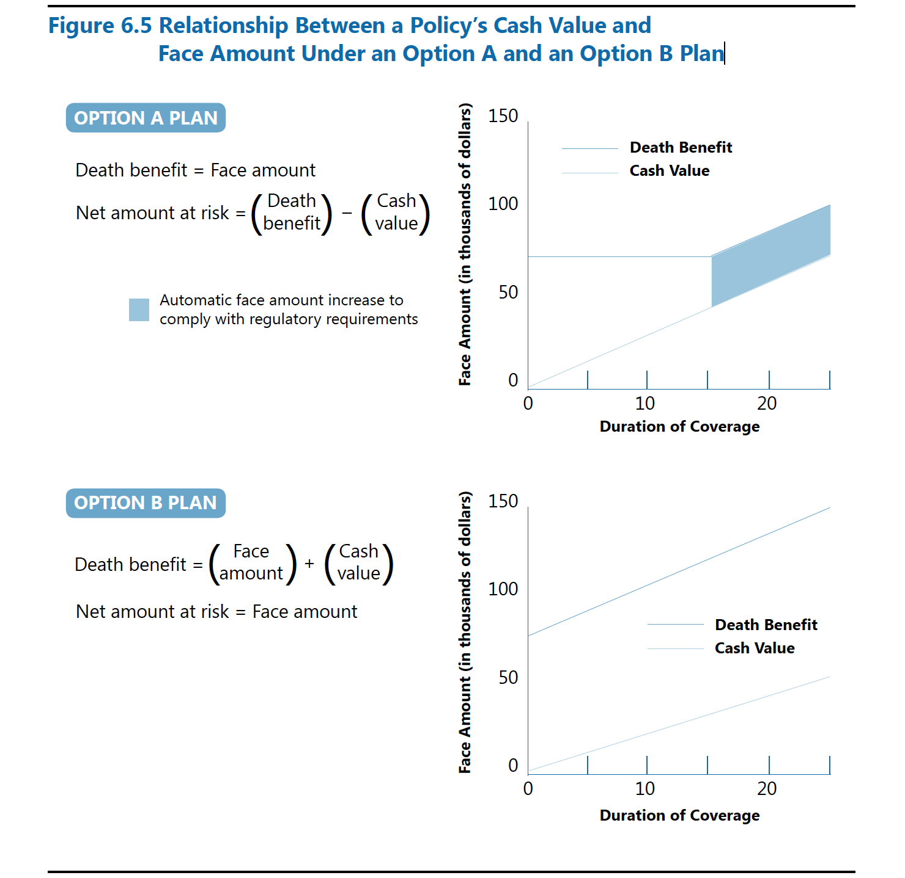
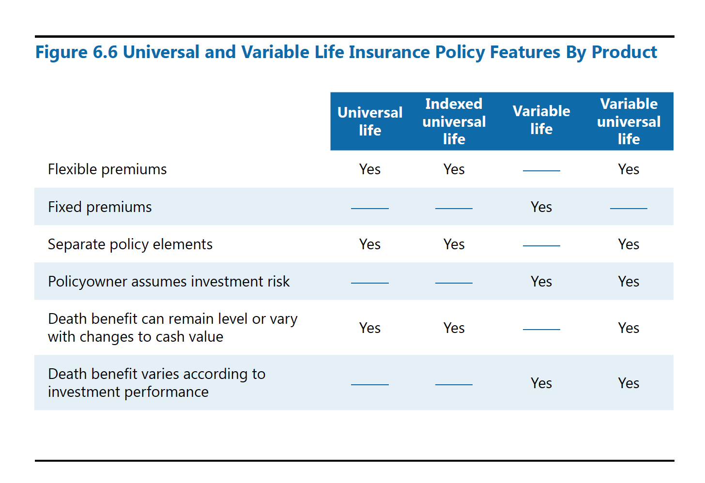

# LOMA 280 Principles of Insurance
## Chapter 1 Introduction to Risk and Insurance
Risk is the chance or possibility of an unexpected result, either a gain or a loss.

### The Concept of Risk
Speculative risk involves three possible outcomes: loss, gain or no change.

Pure risk involves no possibility of gain; either a loss occurs or no loss occurs.

The purpose of insurance is to compensate for financial loss, not to provide an opportunity for financial gain. 

### Risk Management
Risk management is the process in which individuals and businesses identify and assess the risks they face and determine how to deal with their exposure to these risks. Four general methods can be used to manage risk: (1) avoiding the risk, (2) controlling the risk, (3) transferring the risk, and (4) accepting the risk.

The most common way for individuals, families, and businesses to transfer risk is to purchase insurance coverage.

### Insurance
A company that accepts risk and makes a promise to pay a policy benefit if a covered loss occurs is an insurer or insurance company.

A policy benefit is a specific amount of money the insurer agrees to pay under an insurance policy when a covered loss occurs.

An insurance policy, also known as a policy or insurance contract, is a written document that contains the terms of the agreement between th insurer and the owner of the policy.

The premium is the specified amount of money an insurer charges in exchange for agreeing to pay a policy benefit when a covered loss occurs.

In general, individuals and businesses can purchase insurance policies to cover three types of risks:
- Personal risk
- Property damage risk
- Liability risk 

The applicant is the person or business that applies for an insurance policy.

Once an insurer issues a policy, the person or business that owns the insurance policy is known as the policyowner. In most cases, the applicant is also the policyowner.

The insured is the person whose life, health, or property is insured under the policy. In some countries, the term assured is used to refer to the person insured.

A third-party policy is a policy purchased by one person or business on the life of another person.

The beneficiary is the person or party the policyowner names to receive the life insurance policy benefit.

A request for payment under the terms of an insurance policy is called a claim.

### Managing Risks through Insurance
#### Characteristics of Insurable Risks
In general, for a risk - a potential loss - to be considered insurable, it must have the following characteristics:
- The loss must occur by chance.
The loss must result either from an unexpected event or from an event that the insured person did not intentionally cause.
- The loss must be definite.
For most types of insurance, an insurable loss must be definite in terms of time and amount.
A contract of indemnity is an insurance policy under which the amount of the policy benefit payable for a covered loss is based on the actual amount of the financial loss that results from the covered event, as determined at the time of the event.
A value contract specifies the amount of the policy benefit that will be payable when a covered loss occurs, regardless of the actual amount of the loss that was incurred.
- The loss must be significant.
- The loss rate must be predictable.
These predictions are based on observations of past events and a concept known as the law of large numbers.
- The loss must not be catastrophic to the insurer.
A loss without these characteristics generally is not considered an insurable risk.

By using accurate mortality and morbidity tables, life and health insurers can predict the probable loss rates for given groups of insureds. Insurers use those predicted loss rates to establish premium rates that will be adequate to pay claim.

#### Insurance Underwriting
The process of assessing and classifying the degree of risk represented by a proposed insured and making a decision to accept or decline that risk is called underwriting or risk selection. Insurance company employees who are responsible for evaluating proposed risks are called underwriters.

Underwriting becomes more difficult because of antiselection, also know as adverse selection or selection against the insurer.

Antiselection is the tendency of individuals who believe they have a greater-than-average likelihood of loss to seek insurance protection to a greater extent than do other individuals. The possibility of antiselection requires an insurer to carefully review each application to assess the degree of risk the company will be assuming if it issues the requested policy.

Underwriting consist of two primary stages: (1) identifying the risks that a proposed insured present and (2) placing the proposed insured into an appropriate risk class.

The most important of these factors to identify risks are physical hazards and moral hazards.
A physical hazard is a physical characteristic that may increase the likelihood of loss. Moral hazard is a characteristic that exists when the reputation, financial position, or criminal record of an applicant or a proposed insured indicates than the person may act dishonestly in the insurance transaction.

Each insurer has its own underwriting guidelines, which are the general rules it uses when assigning proposed insureds to an appropriate risk class. Individual life insurers' underwriting guidelines usually identify at least four risk classes for proposed insureds: standard risks, preferred risks, substandard risks, declined risks.
Proposed insureds who have a likelihood of loss that is not significantly greater than average are classified as standard risks. Traditionally, most individual life and health insurance policies have been issued at standard premium rates.
Proposed insureds who present a significantly lower-than-average likelihood of loss are classified as preferred risks. Insurance company practices vary widely as to what qualifies a proposed insured as a preferred risk or standard risk.
Proposed insureds who have a significantly greater-than-average likelihood of loss but are still found to be insurable are classified as substandard risks or special class risks.
The declined risk category consists of those proposed insureds who present a risk that is too great for the insurer to cover.

#### Insurable Interest Requirement
Insurance is intended to compensate an individual or a business for a financial loss, not to provide an opportunity for gain.

An insurable interest means that the policyowner must be likely to suffer a genuine loss or detriment should the event insured against occur.

### Objectives
#### 1A. Distinguish between speculative risk and pure risk
> Speculative risk involves three possible outcomes: loss, gain, or no change. For example, when you purchase shares of stock, you are speculating that the value of the stock will rise and that you will earn a profit on your investment. At the same time, you know that the value of the stock could fall and you could lose some or all of the money you invested. Finally, you know that the stock could remain the same - you might not lose money, but you might not make a profit.
Pure risk involves no possibility of gain; either a loss occurs or no loss occurs. An example of pure risk is the possibility that you may become disabled.

#### 1B. Describe four methods used to manage financial risk
>1. Avoiding risk
>2. Controlling risk
>3. Transferring risk
>4. Accepting risk

#### 1C. Identify the five characteristics of insurable risks
>1. The loss must occur by chance.
>2. The loss must be definite.
>3. The loss must be significant.
>4. The loss rate must be predictable.
>5. The loss must not be catastrophic to the insurer.

#### 1D. Define antiselection and give examples of two factors that can increase or decrease the likelihood that an individual will suffer a loss
> Antiselection is the tendency of individuals who believe they have a greater-than-average likelihood of loss to seek insurance protection to a greater extent than do other individuals. 
A physical hazard is a physical characteristic that may increase the likelihood of loss. For example, a person with a history of heart disease possesses a physical hazard that increases the likelihood that the person will die sooner than a person of the same age and sex who does not have a similar medical history.
Moral hazard is a characteristic that exist when the reputation, financial position, or criminal record of an applicant or a proposed insured indicates that the person may act dishonestly in the insurance transaction. For example, an individual who has a confirmed record of illegal or unethical behavior is more likely than an individual without this type of background to act dishonestly in an insurance transaction.

#### 1E. Identify four risk classes for proposed insureds.
>1. preferred class
>2. standard class
>3. substandard class
>4. declined class

#### 1F. Define insurable interest and determine in a given situation whether the insurable interest requirement is met
> An insurable interest means that the policyowner must be likely to suffer a genuine loss or detriment should the event insured against occur.
To understand how insurable interest requirements are met, we need to consider two possible situations: 
(1) An individual purchases insurance on her own life. All person are considered to have more to gain by living than by dying.
(2) An individual purchases insurance on another's life. Certain family relationships are assumed by law to create insurable interest between an insured and a policyowner or beneficiary.

## Chapter 2 The Life and Health Insurance Industry
Profit is the money, or revenue, that a business receives for its products minus the expenses it incurs to create and support the products.

### Insurance Company Organization
In many countries, including the United States, three primary types of business organizations are sole proprietorships, partnerships, and corporations. Insurers are organized as corporations.

#### Types of Business Organizations
A sole proprietorship is owned and operated by one person. 
A partnership is a business that is owned by two or more people, who are known as the partners.
In most countries, insurance companies and most other major businesses are organized as corporations. A corporation is a legal entity that is created by the authority of a governmental unit(through a process known as incorporation) and that is separate and distinct from its owners.

A corporation has two major characteristics that set it apart from a sole proprietorship and a partnership:
- As a legal entity that is separate from its owners, a corporation can sue or be sued, enter into contracts, and own property. In addition, the corporation's debts belong to the corporation itself and not to its owners. The owners are not personally responsible for the corporation's debts.
- The corporation continues beyond the death of any or all of its owners. Because an insurer's contractual obligations extend many years into the future, the corporation is the ideal form of business organization for an insurance company. Recognizing the importance of such stability and permanence, laws in the United States and many other countries require insurance companies to operate as corporations.

Typically, an insurer is organized as a stock insurance company, a mutual insurance company, or a fraternal benefit society.
Most corporations, including most life and health insurers, are stock corporations. A stock corporation is a corporation whose ownership is divided into units known as shares or shares of stock. A stockholder, or shareholder, is a person or organization that owns shares of stock in a corporation. The corporation's stockholders collectively are its owners. Insurers organized as stock corporations are known as stock insurance companies.
If a stock insurance company has profits, the stockholders may receive a stockholder dividend, which is a portion of the corporation's earnings paid to the owners of its stock.
A mutual insurance company is an insurance company that is owned by its policyowners.
A fraternal benefit society, also known as a fraternal insurer, is a nonprofit organization that is operated solely for the benefit of its members and that provides social, as well as insurance, benefits to its members.

### Insurance companies as Financial Institutions
Insurance companies are financial institutions that function in the economy as part of the financial services industry.
A financial institution is a business that owns primarily financial assets, such as stocks and bonds, rather than fixed assets, such as equipment and raw materials.
The financial services industry is an industry that offers financial products and services to help individuals, businesses, and governments meet their financial goals of protecting against financial losses, accumulating and investing money and other assets, and managing debt and payments.

#### Financial Intermediaries
Financial institutions, including insurance companies, serve as financial intermediaries. A financial intermediary is an organization that collects funds from one group of people, businesses, and governments, known as suppliers, and channels them to another group, known as users. Insurers, for example, collect premiums from policyowners and pay claims to beneficiaries. In the process of moving funds from suppliers to users, financial intermediaries generate income for themselves.

#### Evolution of the Financial Services Industry
Today the financial services industry is characterized by convergence, which is a movement toward a single financial institution being able to serve a customer's banking, insurance, and securities needs.
In the financial services industry, the term consolidation typically refers to the combination of financial institutions within or across sectors. This consolidation occurs primarily through mergers and acquisitions:
- A merger is a transaction in which the assets and liabilities of two companies are combined into one company. One of the companies survives as a legal entity, and the other company ceases to exist.
- An acquisition is a transaction in which one corporation purchases a controlling interest in another corporation, resulting in an ownership link between two formerly independent corporation. After the transaction, both corporations survive as separate legal entities.
Financial institutions operate in a global environment. Large financial services enterprises, particularly those from Western Europe and North America, increasingly are expanding their customer bases worldwide.

### Role of Government in Insurance
Governments around the world perform a variety of functions, such as providing social insurance programs, acting as regulators, and influencing spending and saving through taxation. In performing these functions, governments affect the supply and demand for insurance in the private sector.

#### Social Insurance Programs
A social insurance program is a welfare plan that is established by law and administered by a government and that provides assistance to specified groups of the population, such as elderly, disabled, and unemployed.

#### Regulation of Insurance
Throughout the world, insurance regulation has two primary goals:
- To ensure that insurers remain solvent - that is, able to meet their debts and pay policy benefits when they come due.
- To ensure that insurance companies conduct their businesses fairly and ethically.

### Objectives
#### 2A. Distinguish among the three types of businesses organizations and explain why insurance companies must be organized as corporations.
> There are three primary types of business organizations, sole proprietorships, partnerships, and corporations. A sole proprietorship is owned and operated by one person. A partnership is a business that is owned by two or more people, who are known as the partners. A corporation is a legal entity that is created by the authority of a governmental unit and that is separate and distinct from its owners.
> The corporation continues beyond the death of any or all of its owners. This characteristic of the corporation provides an element of stability and permanence that a sole proprietorship and partnership can't guarantee. Because an insurer's contractual obligations extend many years into the future, the corporation is the ideal form of business organization for an insurance company. 

#### 2B. Distinguish among stock insurers, mutual insurers, and fraternal benefit societies.
> Typically, an insurer is organized as a stock insurance company, a mutual insurance company, or a fraternal benefit society. Most corporations, including most life and health insurers, are stock corporations. A stock corporation is a corporation whose ownership is divided into units known as shares or share of stock. A stockholder, shareholder, is a person or organization that owns shares of stock in a corporation. The corporation's stockholders collectively are its owners. Insurers organized as stock corporations are known as stock insurance companies. A mutual insurance company is an insurance company that is owned by its policyowners. Because a mutual insurance company does not have stockholders, it does not pay stockholder dividends. Instead, a portion of the company's operating profits may be distributed to its policyowners in the form of policy dividends. A fraternal benefit society, also known as a fraternal insurer, is a nonprofit organization that is operated solely for the benefit of its members and that provides social, as well as insurance, benefits to its members.

#### 2C. Describe the financial services industry and explain how insurance companies function within that industry.
> The financial services industry is an industry that offers financial products and services to help individuals, businesses, and governments meet their financial goals of protecting against financial losses, accumulating and investing money and other assets, and managing debt and payments. 
> The financial services industry has undergone profound changes in the past few decades. The evolution of the financial services industry is characterized by convergence, consolidation, and globalization. Convergence is a movement towards a single financial institution being able to serve a customer's banking, insurance, and securities needs. Consolidation refers to the combination of financial institutions within or across sectors. Financial institution operate in a global environment.

#### 2D. Describe the roles that the federal and state governments play in U.S. insurance regulation
> Although the power to regulate insurance in the United States is shared by the state governments and the federal government, the states have the primary authority to regulate the business of insurance. Each state has its own laws, usually referred to as the state insurance code, which regulate insurance in that state. Each state also has an administrative agency, typically known as the state insurance department, which is responsible for making sure that companies operating in the state comply with applicable regulatory requirements. Each state insurance department is under the direction of an insurance commissioner, known in some states as the superintendent of insurance or director of insurance.

#### 2E. Identify the two primary types of insurance regulation in most countries.
> Throughout the world, insurance regulation has two primary goals:
>- To ensure that insurers remain solvent - that is, able to meet their debts and pay policy benefits when they come due.
>- To ensure that insurance companies conduct their businesses fairly and ethically.

## Chapter 3 The Insurance Contract
Individual insurance policy is an insurance policy that insures the life or health of a named person. Some individual policies also insure the person's immediately family or a second named person.

A group insurance policy insures the lives or health of a specific group of people.

### Fundamental of Contract Law
A contract is a legally enforceable agreement between two or more parties.

The two parties to an individual life or health insurance contract are the insurance company that issued the policy and the individual who owns the policy, known as the policyowner.

The parties to a group insurance contract are the insurer that issued the policy and the group policyholder, which refers to the person or organization that decides what types of group insurance coverage to purchase for the group members, negotiates the terms of the insurance contract, and purchases the group insurance coverage.

The fact that a contract is legally enforceable means that the parties are bound to carry out the promises they made when entering into the contract. If a party doesn't carry out its promise, then that party has breached the contract. Laws provide innocent parties with remedies they can pursue to recoup losses resulting from a breach of contract.

#### Types of Contracts
Health insurance policies typically are contracts of indemnity, and life insurance policies are valued contracts.

##### Formal and informal Contracts
A formal contract is a written contract that is enforceable because the parties met certain formalities concerning the form of the agreement.

Life and health insurance contracts are informal contracts. An informal contract is an oral or a written contract that is enforceable because the parties met requirements concerning the substance of the agreement rather than requirements concerning the form of the agreement.

##### Bilateral and Unilateral Contracts
A bilateral contract is one in which both parties make legally enforceable promises when they enter into the contract.

A unilateral contract is one in which only one of the parties makes a legally enforceable promise when entering into the contract.

Life and health insurance policies are unilateral contracts. The insurer promises to pay a policy benefit if the insured dies, gets sick, or is injured. As long as the premiums are paid, the insurer is legally bound by its contractual promises. The purchaser of the policy, on the other hand, does not promise to pay the premiums and can't be compelled by law to pay them. In fact, the policyowner has the right to stop paying premiums and cancel the policy at any time.

##### Commutative and Aleatory Contracts
A commutative contract is an agreement in which the parties specify in advance the values that they will exchange. Contracts for the sale of goods or services usually are commutative contracts.

In an aleatory contract, one party provides something of value to another party in exchange for a conditional promise. A conditional promise is a promise to perform a stated act if a specified, uncertain event occurs. If the event does not occur, the promise will not be performed.

Life and health insurance policies are aleatory contracts. A life insurance policy is an aleatory contract because the insurer's promise to pay the policy benefit is contingent upon the death of the insured while the policy is in force. The insured's death is an uncertain event because no one can say with certainty when the insured will die.

A life insurance policy is also an aleatory contract because one of the parties may receive something of greater value than that party gave.

##### Bargaining Contracts and Contracts of Adhesion
A bargaining contract, one in which both parties, as equals, set the terms and conditions of the contract.

A contract of adhesion is a contract that one party prepares and that the other party must accept or reject as a whole, generally without any bargaining between the parties to the agreement.

Life and health insurance policies are contracts of adhesion.

#### General Requirements for a Contract
In describing the legal status of a contract, the words valid, void, and voidable are often used:
- Valid. A valid contract is one that is enforceable by law. Valid contracts satisfy all legal requirements.
- Void. The term void is used in law to describe something that was never valid. A void contract is one that does not satisfy one or more of the legal requirements to create a valid contract and, thus, is never enforceable.
- Voidable. At times, one of the parties to an otherwise valid contract may have grounds to reject, or avoid, it. A voidable contract is one in which a party has the right to avoid her obligations under the contract.

##### Mutual Assent
The requirement of mutual assent is met when the parties reach a meeting of the minds about the terms of their agreement.

For life and health insurance policies, as well as for other contracts, mutual assent is expressed through a process of offer and acceptance. An offer is a proposal to enter into a binding contract with another party. The party that makes the offer is the offeror, and the party to whom the offer is made is the offeree. An acceptance of the offer is the offeree's unqualified agreement to be bound to the terms of the offer.

If an offer is accepted according to its terms, mutual assent has occurred.

##### Contractual Capacity
For an informal contract to be binding on the parties, the parties must have contractual capacity - that is, they each must have the legal capacity to make a contract.

###### Contractual Capacity of Individual
Every individual is presumed to have the legal capacity to enter into a valid contract. The law, however, has established some exceptions to this general rule to protect certain individuals who may not understand the consequences of their actions:
1. Minors. The laws in nearly all jurisdictions establish a particular age, referred to as the age of majority or age of maturity, at which people are considered adults who are capable of managing their own affairs and accepting the legal obligations created by their actions. A minor is a person who has not attained the age of majority.

2. Mental Capacity.
- A court declares the person to be insane or mentally incompetent. A contract entered into by such a person is usually void.
- The person's mental competence is impaired, but a court has not declared her to be insane or mentally incompetent.

###### Contractual Capacity of Organizations
An insurer acquires the legal capacity to issue an insurance contract by being licensed or authorized to do business as an insurer by the proper regulatory authority.

##### Legally Adequate Consideration
For an informal contract to be valid, the parties to the contract must exchange consideration, which means that each party must give or promise something that is of value to the other party.

An applicant submits the application and the initial premium - the first premium paid for an insurance policy - as consideration for a life or health insurance policy.

Renewal premium, which are premiums payable after the initial premium, are a condition for continuance of the policy and are not consideration for the policy.

###### Lawful Purpose
No contract can be made for a purpose that is illegal or against the public interest - a contract is valid only if it is made for a lawful purpose.

The requirement of lawful purpose in making an individual life insurance contract is met if an insurable interest is present when the policy is issued. After insurance, a continuing insurable interest is not required for the contract to remain valid.

An insurable interest usually is not required in a group insurance contract because the group policyholder's interest in the contract does not encourage wagering as does a policyholder's interest in an individual insurance  contract.

### The Policy as Property
In addition to being governed by contract law, insurance policies are a type of property and, thus, are also subject to the principles of property law.

Property is defined as a bundle of rights a person has with respect to something.

Real property is land and whatever is growing on or attached to the land.

All property other than real property is characterized as personal property and includes tangible goods such as clothing, furniture, and automobiles, as well as intangible goods such as contractual rights.

An insurance policy is intangible person property - it represents intangible legal rights that have value and that can be enforced by the courts.

The owner of an insurance policy - rather than the insured or beneficiary - holds these ownership rights in an insurance policy.

Ownership of property is the sum of all the legal rights that exist in that property.

#### Right to Use and Enjoy Property
The owner of an insurance policy has the right to deal with the policy in a number of ways.

#### Right to Dispose of Property
The owner of property generally has the right to dispose of the property.

### Objective
#### 3A. Distinguish between formal and informal contracts, bilateral and unilateral contracts, commutative and aleatory contracts, and contracts of adhesion and bargaining contracts, and identify which types characterize an insurance contract.
>- A formal contract is a written contract that is enforceable because the parties met certain formalities concerning the form of the agreement. An informal contract is an oral or a written contract that is enforceable because the parties met requirements concerning the substance of the agreement rather than requirements concerning the form of the agreement.
>- A bilateral contract is one in which both parties make legally enforceable promises when they enter into the contract. A unilateral contract is one in which only one of the parties makes a legally enforceable promise when entering into the contract.
>- A commutative contract is an agreement i which the parties specify in advance the values that they will exchange. In an aleatory contract, one party provides something of value to another party in exchange for a conditional promise.
>- A bargaining contract is both parties, as equals, set the terms and conditions of the contract. A contract of adhesion is a contract that one party prepares and that the other party must accept or reject as a whole, generally without any bargaining between the parties to the agreement.

>| Type of Contract | Characterizes Life and Health Insurance Contracts |
>|             ---- |                                              ---- |
>| Contract is based on the form of the agreement (Formal contract) | No |
>| Contract is based on the informal of the agreement (Informal contract) | Yes |
>| Both parties make legally enforceable promises (Bilateral contract) | No |
>| Only one party make a legally enforceable promise (Unilateral contract) | Yes |
>| The parties exchange things of equal value (Commutative contract) | No |
>| One party provide something of value in exchange for a conditional promise (Aleatory contract) | Yes |
>| Both parties set the terms (Bargaining contract) | No |
>| One party set the terms that the other party accepts or rejects (Contract of adhesion) | Yes |

### 3B. Explain the difference between a valid contract, a void contract, and a voidable contract.
>- Valid. A valid contract is one that is enforceable by law. Valid contracts satisfy all legal requirements.
>- Void. A void contract is one that does not satisfy one or more of the legal requirements to create valid contract and, thus, is never enforceable.
>- Voidable. A voidable contract is one in which a party has the right to avoid her obligations under the contract.

### 3C. Identify the four general requirements for the creation of a valid informal contract and describe how each of these requirements can be met in the formation of an insurance contract.
>1. The parties to the contract must express mutual assent, or agreement, to the terms of the contract.
> For life and health insurance policies, mutual assent is expressed through a process of offer and acceptance.
>2. The parties to the contract must have contractual capacity.
> Every individual is presumed to have the legal capacity to enter into a valid contract. The law, however, has established some exceptions to this general rule to protect certain individuals who may not understand the consequences of their actions. Corporations are generally presumed to have the contractual capacity of a mentally competent adult. Therefore, a corporation that was created in accordance with the laws of the applicable jurisdiction has the contractual capacity to enter into a contract, including a contract to purchase insurance.
>3. The parties to the contract must exchange legally adequate consideration.
> each party must give or promise something that is of value to the other party.
>4. The contract must be for a lawful purpose.
> No contract can be made for purpose that is illegal or against the public interest - a contract is valid only if it is made for a lawful purpose.

### 3D. Identify the property rights that a policyowner has in the insurance policy he owns.
> The legal rights an owner has in property include the right to use and enjoy the property and the right to dispose of the property.

## Chapter 4 Life Insurance Premiums
To determine the proper premiums to charge, insurers employ specialists known as actuaries. An **actuary** is an expert in financial risk management and the mathematics and modeling of insurance, annuities, and financial instruments. In insurance companies, actuaries are responsible for ensuring that products are financially sound and profitable. Actuaries accomplish this dual objective by establishing for every product a premium rate that will enable the company to both cover its costs of developing and administering the product and generate a reasonable profit for the company and its owners.

### The Legal Reserve System
The system that insurers use to set financial values for life insurance products is generally known as the **legal reserve system**.

Insurers are required by law to establish **policy reserve**, sometimes referred to as contractual reserves, legal reserves, or statutory reserves. These reserves represent the amount an insurer estimates it need to pay future benefits.

In the insurance industry, reserves are not assets. Rather, they are liabilities representing the amount of money an insurer estimates it will need to pay its future obligations. By law, the insurer is required to maintain assets that are at least equal to the amount of its policy reserve liabilities. Accordingly, the insurer must price its life insurances products so that it can meet its policy reserve requirements at all times.

The legal reserve system is based on the following premises:
- The amount of benefits payable should be specified or calculable in advance of the insured event.
- Companies should collect in advance the money needed to fund a policy reserve so that they will have sufficient funds available to pay claims and expenses as they occur.
- The premium an individual pays for a life insurance policy should be directly related to the amount of risk the insurance company assumes for the policy.

### Establishing Premium Rates
In pricing life insurance products, actuaries do not determine the exact premium amount that each policyowner pays. Rather, they establish premium rates for blocks of polices. A **block of policies** is a group of policies issued to insureds who are all the same page and sex and in the same risk classification.

A **premium rate** is a charge per unit of insurance coverage. In most cases,  premium rates for a block policies are based on a $1,000 life insurance coverage amount, known as a coverage unit. Thus, the premium rate for an individual life insurance policy is typically expressed as the rate per thousand per year. An annual premium amount for a policy is calculated by multiplying the premium rate by the number of coverage units.

Actuaries seek to ensure that premium rates are:
- Adequate. Adequate premium rates are high enough so that the insurer will have enough money to pay policy benefits as well as operating expenses.
- Equitable. Equitable premium rates ensure that each policyowner is charged a premium that reflects the degree of risk the insurer assumes in providing the coverage.
- Not excessive. If an insurer's premium rates are too high, potential customers may instead purchase policies from competitors that offer lower premium rates.

The three most important factors that actuaries consider in the calculation of life insurance premium rates are (1) the cost of benefits, (2) operating expenses, and (3) investment earnings.

#### Cost of Benefits
The **cost of benefits**, sometimes known as the cost of insurance, is the value of all the contractually required benefits a product promises to pay.
>Projected cost of a given benefit = Potential benefit amount payable * Probability that the benefit will be payable

The primary policy benefit payable by an insurer when an insured dies while policy is in force is the **death benefit**.

Insurer determine the probability that death benefit will be payable in a given year by referring to mortality tables.

Because life expectancy and mortality rates vary widely from one country to another, insurers usually rely on mortality tables developed for use in a particular country.

Mortality statistics show that, at nearly all ages, females have lower mortality rates than males of the same age. To reflect this difference, most insurers set lower life insurance premium rates for equivalent coverage for women than for men of the same age and underwriting risk.

#### Operating Expenses
For life insurance companies, **operating expenses** are the costs of operations other than expenses for contractual benefits, or the cost of benefits.

In general, insurers spend considerably more on benefit payments to customers than on their operating expenses.

A significant risk associated with an insurer's operating expenses is that customers will terminate or reduce the value of a life insurance policy before the policy becomes profitable.

The termination of an insurance policy for nonpayment of premium is known as a **lapse**. Therefore, the **lapse rate** is the percentage of a specified group of policies in force at the beginning of a specified period, such as a year, that are terminated by the end of that period for reasons other than death of the insured.

#### Investment Earnings 
In setting a product's premium rate, an insurer must take into account **investment earnings** - the money the insurer earns from investing the funds it receives from customers.

Many life insurance policies remain in force for a number of years before benefits become payable. During that time, the funds paid for these policies are available for the insurer to invest.

The earnings on these investments allow insurance companies to charge policyowner less than if companies relied solely on the premiums and charges that policyowners paid.

##### How Investments Create Earnings
Many investments earn money in the form of interest payments. **Interest** is a payment for the use of money. The rate of interest is expressed in terms of a percentage, such as 10 percent. The **principal** is the sum of money originally invested, loaned, or borrowed.

**Simple interest** is interest on the principal only. Calculating interest on both the principal and the accrued interest is called **compounding**, and the interest in this case is called **compound interest**.

The insurer's investment earnings can be expressed as a **rate of return**, which is the investment earnings expressed as a percentage of the principal.

#### Financial Models
Actuaries need to be able to establish premium rates for products that will satisfy the company's objectives over the many years that the products are expected to be in force. 

In general, a **financial model** is a computer-based mathematical model that approximates the operation of real-world financial process.

Insurers build into their financial models the risk that they will face unexpected outcomes. One way they do this is by using projections that are designed to be more than adequate; such projections are said to be conservative.

### The Level Premium System
the **level premium system** is a life insurance premium system that allows a policyowner to pay the same premium amount each year a policy is in force.

### Objectives
#### 4A. Define policy reserves and explain the premises of the legal reserve system
> Insurers are required by law to establish policy reserves, sometimes referred to as contractual reserves, legal reserves, or statutory reserves.

> The legal reserve system is based on the following premises:
>- The amount of benefits payable should be specified or calculate in advance of the insured event.
>- Companies should collect in advance the money needed to find a policy reserve so that they will have sufficient funds available to pay claims and expenses as they occur.
>- The premium an individual pays for a life insurance policy should be directly related to the amount of risk the insurance company assumes for the policy.

#### 4B. Define premium rate and calculate the annual premium amount for a given life insurance policy
> A premium rate is a charger per unit of insurance coverage.

> In most cases, premium rates for a block of policies are based on a $1000 life insurance coverage amount, known as a coverage unit. Thus, the premium rate for an individual life insurance policy is typically expressed as the rate per thousand per year. An annual premium amount for a policy is calculated by multiplying the premium rate by the number of coverage units.

#### 4C. Explain how actuaries account for the cost of benefits, operating expenses, and investment earings in developing premium rates
> For a given life insurance product, the projected cost of benefits generally equals the sum of all the potential benefit payments under the product multiplied by the probability that each benefit will be payable.

> In setting a premium rate for a product, the insurer must estimate the expenses associated with developing the product, selling it, and supporting it over the years it is expected to remain in force.

> Many life insurance policies remain in force for a number of years before benefits become payable. During that time, the funds paid for these polices are available for the insurer to invest.  

#### 4D. Explain how insurers use mortality tables in pricing products and describe the effect that mortality rates have on the cost of benefits and the premium rate for a block of policies
> Insurers determine the probability that death benefits will be payable in a given year by referring to mortality tables, which estimate the mortality rate for a given group of insureds.

> In general, the higher the mortality rate for a group of insureds of the same age and sex, the higher the cost of benefits and, thus, the higher the premium rate. Conversely, the lower the mortality rate for a group of insureds of the same age and sex, the lower the cost of benefits and the lower the premium rate.

#### 4E. Describe the effect of compound interest on investment earnings and calculate the amount of interest earned on a given sum of money
> Calculating interest on both the principal and the accrued interest is called compounding, and the interest in this case is called compound interest. When interest is compounded, the interest earned each investment period is equals to the accumulated balance at the beginning of the period multiplied by the interest rate. The amount of interest earned that period is then added to the accumulated balance to determine the beginning balance on which interest will be paid during the next period. In this way, interest is earned on both the original principal and on all accumulated interest.

#### 4F. Explain the purpose of using conservative values in financial models
> Insurers build into their financial models the risk that they will face unexpected outcomes. One way they do this is by using projections that are designed to be more than adequate.

#### 4G. Explain how the level premium system operates
> Level premium system is a life insurance premium system that allows a policyowner to pay the same premium amount each year a policy is in force. Insurers use the level premium system to price many types of cash value life insurance, term life insurance that provides coverage for more than one year, and endowment insurance.

## Chapter 5 Term Life Insurance
Term life insurance is distinct in that it remains in force for a specific period of time, rather than for the entire life of the insured.

### Needs Met by Life Insurance
#### Personal Needs
##### Dependents' Support
In many jurisdictions, when an insurer pays the death benefit of a life insurance policy in a lump sum to a beneficiary following the death of the insured, that benefit usually is not considered taxable income to the beneficiary.

##### Debts and Final Expenses
The accumulated assets that an individual owns when she dies are referred to as that person's **estate**. When the individual dies, her estate is distributed in an orderly manner according to the law.

In general, an individual can determine who will receive the assets in her estate by executing a **will**, which is a legal document that directs how the individual's property is to be distributed after her death. If an individual does not execute a valid will during her lifetime, the law determines how the property is to be distributed.

To ensure that her estate is distributed properly, a person should have an **estate plan**, which is a plan that considers the amount of assets and debts that a person is likely to have when she dies and how best to preserve those assets so that they can be distributed as she desires. An estate plan is particularly important because a person's death generally does not extinguish her debts. Instead, the debts must be paid from the deceased's estate before her heirs can receive any assets from the estate.

#### Business Needs
##### Business Continuation Insurance
A **business continuation insurance plan** is an insurance plan designed to ensure the continued financial viability of a business when faced with the death or disability of the business owner or other key person. 

A **key person** is any person or employee whose continued participation in the business is vital to the success of the business and whose death or disability would cause the business to incur a significant financial loss.

###### Key Person Life Insurance
**Key person life insurance**, or key employee life insurance, is individual life insurance that a business purchases on the life of a key person.

###### Buy-Sell Agreements
The owner of a small business may want to ensure that the business can continue to operate under new ownership after his death. A **buy-sell agreement** is an agreement in which (1) one party agrees to purchase the financial interest that a second party has in a business following the second party's death, and (2) the second party agrees to direct his estate to sell his interest in the business to the purchasing party.

### Term Life Insurance
A life insurance policy's face amount is the amount of life insurance benefits for which an individual applies and that the insurer approves.

#### Characteristics of Term Life Insurance Products
Term life insurance is life insurance that provides coverage only if the insured dies during the period specified in the policy; that specified period is known as the **policy term**.

Term life policywoners typically must pay annual renewal premium on the policy anniversary to keep the coverage in force. The **policy anniversary** generally is the anniversary of the date on which coverage under the policy became effective.

Another distinctive characteristic of term life is that it does not accumulate a cash value.

#### Plans of Term Life Insurance Coverage
The amount of the benefit payable under a term life insurance policy usually remains the same throughout the term of the policy. To meet specific customer needs, term life policies are also available with benefits that either increase or decrease over the policy's term.

##### Level Term Life Insurance
By far, the most common plan of term insurance is **level term life insurance**, which provides a death benefit that remains the same over the policy term.

Level term policies also usually feature level premiums, where the amount of the initial premium and each renewal premium remains the same throughout the stated policy term.

##### Decreasing Term Life Insurance
**Decreasing term life insurance** provides a death benefit that deceases in amount over the policy term.

The renewal premium for a decreasing term policy usually remain the same throughout the policy term. However, they are usually less than the renewal premiums for a comparable level term policy.

A decreasing term policy usually is specifically intended to shield dependents from inherited debts such as a mortgage, car payments, or credit card debts.

###### Mortgage Life Insurance
**Mortgage life insurance**, sometimes referred to as mortgage redemption insurance, is a plan of decreasing term insurance designed to provide a benefit amount that corresponds to the decreasing amount owed on a mortgage loan.

If the borrower purchases mortgage life insurance, the amount of the death benefit payable at any given time generally equals the amount the borrower owes on the mortgage loan at this time.

The term of a mortgage life policy is based on the length of the mortgage.

Many mortgage loans are obtained jointly by two people, both of whose incomes are required to make the monthly mortgage payments. For that reason, insurers offer **joint mortgage life insurance**, which provides the same benefit as a mortgage life insurance policy except the joint policy insures the lives of two people. If both insureds survive until the end of the policy term, the joint mortgage life policy expires. But if one of the insureds dies while the policy is in force, the insurer pays the death benefit to the beneficiary, who typically is the surviving insured.

###### Credit Life Insurance
**Credit Life Insurance** is a type of term life insurance designed to pay the balance due on a loan other than a mortgage if the borrower die before the loan is repaid. Credit life Insurance is decreasing term insurance. Credit life Insurance policies always provide that the death penalty is payable directly to the lender, or creditor, if the insured borrower dies during the policy's term.

Generally, the loan must be a type of loan that can be repaid in 10 years or less.

###### Family Income Coverage
**Family income coverage** is a plan of decreasing term life insurance that pays the beneficiary a stated monthly income benefit amount if the insured dies during the policy term.

The beneficiary of family income coverage typically is the insured's surviving spouse.

Family income coverage is most commonly purchased as a policy rider to a cash value life insurance policy.

A **policy rider**, also known as an endorsement, is an amendment to an insurance policy that becomes part of the insurance contract and changes its terms.

A policy rider is as legally effective as any other part of the insurance contract. Riders commonly provide some type of supplementary benefit or increase the amount of a policy's death benefit.

A cash value life insurance policy with a family income coverage rider is referred to as a **family income policy**.

##### Increasing Term Life Insurance
**Increasing term life insurance** provides a death benefit that starts at one amount and increases by some specified amount or percentage at stated intervals over the policy term.

People often purchase increasing term insurance as a rider to a life insurance policy, and usually just for a limited time to meet a specific need, such as providing funds for a child's education.

#### Feature of Term Life Insurance Policies
Term life insurance provides only temporary protection; at the end of the stated term, the policy expires.

A policyowner who wants to maintain insurance coverage after the policy expires must apply for a new policy. However, the new policy must be underwritten, and the premium will be higher to take into account the increased age of the insured.

Most one-year term insurance policies and riders are yearly renewable term(YRT) insurance or annually renewable term(ART) insurance, which means they are renewable each year for a stated number of years.

##### Renewable Term Insurance
A **renewable term insurance policy** is a term life insurance policy that gives the policyowner the option to continue the coverage at the end of the specified term without presenting **evidence of insurability** - proof that the insured person continues to be an insurable risk.

The provision in the policy that gives the insured the option to continue coverage for an additional policy term without presenting evidence of insurability is called the **renewal provision**.

The renewal premium rate is based on the insured person's **attained age** - the age the insured has reached (attained) on a specified date, which in this case is the renewal date.

Most one-year term insurance policies and riders are yearly renewable term (YRT) insurance or annually renewable term (ART) insurance, which means they are renewable each year for a stated number of years.

##### Convertible Term Insurance
A **convertible term insurance policy** gives the policyowner the option to convert the term policy to a cash value life insurance policy without providing evidence of insurability.

Convertible term insurance policies contain a **convertible privilege**, which allows the policyowner to change - convert - the term insurance policy to a cash value policy without providing evidence of insurability.

When a term insurance policy is converted to a cash value policy, the new premium rate is higher than the premium rate the policyowner paid for the term insurance policy.

Insurers can use two different types of conversions. The most common conversion is known as an **attained age conversion**, in which the premium rate for the cash value policy is based on the insured's age at the time the policy is converted. Alternatively, under an **original age conversion**, the premium rate for the cash value policy is based on the insured's age when the original term policy was issued.

##### Return of Premium Term Insurance
Some insurers now offer **return of premium (ROP) term insurance**, which is a form of term life insurance that provides a death benefit if the insured dies during the policy term and promise a return of premiums if the insured does not die during the policy term.

Some ROP term policies provide a partial return of premiums if the policy is kept in force for a stated period of time but then canceled before the end of the term.

### Objective 
#### 5A. Identify the common personal and business needs that life insurance can meet.
> People's needs for life insurance coverage vary greatly, but most buyers share a number of common reasons to purchase life insurance. Among the most common of these needs are dependents' support, paying debts and final expenses, and estate planning. \
> Businesses also have needs life insurance can meet. Two common for a business - or an individual who owns a business - to purchase life insurance are (1) to provide funds to ensure that the business continues in the event of the death or disability of an owner, partner, or other key person, and (2) to provide benefits for its employees.

#### 5B. Describe the coverage provided by level term, decreasing term, and increasing term life insurance policies, and explain when the premium charged for term life insurance coverage may increase.
> Level term life insurance provides a death benefit that remains the same over the policy term. Level term policies also usually feature level premiums, where the amount of the initial premium and each renewal premium remains the same throughout the stated policy term. \
> Decreasing term life insurance provides a death benefit that decreases in amount over the policy term. The death benefit begins at a specific amount and then decrease over the policy term according to a method described in the policy. \ 
> Increasing term life insurance provides a death benefit that starts at one amount and increases by some specified amount or percentage at stated intervals over the policy term. \ 
> A policyowner who wants to maintain insurance coverage after the policy expires must apply for a new policy. However, the new policy must be underwritten, and the premium will be higher to take into account the increased age of the insured.

#### 5C. Describe renewable term life insurance and convertible term life insurance
> A renewable term insurance policy is a term life insurance policy that gives the policyowner the option to continue the coverage at the end of the specified term without presenting evidence of insurability - proof that the insured person continues to be an insurable risk. \ 
> A convertible term insurance policy gives the policyowner the option to convert the term policy to a cash value life insurance policy without providing evidence of insurability.

#### 5D. Describe the operation of a return of premium (ROP) term policy.
> ROP term insurance is a form of term life insurance that provides a death benefit if the insured dies during the policy term and promises a return of premiums if the insured does not die during the policy term.

## Chapter 6 Cash Value Life Insurance and Endowment Insurance
Cash value life insurance has two characteristics that distinguish it from term life insurance. First, cash value life insurance provides insurance coverage for the entire lifetime of the insured, as long as the policy remains in force. Second, cash value life insurance provides a savings element, known as the cash value, that a policyowner can use to meet financial needs during the insured's lifetime.

While cash value life insurance is designed for long-term financial needs, it can also be useful in the short term. The owner of a policy that has accumulated a cash value can use the cash value as security for a policy loan from the insurer.

If the insured dies before a policy loan is repaid, however, the unpaid amount of the loan - plus any interest outstanding - is subtracted from the death benefit.

Alternatively, the policyowner can use the cash value as collateral for a loan from another financial institution.

A policyowner can also surrender - or terminate - a cash value policy fot its cash value during the insured's lifetime. If a policyowner chooses not to keep a cash value life insurance policy in force until the insured's death, the insurer agrees to pay the cash surrender value to the policyowner. The cash surrender value is the amount that a policyowner is entitled to receive upon surrendering the policy, before adjustments for factors such as policy loans and applicable charges.

### Whole Life Insurance
Whole life insurance is a type of cash value life insurance that provides lifetime insurance coverage, usually at a level premium rate that doesn't increase as the insured ages.

#### Premium Payment Periods
##### Continuous-Premium Policies
Under a continuous-premium whole life insurance policy, premiums are payable until the death of the insured.

##### Limited-Payment Policies
A limited-payment whole life insurance policy is a whole life policy for which premiums are payable only for a stated period of time or until the insured's death, whichever occurs first.

A policy that requires no further premium payments but continues to provide coverage is said to be a paid-up policy.

##### Single-Premium Policies
A single-premium whole life insurance policy is a type of limited-payment policy that requires only one premium payment.

#### Modified Whole Life Insurance
Some insurers offer whole life insurance policies under which either (1) the amount of the premium payments required changes at some point during the life of the policy or (2) the face amount of the coverage changes during the life of the policy.

##### Modified Premiums
A modified-premium whole life insurance policy is a policy for which the annual premium amount changes after a specified initial period.

The primary advantage of a modified-premium policy is that it allows a person to purchase a larger amount of life insurance than he otherwise could afford.

The chief disadvantage of a modified-premium whole life policy is that the cash value builds more slowly under this type of policy than it would under a continuous-premium whole life policy.

##### Modified Coverage
A modified coverage whole life insurance policy is a whole life policy under which the amount of insurance provided decreases by specific percentages or amounts either when the insured reaches certain stated ages or at the end of stated time period.

The annual premium for a modified coverage whole life policy is lower than for a continuous-premium whole life policy having the same initial face amount.

The reason for the lower premium is that during the period of the greatest risk of death - the period when the insured is at an advanced age - the face amount of the policy will be at its lowest level.

#### Whole Life Insurance Covering More Than One Insured
##### Joint Whole Life Insurance
Joint whole life insurance has the same features and benefits as individual whole life insurance, except that it insures two people under the same policy.

Because coverage under a joint whole life policy ends once the death benefit is paid, the surviving insured may be left uninsured. To give the surviving insured the ability to obtain life insurance coverage, joint whole life policies usually provide a specified period -  frequently 60 - 90 days - following the first insured's death within which the surviving insured may purchase an individual whole life policy of the same face amount without providing evidence of insurability.

If both insureds die simultaneously, the insurer pays a death benefit for each insured.

Joint whole life was designed primarily for a surviving spouse who will need a death benefit to cover continued living expenses, but won't need to leave a death benefit to a beneficiary.

##### Last Survivor Life Insurance
Last survivor life insurance - also known as second-to-die life insurance or survivorship life insurance - is a a variation of joint whole life insurance under which the death benefit is paid only after both people insured by the policy have died.

Last survivor life insurance was designed primarily to insure married couples who want to provide funds to pay estate taxes that may be levied after their deaths.

##### Family Policies
Some insurers market a family policy, which is a whole life insurance policy that includes term life insurance coverage on the insured's spouse and children.

Typically, the applicant for a family policy must provide evidence that all family members are insurable.

Once the policy is issued, however, each child born to or adopted by the family thereafter is automatically covered by the policy, although the additional term life coverage often is not effective until the child reaches age 15 days.

### Universal Life Insurance
Universal life insurance is a form of cash value insurance that is characterized by its separation of the three primary policy elements and its flexible face amount, death benefit amount, and premiums.

#### Separation of Policy Elements
##### Mortality Charges
The mortality charge is the amount needed to cover the  mortality risk the insurer has assumed in issuing the policy.

The amount of the mortality charge usually is based on the insured's age, sex, and risk classification, and this charge typically increases each year as the insured ages.

Universal life policies express the mortality charge as a charge per thousand dollars of net amount at risk. A life insurance policy's net amount at risk is the amount of the insurer's funds that would be required at any given time to pay the policy death benefit.

##### Interest Rate
Current interest-crediting rate is the rate of interest that an insurer declares and pays on a universal life insurance policy's cash value for specified period of time.

The current interest-crediting rate is declared annually, and guaranteed to never be below the guaranteed minimum interest-crediting rate.

##### Expenses
Each universal life insurance policy lists the expenses charges that the insurance company will impose to cover the costs it incurs in connection with the policy.

#### Operation of a Universal Life Insurance Policy
When an insurer receives a premium payment for a universal life insurance policy, it first deducts the amount of any applicable expense charges. The insurer then credits the remainder of the premium to the policy's cash value.

The more a policyowner pays in premiums above the amount needed to pay the policy's mortality and expense charges, the greater the policy's cash value will be.

The policyowner can increase the cash value of a universal life policy by making additional or larger-than-required premium payments, the policyowner usually can decrease the cash value of the policy as well by withdrawing funds from the cash value.

The policy remains in force as long as the cash value is sufficient to pay the applicable mortality and expense charges.

The owner of a universal life policy also can receive a policy loan, which operates in much the same way as a policy loan under a whole life insurance policy.

If the cash value of a universal life policy is not sufficient to pay the periodic mortality and expense charges, the policy will lapse unless the policyowner takes action within a stated period of time - usually 60 days - to keep the policy in force.

To prevent a policy from lapsing, the policyowner must either (1) pay additional premiums or (2) reduce the policy's face amount.

#### Flexibility Features
When he purchases the policy, the policyowner decides, within certain limits, what the policy's face amount will be, the amount of the death benefit payable, and the amount of the premiums he will pay for that coverage.

##### Face Amount and Death Benefit
When a person buys a universal life policy, he specifies the policy's face amount.

The insurer typically requires the policyowner to provide evidence of the insured's continued insurability when a proposed increase in the policy's face amount exceeds a certain amount.

Before approving a decrease in a policy's face amount, the insurer must make sure that the decrease would not cause the policy to lose its status as an insurance contract and instead be classified as an investment contract.

>Relationship Between a Policy's Cash Value and Face Amount Under an Option A and an Option B Plan
> 
>When selecting a Universal Life Insurance (UL) policy, policyholders often choose between Option A (Level Death Benefit) and Option B (Increasing Death Benefit).
>
>Both options affect how the Cash Value (CV) and Face Amount (FA) interact over time.
>
>🔹 Option A (Level Death Benefit) \
>How It Works: \
>The Death Benefit remains constant (Face Amount stays the same). \
>As the Cash Value grows, the Net Amount at Risk (NAR) decreases. \
>The insurer’s risk declines over time. \
>Formula: \
>Death Benefit = max(Face Amount,Cash Value × Minimum DB Factor) \
>Death Benefit=max(Face Amount,Cash Value×Minimum DB Factor) \
>Minimum DB Factor: A regulatory factor ensuring the death benefit does not become too low. 
>
>📌 Example:
>
>Year 1:
>Face Amount: $500,000 \
>Cash Value: $10,000 \
>Death Benefit Paid: $500,000 (FA) \
>Net Amount at Risk (NAR) = $500,000 - $10,000 = $490,000 \
>Year 20:
>Face Amount: $500,000 \
>Cash Value: $200,000 \
>Death Benefit Paid: $500,000 (FA) \
>Net Amount at Risk (NAR) = $500,000 - $200,000 = $300,000 \
>🔹 Key Takeaways: \
>✅ The insurer’s risk decreases over time. \
>✅ The Cash Value reduces the portion the insurer must pay. \
>✅ Cheaper premiums compared to Option B. 
>
>🔹 Option B (Increasing Death Benefit) \
>How It Works: \
>The Death Benefit increases as Cash Value grows. \
>The insurer always pays the Face Amount + Cash Value. \
>The Net Amount at Risk (NAR) remains constant. \
>Formula: \
>Death Benefit = Face Amount + Cash Value \
>Death Benefit=Face Amount+Cash Value 
>
>📌 Example: \
>Year 1: \
>Face Amount: $500,000 \
>Cash Value: $10,000 \
>Death Benefit Paid: $510,000 (FA + CV) \
>Net Amount at Risk (NAR) = $500,000 \
>Year 20: \
>Face Amount: $500,000 \
>Cash Value: $200,000 \
>Death Benefit Paid: $700,000 (FA + CV) \
>Net Amount at Risk (NAR) = $500,000 \
>🔹 Key Takeaways: \
>✅ Death Benefit increases over time as Cash Value grows. \
>✅ Net Amount at Risk remains the same (insurer’s risk does not decrease). \
>✅ Higher premiums compared to Option A.

##### Premiums
A flexible-premium universal life insurance policy allows the policyowner to alter the amount and frequency of premium payments, within specified limits.

One of the main advantages of flexible premiums is the ability to pay a larger premium than required and directly add to the policy's cash value.

As long as the policy's cash value is larger enough to pay the periodic mortality and expense charges the insurer imposes, the policy remains in force even if the policyowner does not pay renewal premiums.

A fixed-premium universal life insurance policy requires a series of scheduled premium payments of a specified amount for a specified length of time or until the insured's death, whichever comes first. However, the owner of a fixed-premium universal life policy does not have a paid-up policy at the end of the premium payment period.

##### Effects of Regulation on Universal Life Policies
The larger the cash value is in relation to the policy's death benefit, the more a policy resemble an investment product rather than an insurance product.

Insurance companies generally do not allow a policyowner to pay a premium amount that would result in the death benefit exceeding the legislatively specified percentage of the cash value. In addition, most universal life policies provide that if the cash value exceeds the specified percentage of the death benefit, then the insurer will increase the death benefit to an amount that meets the regulatory requirements.

#### Periodic Statements
Because so many aspects of a universal life insurance policy change over the course of a year, insurers send each policyowner an annual, semiannual, or quarterly statement containing the policy's current values and benefits.

#### Indexed Universal Life Insurance
Indexed universal life insurance offers the same features as universal life insurance, but also offers the possibility of additional earnings based on changes in a published index.

Commonly used indexes are the S&P 500 or Nasdaq 100.

An IUL policy generally divides the cash value into two policy accounts:
- A fixed account, which is the portion of the cash value for which the crediting rate is the same as on the insurer's traditional UL products.
- An indexed account, which is the portion of the cash value for which the crediting rate is determined by changes in an index.

The policyowner decides how to allocate premium payments between the two types of accounts.

The index performance rate is the change in the index's value over the policy's index term.

To determine the index crediting rate, the index performance rate is multiplied by the participate rate, which is the percentage of the index performance rate that is counted in calculating the crediting rate.

The main attraction of indexed universal life insurance is that it offers additional gains in the cash value when the market is strong, with relatively little risk.

### Variable Life Insurance
Variable life insurance is a form of cash value life insurance in which premium are fixed, but the death benefit and other value may vary, reflecting the performance of the investment subaccounts that the policyowner selects.

A subaccount is one of several investment funds to which a variable life insurance policyowner allocates the premiums she has paid and the cash values that have accumulated under the policy.

The amount of both the variable life policy's death benefit and cash value depends on how well the subaccounts perform.

Although the policy's death benefit may change from time to time, most variable life policies provide a minimum guaranteed death benefit, regardless of the subaccount's performance.

### Variable Universal Life Insurance
Variable universal life insurance combines the premium and death benefit flexibility of universal life insurance with the investment flexibility and risk of variable life insurance.

Most insurers allow the policyowner to choose whether a variable universal policy's death benefit will remain level or will vary along with changes in the investment earings of the subaccounts.

### Endowment Insurance
Endowment insurance provides a policy benefit payable either when the insured dies or on a stated date if the insured is still alive on that date. Each endowment policy specifies a maturity date, which is the date on which the insurer will pay the policy's face amount to the policyowner if the insured is still living.

If the insured dies before the maturity date, then the insurer pays the policy's face amount to the designed beneficiary. Thus, an endowment insurance policy pays a flexed benefit whether the insured survives to the policy's maturity date or dies before that maturity date.

The reserve and cash value of an endowment policy usually equal the policy's face amount on the policy's maturity date, which typically is much sooner than when the insured reaches the last age found in the mortality table.

